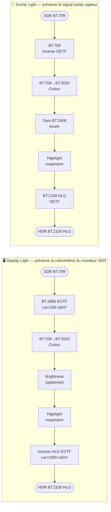
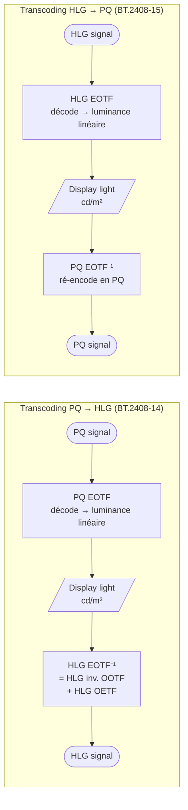
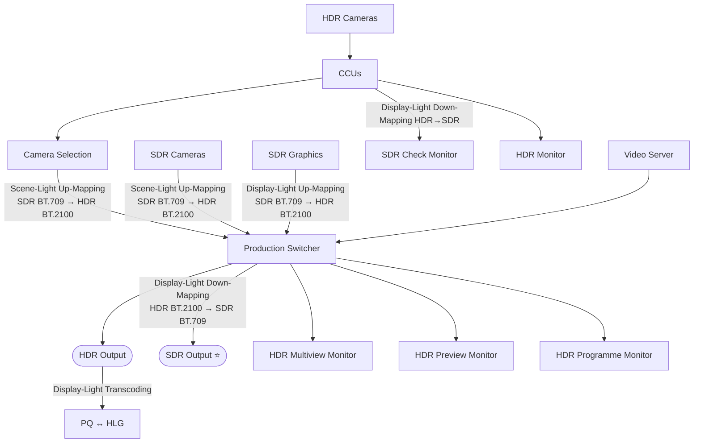

# Environnement de travail HDR

![[20260408_100604.jpg]]
[IMAGE]

# Guide des bonnes pratiques

>[!Claude] ✅
>Se renseigner sur ITU-R BT.2408

**ITU-R BT.2408** — *Operational practices in HDR television production* — est la norme de référence pour la production HDR broadcast. Elle définit :
- Les **niveaux nominaux de signal** pour PQ et HLG (HDR Reference White = 203 nits PQ / 75% HLG)
- Les niveaux indicatifs pour les **teintes de peaux** (Échelle Fitzpatrick) et les objets courants
- Les pratiques de **conversion SDR↔HDR** (Display Light vs Scene Light)
- Les recommandations pour les LUTs et la production simultanée HDR-SDR
- La gestion du **headroom** au-dessus du Reference White (spéculaires, éclairages jusqu'à 1000 cd/m²)

![[20260408_100927.jpg]]
[IMAGE]

![[20260408_101125.jpg]]
[IMAGE]

![[20260408_101215.jpg]]
[IMAGE]
Les deux dernières images concernent les teintes de peaux dans le monde HDR

# Conversions
- upmaping/downmaping
- Tone Mapping : HDR -> SDR (down convert)
- Inverse Tone Mapping : SDR -> HDR (up convert)
- Direct maping : contenu SDR "encapsulé" dans HDR
- Hard cliping : HDR -> SDR en coupant toutes les informations

![[20260408_101401.jpg]]
[IMAGE]

Pour la conversion de SDR -> HDR, deux méthodes :
- Display Referred Mapping (=Display Light) (petit à petit abandonné car lourd à mettre en place)
- Scence Referred Mapping (=Referrred Light)

Pour HDR -> SDR, les deux méthodes existent mais on préferera "Dsiplay Light" car on maintient le look de l'image HDR

![[20260408_101949.jpg]]
[IMAGE]

![[20260408_102232.jpg]]
[IMAGE]
>[!Claude] ✅
>Je coudrais que tu reproduise le schéma si dessus en expliquant la différence de rendu entre "Display" et "Scene"

**Différence de rendu** :
- **Display Light** : passe par l'EOTF du standard SDR (BT.1886) pour obtenir la luminance linéaire vue sur le moniteur SDR (100 cd/m²), puis la ré-encode en HLG. Le rendu final préserve exactement l'apparence visible sur le moniteur SDR. Utilisé pour les **contenus étalonnés** (graphiques, programmes SDR archivés).
- **Scene Light** : applique l'inverse de l'OETF pour retrouver la lumière de scène capturée par le capteur (balance des blancs, réglages artistiques compris). Ne passe pas par la notion de "moniteur SDR". Permet d'**aligner des caméras SDR natives et des caméras HDR** dans un même flux de production.

![[20260408_102629.jpg]]
>[!Claude] ✅
>Réutilise cette image comme illustration de la différence en "Display" et "Scene"

Le graphe ci-dessus (*Comparison of scene-light and display-light direct-mapping*) illustre concrètement l'écart entre les deux conversions :
- **Axe X** : niveau du signal SDR en entrée (SDR Input Signal Y', 0–110%)
- **Axe Y** : niveau du signal HLG en sortie (HLG Output Signal Y', 0–100%)
- La courbe **Scene-Light** (tirets bleus) est légèrement **au-dessus** de la courbe Display-Light sur toute la plage
- À 100% SDR : Scene-Light produit ~75% HLG vs ~70% HLG en Display-Light

→ La conversion Scene-Light "ouvre" davantage les hautes lumières car elle part du signal capteur brut, non limité par la colorimétrie du moniteur SDR à 100 cd/m².

![[20260408_102839.jpg]]
>[!Claude] ✅
>- Je voudrais que tu reproduise le schéma si dessus
>- Je voudrais que explique l'usage d'un EOTF dans ces cas ci et l'usage d'un OOTF

**EOTF (Electro-Optical Transfer Function)** : transforme le **signal numérique** (code 0–1023) en **luminance d'affichage** (cd/m²). C'est la fonction appliquée par le moniteur. Chaque standard a son EOTF :
- PQ EOTF : signal PQ → 0 à 10 000 cd/m²
- HLG EOTF : signal HLG → 0 à 1 000 cd/m² (varie selon la luminance de crête du display)

**OOTF (Opto-Optical Transfer Function)** : transforme la **lumière de scène** (capteur) en **luminance d'affichage**. C'est la combinaison OETF (scène→signal) + EOTF (signal→affichage). En HLG, l'OOTF est **non-linéaire** et dépend du niveau de luminance de crête du moniteur (γ = 1.2 pour un display à 1000 cd/m²).

Dans le transcoding PQ→HLG : l'EOTF PQ décode le signal en luminance linéaire (display light), puis le HLG inverse OOTF ré-encode cette luminance en signal HLG. Le **display light** est le point de référence commun entre PQ et HLG.

# Look-Up tables (LUT)

## Lut 1D

Conversion de chaque primaire sans tenir compte des deux autres couleurs primaire
Conversion très simple

ne permet pas de modifier la saturation indépendamment du contraste
À utiliser pour de l'affichage, lorsqu'on a pas besoin de précision
## Lut 3D

Plus adapté pour faire correspondre les espaces colorimétriques entre eux dans une matrice en 3 dimensions

Résolution différentes  :
- 33 x 33 x 33 (broadcast)
- 65 x 65 x 65 (post prod)

Différentes méthodes d'interpolations entre chaque coordonnées :
- Trilinear (monitoring)
- Tetrahedral (plus précis)

## Remarques

![[20260408_104540.jpg]]
[IMAGE]

Dans notre situation en régie pour de la diffusion, nous travaillions plutôt avec des LUT 3D, en 33x33x33, et Tetrahedral, et Type III, 10 bits

![[20260408_104946.jpg]]
[IMAGE]
>[!Claude] ✅
>Je souhaite que tu reproduise le schéma ci-dessus

Le schéma ci-dessus présente le comportement de l'IMAGINE SNP (Selenio Network Processor) lors de l'application d'une LUT 3D, selon le mode de scaling SDI choisi.

**Entrée (SDI IN → LUT 3D) :**

| Mode | SDI IN | Mapping LUT | Comportement |
|---|---|---|---|
| Full/Wide Input Scaling | 0–1023 | 0→1 | Toutes les valeurs SDI couvrent la plage entière de la LUT (rectangle) |
| Narrow/Nominal Input Scaling | 64–940 | 0→1 | Seules les valeurs légales sont étirées sur la plage LUT (trapèze, headroom extrapolé) |

**Sortie (LUT 3D → SDI OUT) :**

| Mode | Mapping LUT | SDI OUT | Comportement |
|---|---|---|---|
| Full/Wide Output Scaling | 0→1 | 0–1023 | La sortie LUT couvre la totalité du signal SDI |
| Narrow/Nominal Output Scaling | 0→1 | 64–940 | La sortie est comprimée dans la plage légale narrow-range |

→ Pour un usage broadcast TV : **Narrow/Nominal en entrée et en sortie**, avec une LUT de Type III (traitement full-range, préserve la marge).

LUTs Recommandée par NBCU : https://github.com/digitaltvguy/NBCUniversal-UHD-HDR-SDR-Single-Master-Production-Workflow-Recommendation-LUTs

# Workflow

![[20260408_114132.jpg]]
[IMAGE]
>[!Claude] ✅
>Je veux que tu reproduise les schéma.

Schéma ITU-R BT.2408-8 Fig20 §7.2 — **Production simultanée HDR-SDR** (*HDR-focused camera shading*)

**Légende des conversions** :
- 🟡 **Display-Light** : préserve le rendu colorimétrique (Down-Mapping monitoring, sorties SDR, graphiques)
- 🟢 **Scene-Light** : préserve le signal capteur (Up-Mapping des caméras SDR vers HDR)
- ⭐ Les sorties SDR monitoring et programme sont **identiques** et peuvent être dynamiques

**Principe clé** : la régie travaille nativement en HDR. Les caméras SDR sont remontées en HDR dès l'entrée (Scene-Light). La sortie SDR est une descente Display-Light depuis le signal HDR maître.

Doc : https://cst.fr/glossaire-hdr/

