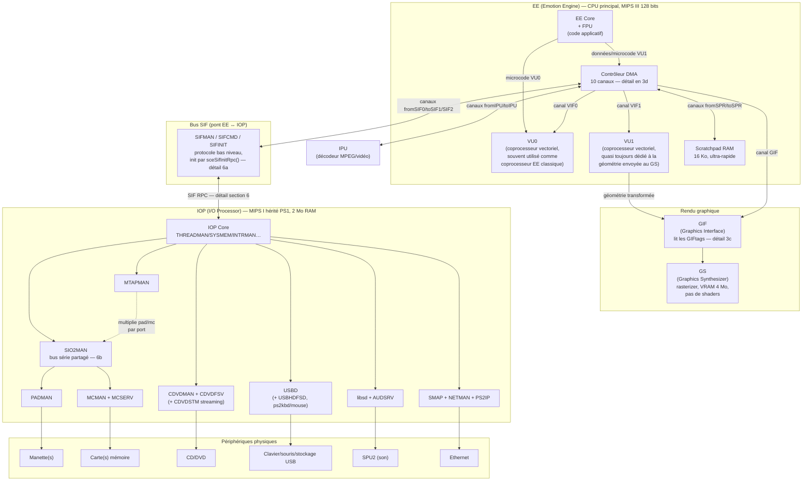
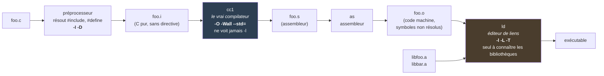

**PS2SDK :** Kit de développement pour la PS2 (https://github.com/ps2dev/ps2sdk)

https://ps2dev.github.io/#getting-started
https://www.psdevwiki.com/ps2/Main_Page

Vidéo présentations : https://www.youtube.com/watch?v=kX_JpzxR2Qg&list=PLFZsvEE0TWOsFhZr-9KwLED3Rzlwra_Rm


# Part1

## 1 - Hardware infrastructure

La PS2 n'a pas un seul CPU mais plusieurs processeurs spécialisés qui communiquent entre eux. L'arborescence du SDK reflète cette architecture (`ee/`, `iop/`, `dvp/`, `gsKit/`).



Ce diagramme consolide tout ce qui est détaillé plus loin dans la note : les 10 canaux DMA (section 3d), le mécanisme GIFtag/GIF (section 3c), le bus SIF et la hiérarchie des modules IOP (section 6a-e).

| Hardware                       | Description                                                                                                                            | Toolchain / accès depuis le SDK                                                     |
| ------------------------------- | ---------------------------------------------------------------------------------------------------------------------------------------- | ------------------------------------------------------------------------------------ |
| EE (Emotion Engine)             | Processeur principal de la PS2, MIPS 64 bits (utilisé surtout en 32 bits en pratique). Exécute le code applicatif.                       | `ee/bin/mips64r5900el-ps2-elf-*`, headers `ee/include`                               |
| VU0 / VU1                       | Coprocesseurs vectoriels de l'EE, programmables en microcode (assembleur VU). VU1 quasi toujours dédié à la géométrie envoyée au GS.     | assembleur/compilateur VU : `openvcl`, `masp` (dans `bin/`)                          |
| DMA (EE)                        | Contrôleur à 10 canaux qui déplace les données (RAM → GIF, RAM → VU...) sans bloquer le CPU.                                             | `dmaKit.h` (gsKit), lib `-ldma`                                                       |
| Graphics Synthesizer (GS)       | GPU de la PS2 = rasterizer, pas de shaders. Pilotée en lui envoyant des paquets **GIF** construits par l'EE/VU1 via DMA.                 | `gsKit.h`, `gsVU1.h`, lib `-lgraph`/`-ldraw`                                          |
| IOP (I/O Processor)             | 2ᵉ CPU, plus modeste (MIPS I, hérité de la PS1), très peu de RAM (2 Mo). Gère tout ce qui touche à l'I/O (CD/DVD, mémoire, pad, USB, réseau, son). | `iop/bin/mipsel-none-elf-*`, headers `iop/include`                                    |
| Modules IRX                     | Code IOP packagé en modules chargeables au runtime (`.irx`). 212 modules précompilés fournis (cdvd, usbd, audsrv, memcard...).           | `ps2sdk/iop/irx`                                                                      |
| SIF (Sub-system Interface)      | Bus/pont EE ↔ IOP. La communication se fait via **SIF RPC** : l'EE envoie une requête à un module IRX chargé côté IOP, qui répond.       | samples `ps2sdk/samples/rpc/*` (pad, memorycard, audsrv, filexio, mtap, poweroff...) |
| DVP                             | 3ᵉ processeur, marginal (traitement vidéo/IPU), toolchain séparé. Rarement utilisé en homebrew classique.                                | `dvp/bin/dvp-*`                                                                       |

**Limites à retenir :**
- L'EE ne parle **jamais directement** aux périphériques (pad, mémoire, CD) — c'est toujours le rôle de l'IOP, via SIF RPC.
- L'IOP est lent et a très peu de RAM → jamais de calcul lourd ni de rendu côté IOP, uniquement de l'I/O.
- Conséquence pratique : dans presque tout programme PS2, il y a une étape explicite de **chargement de modules IRX** avant de pouvoir utiliser un pad, une carte mémoire ou le CD — ce n'est jamais "juste disponible" comme sur un OS classique.
- Le GS n'est pas programmable comme un GPU moderne : pas de shaders, on lui envoie des paquets GIF (registres/textures/primitives) — `gsKit` évite d'avoir à les construire à la main.


## 2 - Sdk


### Makefile

*Exemple Makefile:*
```Makefile
EE_BIN=test.elf
EE_OBJS=main.o

EE_LIBS=-ldma -lgraph -ldraw -lkernel -ldebug -lpacket

EE_CFLAGS += -Wall --std=c99
EE_LDFLAGS = -L$(PS2SDK)/ee/lib


PS2SDK=/usr/local/ps2dev/ps2sdk

ISO_TGT=test.iso

all: $(ISO_TGT)

include $(PS2SDK)/samples/Makefile.eeglobal
include $(PS2SDK)/samples/Makefile.pref

$(ISO_TGT): $(EE_BIN)
	mkisofs -l -o $(ISO_TGT) $(EE_BIN) SYSTEM.CNF

.PHONY: docker-build
docker-build:
	docker run -v $(shell pwd):/src ps2build make


.PHONY: clean
clean:
	rm -rf $(ISO_TGT) $(EE_BIN) $(EE_OBJS)
```


La ps2 lira le fichier `.elf` en sortie (executable et linkable)
il contient toute sorte de données, notamment les métadonnées liée à l'accès de la mémoire

On inclue une série de libraire importante :
- ldma : Direct Memory Access
- lgraph : Graphics Synthesizer
- ldraw : fonctions de dessin
- lkernel : fonction de système de base
- ldebug : affichage de debug (souvent `scr_printf`)
- lpacket : construction des buffers DMA (`packet_init` / `packet_free`, cf. 3k)

Toutes ces archives vivent au même endroit, `$(PS2SDK)/ee/lib/` — détail dans « Où vivent les en-têtes et les bibliothèques » plus bas.

>[!Warning] Trois pièges corrigés dans l'exemple ci-dessus
>**1. `-lpacket` manquait.** Dès qu'on appelle `packet_init` / `packet_free`, le link échoue sur `undefined reference to 'packet_init'`. Le `#include <packet.h>` ne suffit pas — l'en-tête déclare, l'archive définit (principe général en **7c**).
>
>**2. `all:` doit être déclaré *avant* les `include`.** Règle GNU Make générique, détaillée en **7g** : le but par défaut est la première cible explicite rencontrée, `include` compris. Ici `Makefile.eeglobal` définit `$(EE_BIN): $(EE_OBJS)` ; inclus avant `all:`, il devient le but par défaut et un `make` nu construit `test.elf` **sans jamais fabriquer l'ISO**, silencieusement.
>```
>include AVANT all:  ->  .DEFAULT_GOAL := test.elf
>include APRES all:  ->  .DEFAULT_GOAL := all
>```
>
>**3. `-L$(PS2SDK)/ee/common/lib` a été retiré** : ce répertoire **n'existe pas** (`common/` ne contient que `include/`), c'était un `-L` mort.

`EE_CFLAGS` existe déjà dans `$(PS2SDK)/samples/Makefile.eeglobal`. On ajoute juste quelques flags de compilation : `EE_CFLAGS += -Wall --std=c99`

`EE_LDFLAGS` passe des arguments à l'éditeur de liens. Même mécanique que `EE_CFLAGS` : `Makefile.eeglobal` fait `EE_LDFLAGS := -L$(PS2SDK)/ee/lib -Wl,-zmax-page-size=128 $(EE_LDFLAGS)`, c'est-à-dire qu'il **place les siens devant et concatène les nôtres derrière**. Le `-L$(PS2SDK)/ee/lib` de l'exemple est donc lui aussi redondant — on peut vider la ligne, elle n'est utile que pour ajouter un répertoire de bibliothèques *supplémentaire* (un port compilé à la main, par exemple).

>[!Note]
>`EE_LDFLAGS` est déclaré avec `=` (expansion différée), ce qui lui permet de référencer `$(PS2SDK)` alors que la variable n'est assignée que trois lignes plus bas.
>Avec `:=` (expansion immédiate) l'exemple fonctionnerait **quand même ici**, mais pour une raison accidentelle : `PS2SDK` est exportée dans l'environnement du shell, et Make importe les variables d'environnement. Sans cet export, `:=` donnerait `-L/ee/lib` — vérifié avec `env -u PS2SDK make`. Le `=` rend l'exemple robuste dans les deux cas.

Les variable par défaut sont définies dans `$(PS2SDK)/samples/Makefile.pref`
Les règles de compilations de base sont définies dans `$(PS2SDK)/samples/Makefile.eeglobal`

Les règles
- On génère `.c` -> `.o` (règle implicite dans `Makefile.eeglobal`)
- `.o` -> `.elf` (règle implicite dans `Makefile.eeglobal`)
- `.elf` -> `.iso` (`mkisofs`)


`SYSTEM.CNF` -> fichier lu en premier lieu à la lecture du disque. Il permet d'identifier quel binaire exécuter

```SYSTEM.CNF
BOOT2 = cdrom0:\TEST.ELF;1
VER = 0.0
VMODE = NTSC
```

>[!Note]
>`bear -- make` permet de créer un `compile_commands.json` qui va être lu par le LSP et permettre un environnement de développement adapté en fonction des librairies incluse dans le makefile

Exemple de `.clangd` pour indiquer à l'éditeur quel compilateur utiliser 
```.clangd
CompileFlags:
  Add:
    - --target=mips64el-unknown-elf
	- -isystem/usr/local/ps2dev/ee/lib/gcc/mips64r5900el-ps2-elf/15.2.0/include

    - -isystem/usr/local/ps2dev/ee/lib/gcc/mips64r5900el-ps2-elf/15.2.0/include-fixed
    - -isystem/usr/local/ps2dev/ee/mips64r5900el-ps2-elf/include
```

>[!Warning]
>Ces trois `-isystem` ne couvrent que les en-têtes **builtin de GCC** (`stddef.h`, `stdint.h`…). Aucun ne pointe vers le PS2SDK : `draw.h`, `graph.h`, `tamtypes.h` restent introuvables pour le LSP, qui souligne en rouge tout le fichier alors que la compilation passe. Il manque ce que `Makefile.eeglobal` injecte via `EE_INCS` :
>```
>    - -I/usr/local/ps2dev/ps2sdk/ee/include
>    - -I/usr/local/ps2dev/ps2sdk/common/include
>```
>C'est exactement ce que `bear -- make` résout tout seul en capturant les vraies lignes de compilation dans `compile_commands.json` : quand il est présent et à jour, clangd s'en sert et le `.clangd` devient un simple filet de sécurité.

### Les variables des Makefile du SDK

Quatre fichiers interviennent dans un build EE. Savoir lequel définit quoi évite de chercher `EE_CC` au mauvais endroit.

| Fichier | Rôle | Nb de variables |
|---|---|---|
| `Makefile` du projet | ce qu'on écrit soi-même | 7 |
| `$PS2SDK/samples/Makefile.pref` | noms des outils (toolchain, shell) | 28, **toutes en `?=`** |
| `$PS2SDK/samples/Makefile.eeglobal` | flags de compilation/link + règles | 16 |
| `$PS2SDK/Defs.make` | même contenu que `Makefile.pref`, pour construire **le SDK lui-même** | 29 |

`Makefile.eeglobal` annonce lui-même son contrat d'interface en commentaire :

```
# Externally defined variables: EE_BIN, EE_OBJS, EE_LIB
```

Tout le reste a une valeur par défaut ; ces trois-là sont à nous.

#### 1. Ce que le projet définit

| Variable | Opérateur | Rôle |
|---|---|---|
| `EE_BIN` | `=` | nom de l'ELF produit — **contrat** |
| `EE_OBJS` | `=` | objets à lier — **contrat** |
| `EE_LIBS` | `=` | bibliothèques applicatives (`-l…`), cf. section précédente |
| `EE_CFLAGS` | `+=` | flags de compilation supplémentaires |
| `EE_LDFLAGS` | `=` | `-L` supplémentaires (souvent inutile, voir plus bas) |
| `PS2SDK` | `=` | racine du SDK — redondant si déjà dans l'environnement |
| `ISO_TGT` | `=` | cible ISO, propre à ce projet (pas une variable du SDK) |

`EE_LIB` (au singulier, sans `S`) est une **autre** variable : elle sert à produire une bibliothèque `.a` au lieu d'un exécutable. À ne pas confondre avec `EE_LIBS`.

#### 2. `Makefile.pref` — les noms des outils

28 variables, **toutes déclarées en `?=`**, donc toutes surchargeables depuis l'environnement ou la ligne de commande (`make EE_CC=ma-version-de-gcc`).

| Groupe | Variables | Valeur de tête |
|---|---|---|
| Toolchain EE (10) | `EE_TOOL_PREFIX`, puis `EE_CC` `EE_CXX` `EE_AS` `EE_LD` `EE_AR` `EE_OBJCOPY` `EE_STRIP` `EE_ADDR2LINE` `EE_RANLIB` | `EE_TOOL_PREFIX ?= mips64r5900el-ps2-elf-` |
| Toolchain IOP (9) | `IOP_TOOL_PREFIX` + les mêmes dérivés | `IOP_TOOL_PREFIX ?= mipsel-none-elf-` |
| Toolchain hôte (6) | `CC` `AS` `LD` `AR` `OBJCOPY` `STRIP` | `CC ?= cc` |
| Shell (5) | `MKDIR` `RMDIR` `ECHO` `PRINTF` `MAKEREC` | `MAKEREC ?= $(MAKE) -C` |

Tous les outils sont dérivés du préfixe : `EE_CC ?= $(EE_TOOL_PREFIX)gcc`.

>[!Note] Deux préfixes différents, deux architectures
>`mips64r5900el-ps2-elf-` pour l'EE (MIPS III, cœur r5900, 64 bits) et `mipsel-none-elf-` pour l'IOP (MIPS I, hérité de la PS1 — cf. chapitre 1). Ce ne sont pas deux configurations du même compilateur mais **deux toolchains complets et distincts**. Le troisième groupe (`CC ?= cc`) désigne le compilateur **du PC**, pour les outils qui tournent côté hôte au moment du build (`bin2c` par exemple).

#### 3. `Makefile.eeglobal` — les flags, et le motif qui les compose

| Variable | Valeur |
|---|---|
| `EE_INCS` | `:= -I$(PS2SDK)/ee/include -I$(PS2SDK)/common/include -I. $(EE_INCS)` |
| `EE_OPTFLAGS` | `?= -O2` |
| `EE_WARNFLAGS` | `?= -Wall` |
| `EE_DBGINFOFLAGS` | `?= -gdwarf-2 -gz` |
| `EE_CFLAGS` | `:= -D_EE -G0 $(EE_OPTFLAGS) $(EE_WARNFLAGS) $(EE_DBGINFOFLAGS) $(EE_CFLAGS)` |
| `EE_CXXFLAGS` | idem, pour le C++ |
| `EE_LDFLAGS` | `:= -L$(PS2SDK)/ee/lib -Wl,-zmax-page-size=128 $(EE_LDFLAGS)` |
| `EE_ASFLAGS` | `:= -G0 $(EE_ASFLAGS)` |
| `EE_LINKFILE` | `:= $(PS2SDK)/ee/startup/linkfile` (si non défini) |
| `EE_C_COMPILE` | `= $(EE_CC) $(EE_CFLAGS) $(EE_INCS)` |
| `DIR_GUARD` | `= @$(MKDIR) -p $(@D)` |
| `NEWLIB_NANO` | testé, non défini → pilote `NODEFAULTLIBS`, `LIBC`, `LIBM`, `EXTRA_LDFLAGS` |

C'est la ligne `EE_INCS` qui rend `#include <draw.h>` possible **sans rien déclarer dans le projet** : les deux répertoires d'en-têtes du SDK sont injectés d'office.

>[!Important] Le motif `X := <défauts SDK> $(X)`
>Chaque variable de flags est reconstruite en plaçant les valeurs du SDK **devant** et en concaténant les nôtres **derrière**. Deux conséquences :
>- `:=` évalue immédiatement, donc `$(X)` capture ce que le projet a défini **avant** l'`include` — d'où le fait que `EE_CFLAGS += -Wall --std=c99` fonctionne alors qu'il précède la ligne `include`.
>- Nos flags se retrouvant en fin de ligne, ils **l'emportent** en cas de conflit : chez `gcc`, le dernier flag gagne. Mettre `EE_OPTFLAGS = -O0` dans le projet écrase bien le `-O2` du SDK.
>
>Le `?=` de `Makefile.pref` obéit à une autre règle : il n'affecte que si la variable est **vide et non héritée de l'environnement**. C'est pourquoi un `PS2SDK` exporté dans le shell suffit (vérifié avec `env -u PS2SDK make`, cf. la note sur `=` / `:=` plus haut).

#### `NEWLIB_NANO` : la variante réduite de la libc

Non définie par défaut. Si on la met à `1`, `Makefile.eeglobal` bascule sur `-lc_nano` / `-lm_nano` et remplit `EXTRA_LDFLAGS` avec une liste explicite :

```makefile
EXTRA_LDFLAGS = -nodefaultlibs $(LIBM) -lgcc -Wl,--start-group $(LIBC) \
                -lcdvd -lcglue -lpthread -lpthreadglue -lkernel -Wl,--end-group
```

On retrouve ici, écrit à la main, le `--start-group` que les specs GCC injectent d'office dans le cas normal (section suivante) : `-nodefaultlibs` ayant désactivé l'injection automatique, il faut reconstruire le groupe soi-même. Utile pour réduire la taille de l'ELF sur un projet qui n'utilise pas toute la newlib.

#### Les deux seules macros qui atteignent le code C

À distinguer des variables Make, qui ne franchissent jamais la frontière du préprocesseur :

| Flag | Nature | Effet |
|---|---|---|
| `-D_EE` | vraie macro préprocesseur | identifie la cible Emotion Engine, testable par `#ifdef _EE`. C'est ainsi que les en-têtes partagés `common/include/` se compilent différemment côté EE et côté IOP |
| `-G0` | flag MIPS, **pas un define** | seuil de placement en *small data section* mis à 0, ce qui désactive complètement le mécanisme |

#### 4. `Defs.make` : le piège de la recherche

`$PS2SDK/Defs.make` reprend **à l'identique** les 28 variables de `samples/Makefile.pref`, plus une : `EE_PKG_CONFIG ?= $(EE_TOOL_PREFIX)pkg-config`. C'est la copie utilisée pour compiler le SDK lui-même ; `samples/Makefile.pref` est celle destinée aux projets.

>[!Warning]
>Un `grep -r 'EE_CC' $PS2SDK` remonte donc **deux définitions** de chaque variable de toolchain. Celle qui s'applique à un projet est celle de `samples/Makefile.pref` — c'est elle que le `Makefile` inclut. `Defs.make` n'est jamais lu par un projet utilisateur.

### Où vivent les en-têtes et les bibliothèques

>[!Note] Variables d'environnement posées par l'installation
>`PS2DEV=/usr/local/ps2dev` et `PS2SDK=/usr/local/ps2dev/ps2sdk`, avec `$PS2DEV/{bin,ee/bin,iop/bin,dvp/bin,ps2sdk/bin}` déjà dans le `PATH`. Les outils s'appellent donc directement, sans chemin absolu — mais **sous leur nom complet** : le compilateur EE est `mips64r5900el-ps2-elf-gcc`, il n'existe **aucun alias `ee-gcc`** (contrairement à ce qu'on lit dans de vieux tutos ps2dev). Même logique pour `-ld`, `-as`, `-objdump`, `-nm`, `-gdb`.

Trois répertoires à ne pas confondre, tous sous `$PS2SDK` (= `/usr/local/ps2dev/ps2sdk`) :

| Chemin | Contenu | Injecté par |
|--------|---------|-------------|
| `ee/include/` | en-têtes spécifiques EE : `dma.h`, `draw.h`, `graph.h`, `kernel.h`, `packet.h`, `debug.h`, `dma_tags.h` | `EE_INCS` |
| `common/include/` | en-têtes partagés EE/IOP : `tamtypes.h`, `gif_tags.h`, `gs_gp.h`, `gs_psm.h` | `EE_INCS` |
| `ee/lib/` | **toutes** les archives `.a` | `EE_LDFLAGS` |

Poids indicatif des archives du projet — `libkernel` écrase tout le reste, c'est elle qui embarque les syscalls et la gestion de threads :

```
libdma.a      49 Ko      libdebug.a   108 Ko
libpacket.a   23 Ko      libgraph.a   111 Ko
libdraw.a    172 Ko      libkernel.a  1,3 Mo
```

#### Le piège : tout en-tête n'a pas sa bibliothèque

Application directe du principe en-tête ≠ archive (**7c**) : une partie du SDK est *header-only*. Ces fichiers ne contiennent que des `#define` et des `typedef`, entièrement résolus à la compilation — il n'existe donc **aucune archive à lier**, et le réflexe « un `#include` → un `-l` » produit une erreur. L'inventaire complet est en fin de section suivante, « Les en-têtes sans archive ».

Mettre un `-l` par `#include` donne donc :

```
ld: cannot find -lgif_tags: Aucun fichier ou dossier de ce nom
ld: have you installed the static version of the gif_tags library ?
```

Message trompeur — il n'y a rien à installer, la bibliothèque n'a jamais existé. Le réflexe correct avant d'ajouter un `-l` :

```bash
ls $PS2SDK/ee/lib/lib*.a
```

>[!Note]
>Attention aux noms : l'en-tête s'appelle `dma_tags.h` (avec underscore) mais aucune archive `libdma_tags.a` ni `libdmatags.a` n'existe. `GIF_SET_TAG`, `GIF_SET_PRIM`, `PACK_GIFTAG`, `GS_PSM_32` sont tous des macros — voir 3c et 3f.

### Que contient chaque bibliothèque

Relevé fait sur l'installation locale en croisant `nm -g --defined-only` sur chaque archive avec les identifiants déclarés dans `ee/include/*.h` et `common/include/*.h`. **491 fonctions publiques** au total sur les six archives du projet.

| Archive | `#include` de tête | En-têtes servis | Fonctions |
|---|---|---|---|
| `libpacket.a` | `packet.h` | 1 | 3 |
| `libdma.a` | `dma.h` | 1 | 13 |
| `libgraph.a` | `graph.h` | 3 | 29 |
| `libdebug.a` | `debug.h` | 3 | 41 |
| `libdraw.a` | `draw.h` | 12 | 53 |
| `libkernel.a` | `kernel.h` | 21 | 352 |

>[!Note]
>Un symbole déclaré dans plusieurs en-têtes est rattaché ici à un seul. Les comptes donnent l'ordre de grandeur et la répartition, pas un inventaire exact au symbole près.

#### libpacket (3) et libdma (13) — les plus simples

```
packet.h   packet_init  packet_reset  packet_free
```

```
dma.h      dma_channel_initialize  dma_channel_shutdown  dma_reset
           dma_channel_send_normal   dma_channel_send_normal_ucab
           dma_channel_send_chain    dma_channel_send_chain_ucab
           dma_channel_receive_normal  dma_channel_receive_chain
           dma_channel_send_packet2  dma_channel_wait
           dma_channel_fast_waits    dma_wait_fast
```

Toute l'API DMA tient en 13 fonctions, organisées en trois axes : sens (`send` / `receive`), mode (`normal` / `chain`, cf. 3e) et attente (`wait` / `fast_waits`, cf. 3m). Le suffixe `_ucab` désigne les variantes *UnCached Accelerated*, qui contournent le cache pour écrire directement en mémoire.

#### libgraph (29) — trois en-têtes

| En-tête | Nb | Domaine |
|---|---|---|
| `graph.h` | 19 | mode vidéo, sortie, synchronisation verticale |
| `graph_config.h` | 5 | `graph_get_config` `graph_set_config` `graph_make_config` `graph_load_config` `graph_save_config` |
| `graph_vram.h` | 4 | `graph_vram_allocate` `graph_vram_free` `graph_vram_clear` `graph_vram_size` |

`graph.h` se découpe lui-même en trois familles : initialisation (`graph_initialize` `graph_shutdown` `graph_set_mode` `graph_set_screen` `graph_set_output` `graph_set_smode1`), framebuffer (`graph_set_framebuffer` `graph_set_framebuffer_filtered` `graph_set_bgcolor` `graph_enable_output` `graph_disable_output`), et synchronisation (`graph_wait_vsync` `graph_wait_hsync` `graph_start_vsync` `graph_check_vsync` `graph_add_vsync_handler` `graph_remove_vsync_handler`), plus `graph_get_region` et `graph_aspect_ratio`.

>[!Note]
>`graph_get_field` est exporté par l'archive mais **déclaré dans aucun en-tête** : utilisable seulement en le déclarant soi-même, donc à considérer comme non public.

#### libdraw (53) — `draw.h` est un chapeau

Un seul `#include <draw.h>` suffit parce que ce fichier n'est presque qu'une liste d'inclusions :

```c
#include <tamtypes.h>
#include <draw_blending.h>   #include <draw_buffers.h>
#include <draw_dithering.h>  #include <draw_fog.h>
#include <draw_masking.h>    #include <draw_primitives.h>
#include <draw_sampling.h>   #include <draw_tests.h>
#include <draw_types.h>      #include <draw2d.h>
#include <draw3d.h>
```

| En-tête | Nb | Fonctions |
|---|---|---|
| `draw2d.h` | 15 | `draw_point` `draw_line` `draw_triangle_filled` `draw_triangle_outline` `draw_rect_filled` `draw_rect_filled_strips` `draw_rect_outline` `draw_rect_textured` `draw_rect_textured_strips` `draw_round_rect_filled` `draw_round_rect_outline` `draw_arc_filled` `draw_arc_outline` `draw_enable_blending` `draw_disable_blending` |
| `draw.h` en propre | 6 | `draw_setup_environment` `draw_clear` `draw_finish` `draw_wait_finish` `draw_texture_transfer` `draw_texture_flush` |
| `draw3d.h` | 6 | `draw_prim_start` `draw_prim_end` `draw_convert_xyz` `draw_convert_st` `draw_convert_rgbaq` `draw_convert_rgbq` |
| `draw_buffers.h` | 6 | `draw_framebuffer` `draw_zbuffer` `draw_texturebuffer` `draw_clutbuffer` `draw_clut_offset` `draw_log2` |
| `draw_sampling.h` | 5 | `draw_texture_sampling` `draw_texture_wrapping` `draw_texture_expand_alpha` `draw_mipmap1` `draw_mipmap2` |
| `draw_tests.h` | 4 | `draw_enable_tests` `draw_disable_tests` `draw_pixel_test` `draw_scissor_area` |
| `draw_blending.h` | 3 | `draw_alpha_blending` `draw_alpha_correction` `draw_pixel_alpha_control` |
| `draw_primitives.h` | 3 | `draw_primitive_override` `draw_primitive_override_setting` `draw_primitive_xyoffset` |
| `draw_dithering.h` | 2 | `draw_dithering` `draw_dither_matrix` |
| `draw_masking.h` | 2 | `draw_color_clamping` `draw_scan_masking` |
| `draw_fog.h` | 1 | `draw_fog_color` |

Les six fonctions de `draw.h` en propre sont exactement celles utilisées dans le squelette de rendu (3b). Le reste est du confort : `draw2d.h` évite d'écrire les GIFtags à la main pour les formes courantes.

#### libdebug (41) — trois en-têtes, dont un inattendu

| En-tête | Nb | Domaine |
|---|---|---|
| `hwbp.h` | 18 | points d'arrêt **matériels** via les registres COP0 : `InitBPC` `SetBPC` `GetBPC`, les paires `Set/Get` pour `IAB` `IABM` `DAB` `DABM` `DVB` `DVBM`, et les trois enveloppes `SetInstructionBP` `SetDataAddrBP` `SetDataValueBP` |
| `debug.h` | 16 | console texte : `init_scr` `scr_printf` `scr_vprintf` `scr_putchar` `scr_clear` `scr_clearline` `scr_clearchar` `scr_setXY` `scr_getX` `scr_getY` `scr_setCursor` `scr_setfontcolor` `scr_setbgcolor` `scr_setcursorcolor` `scr_change_defaultcolor` `ps2GetStackTrace` |
| `screenshot.h` | 2 | `ps2_screenshot` `ps2_screenshot_file` |

`hwbp.h` est la partie méconnue : elle donne accès aux breakpoints matériels de l'EE (arrêt sur adresse d'instruction, sur adresse de donnée, ou sur *valeur* de donnée) sans passer par un debugger externe — voir 3n.

>[!Note]
>Cinq fonctions sont exportées sans être déclarées dans un en-tête : `ps2GetReturnAddress` `ps2GetStackPointer` `ps2_screenshot_16to32_buffer` `ps2_screenshot_16to32_line` `scr_setfontcolorescape`. Utilisables, mais hors contrat.

#### libkernel (352) — 21 en-têtes

De loin la plus grosse. `kernel.h` en concentre la moitié :

| En-tête | Nb | Domaine |
|---|---|---|
| `kernel.h` | 170 | threads, sémaphores, interruptions, cache, TLB, système |
| `timer.h` | 27 | compteurs matériels de l'EE |
| `fileio.h` | 22 | `fio*` — I/O historique passant par l'IOP (cf. 6c) |
| `loadfile.h` | 19 | `SifLoadModule` & co, chargement des IRX (cf. 6a) |
| `osd_config.h` | 17 | configuration console (langue, fuseau, date) |
| `sifrpc-common.h` | 13 | `sceSifInitRpc` `sceSifBindRpc` `sceSifCallRpc`… |
| `sifcmd-common.h` | 11 | couche commande du bus SIF |
| `deci2.h` | 10 | protocole de debug DECI2 (kit de développement Sony) |
| `sio.h` | 10 | port série de debug |
| `iopheap.h`, `timer_alarm.h` | 5 chacun | tas côté IOP, alarmes |
| `rom0_info.h`, `iopcontrol.h` | 4 chacun | infos ROM, `SifIopReset` / `SifIopReboot` |
| `tty.h` | 3 | sortie console |
| `delaythread.h`, `kernel_util.h`, `ps2sdkapi.h` | 1 chacun | `DelayThread`, `WaitSemaEx`, … |

Les familles de `kernel.h` :

| Famille | Fonctions représentatives |
|---|---|
| Threads | `CreateThread` `DeleteThread` `StartThread` `ExitThread` `TerminateThread` `SuspendThread` `ResumeThread` `SleepThread` `WakeupThread` `ChangeThreadPriority` `RotateThreadReadyQueue` `GetThreadId` `ReferThreadStatus` |
| Sémaphores | `CreateSema` `DeleteSema` `SignalSema` `WaitSema` `PollSema` `ReferSemaStatus` |
| Interruptions | `AddIntcHandler` `RemoveIntcHandler` `EnableIntc` `DisableIntc` `AddDmacHandler` `RemoveDmacHandler` `EnableDmac` `DisableDmac` `DIntr` `EIntr` |
| Cache / mémoire | `FlushCache` `InvalidDCache` `SyncDCache` `SetMemoryMode` `GetMemorySize` `SetupHeap` `EndOfHeap` `ExpandScratchPad` `KSeg0` |
| TLB | `InitTLB` `SetTLBEntry` `GetTLBEntry` `PutTLBEntry` `ProbeTLBEntry` |
| Alarmes / timers | `InitAlarm` `SetAlarm` `ReleaseAlarm` `SetCPUTimer` `SetCPUTimerHandler` |
| SIF (pont EE↔IOP) | `sceSifSetDma` `sceSifDmaStat` `sceSifSetDChain` `sceSifSetReg` `sceSifGetReg` |
| Exécution / système | `ExecPS2` `LoadExecPS2` `ExecOSD` `ResetEE` `Exit` `MachineType` `SetSyscall` `SetGP` |
| GS côté noyau | `GsGetIMR` `GsPutIMR` `SetGsCrt` `SetGsHParam` `SetGsVParam` `SetVSyncFlag` `SetVInterruptHandler` |

`SleepThread`, utilisé en fin de `main()` (voir « Architecture de base d'un programme »), vient de cette première famille. `DelayThread` en revanche est dans `delaythread.h`, pas dans `kernel.h` — c'est une cause classique de `implicit declaration`.

#### La convention de préfixe `i` et `_`

C'est le point le plus utile à retenir de `libkernel` : **43 fonctions existent en doublon préfixé `i`**, dont 42 ont leur jumelle sans préfixe.

```
WakeupThread   ↔  iWakeupThread
SignalSema     ↔  iSignalSema
EnableIntc     ↔  iEnableIntc
FlushCache     ↔  iFlushCache
```

Le préfixe `i` = version appelable **depuis un contexte d'interruption** : elle ne reprogramme pas l'ordonnanceur et ne peut pas se mettre en attente. Appeler la version sans `i` depuis un gestionnaire d'interruption est une faute qui se paie par un blocage ou une corruption d'état.

Le préfixe `_` (37 fonctions : `_EnableDmac` `_DisableIntc` `_ExecPS2` `_InitSys`…) marque les variantes internes bas niveau, en dessous de la couche publique. Les deux se combinent (`_iEnableDmac`).

>[!Note]
>29 symboles de `libkernel` ne sont déclarés nulle part, dont cinq nommés `RFU009` `RFU059` `RFU060` `RFU061` `RFU105` — *Reserved for Future Use*, des emplacements de syscalls que Sony n'a jamais attribués.

#### Les en-têtes sans archive

Instanciation PS2 du principe en-tête ≠ archive (**7c**) : ces fichiers ne contiennent que des `#define` et des `typedef`, donc **aucun `-l` ne leur correspond**.

| En-tête | Contenu | `-l` |
|---|---|---|
| `common/include/gs_gp.h` | 120 defines — registres GS, macros `GS_SET_*` | **aucun** |
| `common/include/gif_tags.h` | 42 defines — `GIF_SET_TAG`, `GIF_REG_*` (cf. 3c) | **aucun** |
| `ee/include/dma_tags.h` | 21 defines — DMAtags (cf. 3e) | **aucun** |
| `common/include/gs_psm.h` | 19 defines — `GS_PSM_*` (cf. 3f) | **aucun** |
| `common/include/tamtypes.h` | 35 typedefs, 2 defines — `u8`/`u32`/`u128`… | **aucun** |
| `ee/include/draw_types.h` | 7 typedefs, 1 define — `framebuffer_t`, `zbuffer_t`… | via `libdraw` |

`draw_types.h` est le cas mixte : il ne définit que des types, mais ces types sont consommés par des fonctions de `libdraw`. C'est le `#include <draw.h>` qui l'amène, et `-ldraw` qui fournit le code.

#### Aucune variable globale dans l'API

Résultat notable du relevé : **l'API publique du PS2SDK côté EE n'exporte pratiquement aucune variable globale**. Tout passe par des fonctions et des structures transmises par pointeur (`framebuffer_t *`, `zbuffer_t *`, `packet_t *`) — ce qui explique la forme de tous les exemples du SDK.

Les seuls symboles de données publics sont :

- `erl_id` et `erl_dependancies`, présents dans **toutes** les archives : métadonnées ERL (*Executable Relocatable Linkable*, cf. la note sur les `.erl`), pas de l'API ;
- `msx` dans `libdebug` (en `R`, lecture seule) : la fonte bitmap de la console texte ;
- dans `libkernel` uniquement, de l'état interne non documenté — `_fio_cd` `_fio_io_sema` `_fio_block_mode` `_sif_cmd_data` `_sif_rpc_data` `g_Timer` `g_AlarmBuf` `g_CounterBuf` `g_rom0_info_data` `_iop_reboot_count` `stack` `tinfo`… **à ne jamais toucher directement**.

### Ce que le toolchain PS2 ajoute d'office à l'édition de liens

>[!Info] Prérequis générique
>Les mécanismes sous-jacents — `gcc` comme *driver*, la convention `-lfoo` → `libfoo.a`, la résolution des archives de gauche à droite — n'ont rien de spécifique à la PS2 et sont traités au chapitre **7 - La chaîne de compilation C**. Cette section ne couvre que ce que la chaîne ps2dev fait *en plus*.

#### Les specs GCC injectent déjà une liste de bibliothèques

`EE_LIBS` n'est pas la liste complète des bibliothèques liées. Les *specs* de ce toolchain en ajoutent d'autres après les nôtres, visible avec `-###` (cf. 7b) :

```
main.o  -ldma -lpacket  -lgcc -lm --start-group -lc -lcdvd -lpthread -lpthreadglue -lcglue -lkernel --end-group -lgcc
        └─ nos EE_LIBS ─┘└──────────── ajoutées par le driver ps2dev ─────────────────────────┘
```

Deux conséquences :

- **`-lkernel` dans `EE_LIBS` est redondant** — il figure déjà dans le groupe injecté. Le garder ne casse rien (le link passe aussi bien sans), mais ce n'est pas lui qui fait le travail.
- Le `--start-group` / `--end-group` autour de `libc`, `libcdvd`, `libcglue` et `libkernel` n'est pas décoratif : ces quatre-là ont des **dépendances croisées** (`libcglue` fait le pont entre la libc et les syscalls du noyau EE, qui eux-mêmes rappellent des fonctions de la libc). Sans le groupe, aucun ordre linéaire ne les satisferait — voir 7f.

C'est aussi ce qui explique que `newlib` soit disponible sans effort : `printf`, `malloc`, `cosf` viennent de `-lc` / `-lm` injectées, jamais déclarées dans le `Makefile`.

#### Le lien est intégralement statique

La PS2 n'a ni chargeur dynamique ni bibliothèques partagées. `ld` ne tente donc **jamais** d'ouvrir un `.so` (contrairement au cas hébergé décrit en 7d) — la trace `-Wl,--verbose` ne montre que des `.a` :

```
attempt to open /tmp/libdebug.a failed
attempt to open /usr/local/ps2dev/ps2sdk/ee/lib/libdebug.a succeeded
```

Tout le code utilisé est recopié dans l'ELF, d'où un `test.elf` d'environ **1,4 Mo pour une centaine de lignes de C** — l'essentiel étant `libkernel` et la newlib.

>[!Note]
>Les `SEARCH_DIR` internes de ce `ld` pointent vers les chemins de la machine de CI qui a construit le toolchain (`/__w/ps2dev/…`) et sont préfixés `=`, donc relatifs au sysroot. Ils ne résolvent rien d'utile ici : **tout vient des `-L`** posés par `EE_LDFLAGS` et `Makefile.eeglobal`.

#### Le plugin LTO masque les erreurs d'ordre

Sur cette chaîne, mettre les bibliothèques *avant* les objets — l'erreur classique décrite en 7f — **passe quand même** quand on invoque `gcc`. Le plugin d'édition de liens (`liblto_plugin.so`, actif par défaut) réexamine les archives et rattrape l'ordre. L'échec ne réapparaît qu'en le désactivant :

```bash
# passe (plugin LTO actif, comportement par défaut)
mips64r5900el-ps2-elf-gcc ... -ldma -lgraph -ldraw -lpacket main.o

# échoue : undefined reference to `dma_channel_initialize', `draw_setup_environment'...
mips64r5900el-ps2-elf-gcc -fno-use-linker-plugin ... -ldma -lgraph -ldraw -lpacket main.o
mips64r5900el-ps2-elf-ld ...                        -ldma -lgraph -ldraw -lpacket main.o
```

Conclusion pratique : respecter l'ordre malgré tout. Le jour où on appelle `ld` à la main, où on désactive LTO, ou sur une autre chaîne d'outils, l'erreur ressort.

#### Symptômes rencontrés sur ce projet

| Message de `ld` | Cause | Correction |
|---|---|---|
| `undefined reference to 'packet_init'` | `-lpacket` absent de `EE_LIBS` alors que `packet.h` est inclus | ajouter `-lpacket` |
| `cannot find -lgif_tags` (et `-lgs_gp`, `-lgs_psm`, `-ltamtypes`, `-ldmatags`) | un `-l` a été ajouté pour un en-tête *header-only* | retirer le `-l`, garder le `#include` |
| `cannot find -l…` alors que l'archive existe | `-L` pointant vers un répertoire inexistant (`ee/common/lib`) | corriger le `-L` |

### Architecture de base d'un programme

Pas d'OS derrière l'ELF : le programme tourne "bare metal" sur l'EE. Le squelette qui revient dans presque tous les samples (`graph.c`, `pad.c`, `mc_example.c`, `filexio/main.c`) :

1. **Includes de base** : `tamtypes.h` (types genre `u32`/`u64`), `kernel.h`, et dès qu'on touche à un périphérique → `sifrpc.h`.
2. **`sceSifInitRpc(0)`** — initialise le canal RPC vers l'IOP. Obligatoire dès qu'on veut parler pad/carte mémoire/CD/réseau.
3. **Chargement des modules IRX** nécessaires, deux méthodes selon que le module existe déjà en ROM de la console ou pas :
   - `SifLoadModule("rom0:PADMAN", 0, NULL)` → charge un module déjà présent dans la ROM de l'IOP (ex: `SIO2MAN`, `PADMAN`, `MCMAN`, `MCSERV`).
   - Pour un module qui n'est *pas* en ROM (ex: `iomanX`, `fileXio`) : on l'embarque dans l'ELF au moment du build via `bin2c` (voir `Makefile` de `samples/rpc/filexio` : règle `%_irx.c: ... bin2c $(PS2SDK)/iop/irx/$*.irx $@`), puis on le charge au runtime avec `SifExecModuleBuffer(&mon_irx, size_mon_irx, 0, NULL, NULL)`.
4. **Initialisation de la lib applicative correspondante** : `padInit()`, `mcInit(MC_TYPE_MC)`, `fileXioInit()`...
5. **Boucle principale** (`for(;;)`) : lecture d'entrées, logique, rendu.
6. **Fin** : `SleepThread()` — il n'y a personne pour récupérer le `return` de `main()` puisqu'il n'y a pas d'OS ; on endort le thread au lieu de "quitter".

> [!Note]
> Il existe une variante "module relocatable" (`.erl`, voir `samples/hello`) chargée dynamiquement par un `erl-loader.elf`, mais c'est un cas plus avancé (chargement dynamique de code) — le cas standard reste l'ELF autonome + `SYSTEM.CNF` déjà documenté plus haut.


## 3 - Afficher quelque chose à l'écran

Deux niveaux, du plus simple au plus "réel" :

### a) Texte de debug rapide (`libdebug`)

Pratique pour débugger sans passer par le pipeline graphique complet (`samples/debug/helloworld`) :

*Fichier complet, `samples/debug/helloworld/helloworld.c` :*

```c
#include <sifrpc.h>
#include <debug.h>
#include <unistd.h>

int main(int argc, char *argv[])
{
    sceSifInitRpc(0);
    init_scr();

	scr_setXY(0, 10);
    scr_printf("Hello, World!\n");

    // Apres 5 secondes, on efface l'ecran.
    sleep(5);
    scr_clear();

    // Deplace le curseur en 20, 20
    scr_setXY(20, 20);
    scr_printf("Hello Again, World!\n");

    sleep(10);

    return 0;
}
```

*Makefile associé (`EE_LIBS`) :*
```makefile
EE_BIN = helloworld.elf
EE_OBJS = helloworld.o
EE_LIBS = -ldebug

include $(PS2SDK)/samples/Makefile.pref
include $(PS2SDK)/samples/Makefile.eeglobal
```

`scr_printf` dessine du texte directement via le GS, un peu comme une console — pas besoin de gérer framebuffer/DMA/GIF soi-même.

### b) Vrai rendu graphique (`libgraph` + `libdraw`, bas niveau)

Le principe, en résumé, avant le code :

1. `dma_channel_initialize(DMA_CHANNEL_GIF, NULL, 0)` — init du canal DMA dédié au GIF (Graphics Interface).
2. Allouer un framebuffer en VRAM : `graph_vram_allocate(width, height, psm, GRAPH_ALIGN_PAGE)`.
3. `graph_initialize(frame.address, width, height, psm, 0, 0)` — relie ce framebuffer aux circuits d'affichage (le rendu à l'écran proprement dit).
4. Construire un **paquet GIF** (macros `PACK_GIFTAG`, registres `GIF_REG_PRIM`/`GIF_REG_RGBAQ`/`GIF_REG_XYZ2`) décrivant les primitives à dessiner.
5. Envoyer ce paquet au GS via DMA : `dma_channel_send_normal(DMA_CHANNEL_GIF, packet->data, ...)`.
6. `draw_wait_finish()` puis `graph_wait_vsync()` pour synchroniser avec le rafraîchissement écran (éviter le tearing).

**Synoptique des échanges entre processeurs** (chemin bas niveau de `graph.c` — pas de VU1 ici, l'EE construit et envoie le paquet directement) :

```
        EE                                DMA (canal GIF)                       GS
  ┌──────────────┐                    ┌────────────────────┐              ┌──────────────┐
  │ construit le  │  dma_channel_      │  copie RAM → GS     │   paquet     │  exécute le   │
  │ paquet GIF    │─ send_normal() ──► │  en tâche de fond    │─ GIF ──────► │  dessin des   │
  │ en RAM        │  (non bloquant,    │  (l'EE continue      │              │  primitives   │
  │ (packet_t)    │   l'EE est libre)  │   son thread)        │              │  (triangles)  │
  └──────┬────────┘                    └──────────┬──────────┘              └──────┬───────┘
         │                                          │                                │
         │  draw_wait_finish() ◄── interruption fin de transfert DMA ────────────────┘
         │  (attend que le DMA ait fini d'envoyer)
         │
         │  graph_wait_vsync() ◄── interruption VBLANK (retour vertical écran, 50/60 Hz)
         │  (attend le rafraîchissement pour éviter le tearing)
         ▼
   boucle suivante (frame suivante)
```

Le point clé : `dma_channel_send_normal` **ne bloque pas** l'EE — le transfert RAM→GS se fait en parallèle, pendant que l'EE pourrait préparer autre chose. Les deux points de synchronisation explicites (`draw_wait_finish`/`graph_wait_vsync`) sont volontairement placés par le programmeur pour garantir l'ordre (ne pas réécrire le paquet avant que le DMA l'ait consommé, ne pas dessiner une nouvelle frame avant l'affichage de la précédente).

>[!Note]
>`draw_finish(q)` (`ee/include/draw.h:38`, « Signal that drawing is finished ») ajoute la primitive **FINISH** en fin de paquet — c'est elle qui, une fois traitée par la GS, lève l'évènement d'interruption sur lequel `draw_wait_finish()` (`draw.h:41`, « Wait until finish event occurs ») se bloque. Sans `draw_finish(q)` avant l'envoi, `draw_wait_finish()` n'a aucun évènement à attendre. `graph_wait_vsync()` n'a rien à voir avec cette mécanique : il attend le prochain VBlank (retour de balayage vertical, ~60 Hz NTSC / 50 Hz PAL) pour cadencer l'affichage et éviter le tearing, indépendamment de l'état de la GS.

C'est bas niveau — on construit les tags GIF à la main. **`gsKit`** (`gsKit.h`, `gsVU1.h`) existe justement pour éviter ça en fournissant des fonctions de dessin haut niveau (sprites, primitives, textures) qui génèrent les paquets GIF pour toi ; c'est la lib à privilégier pour un vrai projet plutôt que refaire `draw.h` à la main.

*Fichier complet, `samples/graph/graph.c` (dessine 20 carrés colorés puis dort) :*

```c
#include <kernel.h>
#include <tamtypes.h>
#include <stdio.h>

#include <gif_tags.h>
#include <gs_gp.h>
#include <gs_psm.h>

#include <dma.h>
#include <dma_tags.h>

#include <draw.h>
#include <graph.h>
#include <packet.h>

void init_gs(framebuffer_t *frame, zbuffer_t *z)
{
    // Framebuffer 32-bit 512x512.
    frame->width = 512;
    frame->height = 512;
    frame->mask = 0;
    frame->psm = GS_PSM_32;

    // Allocation de la vram pour le framebuffer.
    frame->address = graph_vram_allocate(frame->width, frame->height, frame->psm, GRAPH_ALIGN_PAGE);

    // Zbuffer desactive.
    z->enable = 0;
    z->address = 0;
    z->mask = 0;
    z->zsm = 0;

    // Initialise l'ecran et relie le framebuffer aux circuits d'affichage.
    graph_initialize(frame->address, frame->width, frame->height, frame->psm, 0, 0);
}

void init_drawing_environment(packet_t *packet, framebuffer_t *frame, zbuffer_t *z)
{
    qword_t *q = packet->data;

    q = draw_setup_environment(q, 0, frame, z);
    q = draw_finish(q);

    // Envoie le paquet, pas besoin d'attendre puisque c'est le premier.
    dma_channel_send_normal(DMA_CHANNEL_GIF, packet->data, q - packet->data, 0, 0);
    draw_wait_finish();
}

void render(packet_t *packet, framebuffer_t *frame)
{
    int loop0;
    qword_t *q;

    dma_wait_fast();

    q = packet->data;
    q = draw_clear(q, 0, 0, 0, frame->width, frame->height, 0, 0, 0);
    q = draw_finish(q);

    dma_channel_send_normal(DMA_CHANNEL_GIF, packet->data, q - packet->data, 0, 0);
    draw_wait_finish();
    graph_wait_vsync();

    // Dessine 20 carres de 100x100 depuis l'origine.
    for (loop0 = 0; loop0 < 20; loop0++) {
        q = packet->data;
        dma_wait_fast();

        PACK_GIFTAG(q, GIF_SET_TAG(4, 1, 0, 0, 0, 1), GIF_REG_AD);
        q++;
        PACK_GIFTAG(q, GIF_SET_PRIM(6, 0, 0, 0, 0, 0, 0, 0, 0), GIF_REG_PRIM);
        q++;
        PACK_GIFTAG(q, GIF_SET_RGBAQ((loop0 * 10), 0, 255 - (loop0 * 10), 0x80, 0x3F800000), GIF_REG_RGBAQ);
        q++;
        PACK_GIFTAG(q, GIF_SET_XYZ(((loop0 * 20) << 4) + (2048 << 4), ((loop0 * 10) << 4) + (2048 << 4), 0), GIF_REG_XYZ2);
        q++;
        PACK_GIFTAG(q, GIF_SET_XYZ((((loop0 * 20) + 100) << 4) + (2048 << 4), (((loop0 * 10) + 100) << 4) + (2048 << 4), 0), GIF_REG_XYZ2);
        q++;

        q = draw_finish(q);

        dma_channel_send_normal(DMA_CHANNEL_GIF, packet->data, q - packet->data, 0, 0);
        draw_wait_finish();
        graph_wait_vsync();
    }
}

int main(void)
{
    framebuffer_t frame;
    zbuffer_t z;

    packet_t *packet = packet_init(50, PACKET_NORMAL);

    dma_channel_initialize(DMA_CHANNEL_GIF, NULL, 0);
    dma_channel_fast_waits(DMA_CHANNEL_GIF);

    init_gs(&frame, &z);
    init_drawing_environment(packet, &frame, &z);
    render(packet, &frame);

    graph_vram_free(frame.address);
    packet_free(packet);

    graph_shutdown();
    dma_channel_shutdown(DMA_CHANNEL_GIF, 0);

    SleepThread();

    return 0;
}
```

*Makefile associé :*
```makefile
EE_BIN = graph.elf
EE_OBJS = graph.o
EE_LIBS = -lpacket -ldma -lgraph -ldraw -lc

include $(PS2SDK)/samples/Makefile.pref
include $(PS2SDK)/samples/Makefile.eeglobal
```

### c) Paquets GIF : `PACK_GIFTAG` et les registres `GIF_REG_*`

`PACK_GIFTAG` est la macro la plus bas niveau du dessin en libdraw/libgraph : elle écrit un quadword (128 bits) brut dans le paquet, en assemblant deux valeurs 64 bits (`common/include/gif_tags.h:76-78`) :

```c
#define PACK_GIFTAG(Q, D0, D1) \
    Q->dw[0] = (u64)(D0),      \
    Q->dw[1] = (u64)(D1)
```

`Q` est un pointeur `qword_t*` (un quadword = 16 octets = l'unité de transfert du GIF/DMA, cf. section 3b/3c). La macro se contente de poser `D0` dans les 64 bits bas et `D1` dans les 64 bits hauts — elle ne connaît rien au GIF en elle-même, c'est un simple "pack 2×64→128 bits". Son sens vient des valeurs qu'on y met, produites par les macros `GIF_SET_*` du même header.

**Un paquet GIF = un GIFtag (en-tête) suivi de N qwords de données.** Le GIFtag décrit ce qui suit (`GIF_SET_TAG(nloop, eop, pre, prim, flg, nreg)`) :

```c
PACK_GIFTAG(q, GIF_SET_TAG(4, 1, 0, 0, 0, 1), GIF_REG_AD);
q++;
```
- `nloop=4` : 4 qwords de données suivent.
- `eop=1` : fin de paquet après ces données (*End Of Packet*).
- `flg=0` : mode **PACKED** (voir plus bas).
- `nreg=1` : un seul registre décrit par qword de données (ici via A+D, voir plus bas).
- D1 = `GIF_REG_AD` (0x0E) : indique que chaque qword suivant est une paire **adresse+donnée** (mode "A+D"), qui permet d'écrire n'importe quel registre GS directement — c'est le cas particulier le plus utilisé du mode PACKED.

**Table complète des codes REGS** (valeurs possibles du champ `NREG`/de chaque descriptor 4 bits en mode PACKED, `common/include/gif_tags.h:41-74`) :

| Code | Constante | Registre/rôle |
|---|---|---|
| 0x0 | `GIF_REG_PRIM` | PRIM |
| 0x1 | `GIF_REG_RGBAQ` | RGBAQ |
| 0x2 | `GIF_REG_ST` | ST |
| 0x3 | `GIF_REG_UV` | UV |
| 0x4 | `GIF_REG_XYZF2` | XYZF2 |
| 0x5 | `GIF_REG_XYZ2` | XYZ2 |
| 0x6 | `GIF_REG_TEX0_1` | TEX0 (contexte 1) |
| 0x7 | `GIF_REG_TEX0_2` | TEX0 (contexte 2) |
| 0x8 | `GIF_REG_CLAMP_1` | CLAMP (contexte 1) |
| 0x9 | `GIF_REG_CLAMP_2` | CLAMP (contexte 2) |
| 0xA | `GIF_REG_FOG` | FOG |
| 0xB | *(non défini)* | — |
| 0xC | `GIF_REG_XYZF3` | XYZF3 (sans draw kick) |
| 0xD | `GIF_REG_XYZ3` | XYZ3 (sans draw kick) |
| 0xE | `GIF_REG_AD` | A+D (adresse+donnée générique) |
| 0xF | `GIF_REG_NOP` | NOP (qword ignoré) |

Les codes 0x0-0xD sont des raccourcis : le GIF sait déjà, par construction, à quel registre GS chaque code correspond (le format de la donnée est figé et connu à l'avance), donc pas besoin de transmettre d'adresse — la position du descripteur dans `NREG` suffit à router la donnée. **A+D (0xE)** est le seul code générique : il abandonne ce raccourci pour transporter, dans chaque qword, une adresse de registre GS explicite (voir la sous-section dédiée ci-dessous) — c'est ce qui permet d'atteindre des registres GS qui n'ont *aucun* code dédié dans cette table (`BITBLTBUF`, `TEST`, `SCISSOR`, `FRAME`...). **NOP (0xF)** ne fait rien, sert de bourrage/alignement.

Ensuite, chaque qword de données en A+D suit le même schéma `PACK_GIFTAG(q, valeur, registre_cible)` :

```c
PACK_GIFTAG(q, GIF_SET_PRIM(...), GIF_REG_PRIM);   // D0 = valeur du registre PRIM,  D1 = n° du registre PRIM
PACK_GIFTAG(q, GIF_SET_RGBAQ(...), GIF_REG_RGBAQ); // D0 = valeur du registre RGBAQ, D1 = n° du registre RGBAQ
PACK_GIFTAG(q, GIF_SET_XYZ(...), GIF_REG_XYZ2);    // D0 = valeur du registre XYZ2,  D1 = n° du registre XYZ2
```
Chaque appel avance le paquet d'un quadword : la donnée dans `dw[0]`, l'identifiant du registre GS ciblé dans `dw[1]`.

Registres GS ciblables via A+D, `common/include/gif_tags.h` (liste non exhaustive) :

| Constante `GIF_REG_*` | Registre GS | Rôle |
|---|---|---|
| `GIF_REG_PRIM` | PRIM | Type de primitive à dessiner (point, ligne, triangle, sprite...) et options (gouraud, texture, AA...) |
| `GIF_REG_RGBAQ` | RGBAQ | Couleur/alpha courants (+ composante Q pour la perspective texture) |
| `GIF_REG_ST` | ST | Coordonnées de texture flottantes (avant division perspective) |
| `GIF_REG_UV` | UV | Coordonnées de texture entières (après division perspective) |
| `GIF_REG_XYZ2` | XYZ2 | Position d'un vertex (« draw kick » — déclenche le dessin) |
| `GIF_REG_XYZF2` | XYZF2 | Position d'un vertex + fog |
| `GIF_REG_XYZ3` / `GIF_REG_XYZF3` | XYZ3/XYZF3 | Variante vertex sans « draw kick » (utile en continuation) |
| `GIF_REG_TEX0_1`/`_2` | TEX0 (contexte 1/2) | Paramètres de texture (adresse VRAM, PSM, taille...) |
| `GIF_REG_CLAMP_1`/`_2` | CLAMP (contexte 1/2) | Mode de répétition/clamp des textures |
| `GIF_REG_FOG` | FOG | Valeur de fog du vertex |
| `GIF_REG_AD` | — | Marqueur "mode A+D" utilisé dans le GIFtag lui-même, pas un registre GS |
| `GIF_REG_NOP` | — | Qword ignoré (padding) |

>[!Note]
>Un GIFtag peut fonctionner selon 3 modes (`flg` dans `GIF_SET_TAG`, constantes `GIF_FLG_PACKED`/`GIF_FLG_REGLIST`/`GIF_FLG_IMAGE`) : **PACKED** (le plus courant, données sur 128 bits alignées, dont A+D est un cas particulier), **REGLIST** (données compactées sur 64 bits, sans padding), **IMAGE** (transfert brut vers la VRAM, ex: upload de texture). `graph.c` (section 3b) utilise PACKED + A+D car c'est le plus simple à écrire à la main ; **gsKit** fait exactement ce travail de construction de GIFtag/registres à la place du développeur.

#### GIF_REG_AD (0x0E) : deux tables de "registres" à ne pas confondre

>[!Note]
>- Le champ `NREG`/la liste de descripteurs 4 bits de la GIFtag (mode PACKED, table `GIF_REG_*` ci-dessus, `common/include/gif_tags.h`) décrit le **format** du contenu de chaque qword de données (« ce qword, c'est un PRIM », « celui d'après, un RGBAQ »...) — le registre GS destinataire est alors **implicite**, déduit de la position du descripteur dans `NREG`.
>- Les vraies **adresses de registres privilégiés du GS** (`GS_REG_*`, `common/include/gs_gp.h`) forment une liste bien plus longue (`GS_REG_XYOFFSET_1`=0x18, `GS_REG_SCISSOR_1`=0x40, `GS_REG_FRAME_1`=0x4C, `GS_REG_ZBUF_1`=0x4E, `GS_REG_BITBLTBUF`=0x50...) : ce sont les adresses réelles que le GS lit en interne, indépendamment de tout format PACKED.

`GIF_REG_AD` = 0x0E = mode « Address+Data ». Quand la GIFtag déclare ce format pour un qword, la structure du qword change : ce n'est plus « valeur d'un registre connu implicitement », mais une paire adresse+valeur explicite.

| `dw` | Contenu en mode A+D |
|---|---|
| `dw[0]` (64 bits bas) | **DATA** — la valeur à écrire dans le registre GS |
| `dw[1]` (64 bits hauts, seul l'octet bas compte) | **ADDRESS** — l'adresse du registre GS ciblé (une constante `GS_REG_*`) |

C'est un mécanisme d'écriture générique : chaque qword porte sa propre adresse destination dans `dw[1]`, contrairement aux autres formats PACKED (`ST`, `UV`, `XYZ2`...) où l'adresse est fixée une fois pour toutes par la position du qword dans le `NREG` de l'en-tête GIFtag.

>[!Note]
>Dans `graph.c`/`main.c` (section 3b), les lignes `PACK_GIFTAG(q, GIF_SET_PRIM(...), GIF_REG_PRIM)` réutilisent les constantes `GIF_REG_PRIM`/`GIF_REG_RGBAQ`/`GIF_REG_XYZ2` (0x00/0x01/0x05) comme **adresses** de registre GS en mode A+D. Ça fonctionne parce que les adresses réelles des registres GS liés aux sommets (`GS_REG_PRIM`=0x00, `GS_REG_RGBAQ`=0x01, `GS_REG_XYZ2`=0x05 dans `gs_gp.h`) coïncident numériquement avec les valeurs de la table de format PACKED — **une coïncidence pratique, pas une règle générale**. Pour les registres de setup GS sans équivalent dans la table de format (voir ci-dessous), il faut utiliser les vraies constantes `GS_REG_*`.

Registres GS de setup, sans format PACKED dédié, donc accessibles **uniquement** via A+D (`common/include/gs_gp.h`) :

| Constante `GS_REG_*` | Adresse | Rôle |
|---|---|---|
| `GS_REG_XYOFFSET_1`/`_2` | 0x18/0x19 | Offset appliqué aux coordonnées XYZ des sommets (contexte 1/2) — détail format fixed-point en 3g |
| `GS_REG_SCISSOR_1`/`_2` | 0x40/0x41 | Zone de découpe (clipping) du rendu |
| `GS_REG_TEST_1`/`_2` | 0x47/0x48 | Tests par pixel (alpha test, depth test...) |
| `GS_REG_FRAME_1`/`_2` | 0x4C/0x4D | Configuration du framebuffer (adresse VRAM, largeur, PSM, masque) |
| `GS_REG_ZBUF_1`/`_2` | 0x4E/0x4F | Configuration du Z-buffer |
| `GS_REG_BITBLTBUF` | 0x50 | Transfert VRAM↔VRAM ou RAM↔VRAM (upload de texture, `draw_texture_transfer`) |
| `GS_REG_TRXPOS`/`GS_REG_TRXREG`/`GS_REG_TRXDIR` | 0x51/0x52/0x53 | Position/taille/déclenchement d'un transfert `BITBLTBUF` |

C'est pour ça que le mode A+D est omniprésent dans le code d'initialisation du GS (`draw_setup_environment`, appelée par `init_drawing_environment` dans `main.c` de ce repo comme dans `graph.c`) : les registres de setup GS (`FRAME`, `ZBUF`, `XYOFFSET`, `SCISSOR`, `BITBLTBUF`...) n'ont **aucun format dédié** dans la table PACKED normale (orientée flux de sommets `PRIM`/`RGBAQ`/`ST`/`UV`/`XYZ2`) — A+D est donc la seule façon de les écrire via une GIFtag.

**Décodage bit à bit, exemple réel tiré de `graph.c` :**

```c
PACK_GIFTAG(q, GIF_SET_TAG(4, 1, 0, 0, 0, 1), GIF_REG_AD);
```
`GIF_SET_TAG(NLOOP=4, EOP=1, PRE=0, PRIM=0, FLG=0, NREG=1)` :

| Champ | Bits | Valeur ici | Sens |
|---|---|---|---|
| `NLOOP` | 0-14 | 4 | 4 qwords de données suivent |
| `EOP` | 15 | 1 | fin de paquet après ces données |
| *(réservé)* | 16-45 | — | non utilisé |
| `PRE` | 46 | 0 | ne force pas de valeur PRIM depuis le tag |
| `PRIM` | 47-57 | 0 | (ignoré puisque `PRE=0`) |
| `FLG` | 58-59 | 0 | mode PACKED |
| `NREG` | 60-63 | 1 | 1 seul descripteur de registre (ici `AD`) |

Calcul du mot brut résultant, en posant chaque champ à sa position puis OR :
```
NLOOP=4        → 0x0000000000000004
EOP=1 (bit 15) → 0x0000000000008000
NREG=1 (bit60) → 0x1000000000000000
                 -------------------
                 0x1000000000008004   ← valeur exacte de Q->dw[0]
```

Chaque macro `GIF_SET_*` (ou `DMATAG`, section 3e) est un encodeur d'instruction : elle place des valeurs à des offsets de bits précis dans un mot 64 bits, comme un assembleur encode opcode+opérandes en un mot machine. `PACK_GIFTAG` (ou `PACK_DMATAG`) est le "store" qui écrit ce mot en mémoire à l'emplacement `Q`.

**Méthode générale pour décoder un tag (GIFtag ou DMAtag) à la main :**
1. Repérer le type de tag selon le contexte : DMAtag, lu par le contrôleur DMA en mode chaîné (section 3e) ; GIFtag, lu par le GIF une fois les données arrivées (ci-dessus).
2. Prendre la définition bit à bit dans le header concerné (`gif_tags.h` ici, `dma_tags.h` en section 3e).
3. Pour chaque champ : `(valeur & masque) << décalage`.
4. OR de tous les champs → mot 64 bits final.
5. Pour un GIFtag en mode PACKED, le second qword (`D1` dans `PACK_GIFTAG`) contient la liste des registres (4 bits chacun, jusqu'à `NREG` entrées) qui dit dans quel ordre interpréter les qwords de données suivants — sauf en mode A+D (`GIF_REG_AD`) où chaque qword de donnée porte lui-même son adresse de registre (voir ci-dessus).

### d) Les 10 canaux DMA de l'EE

Le tableau matériel (section 1) mentionne le contrôleur DMA "10 canaux" — détail des canaux, `ee/include/dma.h:22-31` :

| Constante | Valeur | Rôle |
|---|---|---|
| `DMA_CHANNEL_VIF0` | 0x00 | RAM → VU0 (via VIF0, Vector Interface 0) |
| `DMA_CHANNEL_VIF1` | 0x01 | RAM → VU1 (via VIF1) — le plus utilisé pour envoyer la géométrie/microcode à VU1 |
| `DMA_CHANNEL_GIF` | 0x02 | RAM (ou VU1) → GS, via le GIF (Graphics Interface) — utilisé dans `samples/graph/graph.c` (section 3b) pour envoyer les paquets GIF |
| `DMA_CHANNEL_fromIPU` | 0x03 | IPU (décodeur vidéo/MPEG) → RAM |
| `DMA_CHANNEL_toIPU` | 0x04 | RAM → IPU |
| `DMA_CHANNEL_fromSIF0` | 0x05 | IOP → EE, sens entrant du bus SIF (réception RPC/données depuis l'IOP) |
| `DMA_CHANNEL_toSIF1` | 0x06 | EE → IOP, sens sortant du bus SIF (envoi RPC/données vers l'IOP) |
| `DMA_CHANNEL_SIF2` | 0x07 | Canal SIF additionnel, bidirectionnel, peu utilisé (accès direct IOP↔EE hors protocole RPC standard) |
| `DMA_CHANNEL_fromSPR` | 0x08 | Scratchpad RAM → RAM principale |
| `DMA_CHANNEL_toSPR` | 0x09 | RAM principale → Scratchpad RAM |

Points à retenir :
- VIF0/VIF1/GIF sont les canaux "graphiques" : chemin typique de rendu RAM → VIF1 → VU1 (transformation géométrie) → GIF → GS.
- `fromSIF0`/`toSIF1` sont les deux moitiés du canal utilisé implicitement par `sceSifInitRpc`/`SifLoadModule`/tous les appels RPC (section 4/5/6) — c'est le pont EE↔IOP.
- `fromSPR`/`toSPR` servent à décharger du travail vers la scratchpad RAM (16 Ko) de l'EE, sans passer par le bus principal.
- `fromIPU`/`toIPU` ne sont utiles que pour du décodage MPEG/vidéo côté EE (`samples/mpeg`).

### e) Le DMAtag — chaînage côté DMA, et sa relation avec le GIFtag

Il y a deux langages de tags séparés, à deux étages différents du pipeline. Le GIFtag (section 3c) et le DMAtag ne sont pas la même chose et ne sont pas lus par le même matériel :

```
   EE (RAM)                    Contrôleur DMA                    GIF                    GS
┌────────────┐   lit le      ┌────────────────┐   transfère   ┌──────────┐   dessine  ┌────┐
│ données +   │──DMAtag──────►│ décide QUOI     │──les qwords──►│ lit le   │───────────►│    │
│ DMAtags +   │   (optionnel) │ lire et OÙ      │   au GIF       │ GIFtag   │            │    │
│ GIFtags     │               │ aller ensuite   │                │ qui suit │            │    │
└────────────┘               └────────────────┘                └──────────┘            └────┘
```

- Le **DMAtag** (`ee/include/dma_tags.h`) est lu par le contrôleur DMA lui-même (le matériel qui parcourt la RAM). Il répond à « quel bloc de qwords envoyer, et par où continuer après ? » — un mini-langage de chaînage mémoire.
- Le **GIFtag** (`common/include/gif_tags.h`, section 3c) est lu par le GIF une fois les données arrivées. Il répond à « comment interpréter les qwords qui suivent pour écrire les registres du GS ? » — un mini-langage d'écriture de registres.

Le DMA ne comprend rien au contenu GIF, et le GIF ne sait pas comment il a été acheminé : deux couches indépendantes, empilées.

Le DMAtag n'existe que si on utilise le **mode chaîné** du DMA (`dma_channel_send_chain`). `graph.c` (section 3b) utilise `dma_channel_send_normal` — mode normal, qui envoie un bloc fixe de qwords sans aucun DMAtag ; `dma_tags.h` y est inclus mais n'y sert jamais vraiment. Le DMAtag devient utile pour enchaîner plusieurs paquets (double-buffering VU1, ce que gsKit fait en interne) sans repasser par l'EE entre chaque bloc.

Format brut, `ee/include/dma_tags.h:46-49` :
```c
#define DMATAG(QWC,PCE,ID,IRQ,ADDR,SPR) \
    (u64)((QWC)  & 0x0000FFFF) <<  0 | (u64)((PCE) & 0x00000003) << 26 | \
    (u64)((ID)   & 0x00000007) << 28 | (u64)((IRQ) & 0x00000001) << 31 | \
    (u64)((ADDR) & 0x7FFFFFFF) << 32 | (u64)((SPR) & 0x00000001) << 63
```

| Champ | Bits | Rôle |
|---|---|---|
| `QWC` | 0-15 | Nombre de qwords du bloc de données qui suit ce tag |
| `PCE` | 26-27 | Contrôle de priorité (rarement utilisé) |
| `ID` | 28-30 | L'opcode — quel `DMA_TAG_*` |
| `IRQ` | 31 | Déclenche une interruption après ce tag |
| `ADDR` | 32-62 | Adresse mémoire (suivant à lire, cible d'un saut selon l'opcode) |
| `SPR` | 63 | 1 = l'adresse pointe vers la Scratchpad RAM plutôt que la RAM principale |

Opcodes (`ID`), `dma_tags.h:28-44` :

| Constante | Valeur | Effet (façon assembleur) |
|---|---|---|
| `DMA_TAG_CNT` | 0x01 | Bloc de `QWC` qwords suit, puis continue juste après (séquentiel) |
| `DMA_TAG_NEXT` | 0x02 | Bloc de `QWC` qwords suit, puis saute à `ADDR` (comme `jmp`) |
| `DMA_TAG_REF`/`REFS` | 0x03/0x04 | Le bloc de `QWC` qwords est ailleurs, à `ADDR` (comme un `call` sans retour) ; `REFS` ajoute un contrôle de stall |
| `DMA_TAG_REFE` | 0x00 | Comme `REF`, mais c'est le dernier bloc (fin de chaîne) |
| `DMA_TAG_CALL` | 0x05 | Lit `QWC` qwords ici, empile l'adresse de retour (`ASR0`), puis saute à `ADDR` (comme `call`) |
| `DMA_TAG_RET` | 0x06 | Dépile et reprend où `CALL` s'était arrêté (comme `ret`) ; pile vide → fin |
| `DMA_TAG_END` | 0x07 | Bloc de `QWC` qwords, puis fin de transfert |

`PACK_DMATAG(Q, D0, W2, W3)` (`dma_tags.h:51-54`) fait comme `PACK_GIFTAG` : pose la valeur brute `D0` (le tag) dans `Q->dw[0]`, et deux mots 32 bits optionnels (`W2`/`W3`, souvent STADR pour le mode `CNTS`) dans les positions hautes du qword.

### f) PSM — format de stockage des pixels

**PSM** = *Pixel Storage Method* (aussi vu "Pixel Storage Mode/Matrix" selon les docs). C'est le format d'encodage des pixels utilisé par le GS pour un framebuffer, une texture ou un Z-buffer en VRAM (profondeur de couleur, présence d'alpha, indexé ou non). C'est le champ `frame->psm`/`z->zsm` vu dans `init_gs()` ci-dessus (`GS_PSM_32`, section 3b), et `gsGlobal->PSM`/`PSMZ` côté gsKit.

>[!Note]
>Il existe **deux jeux de constantes différents** pour le même concept, à ne pas confondre :
>- `common/include/gs_psm.h` (ps2sdk bas niveau, utilisé par `libgraph`/`libdraw`, ex. `graph.c` section 3b) : `GS_PSM_*` pour la couleur, `GS_PSMZ_*` pour le Z-buffer avec des **valeurs différentes** (offset `+0x30`).
>- `gsKit/include/gsInit.h` (gsKit) : `GS_PSM_CT*`/`GS_PSM_T*` pour la couleur/textures, `GS_PSMZ_*` pour le Z-buffer, qui reprend **les mêmes valeurs numériques que la couleur** (0x00/0x01/0x02/0x0A) car c'est le registre `ZBUF` du GS qui donne le contexte.

Formats couleur/texture, `common/include/gs_psm.h:9-29` (ps2sdk) et `gsKit/include/gsInit.h:110-127` (gsKit, noms entre parenthèses) :

| Valeur | ps2sdk (`gs_psm.h`) | gsKit (`gsInit.h`) | Description |
|---|---|---|---|
| 0x00 | `GS_PSM_32` | `GS_PSM_CT32` | RGBA 32 bits (8:8:8:8) |
| 0x01 | `GS_PSM_24` | `GS_PSM_CT24` | RGB 24 bits (8:8:8, pas d'alpha) |
| 0x02 | `GS_PSM_16` | `GS_PSM_CT16` | RGBA 16 bits (5:5:5:1) |
| 0x0A | `GS_PSM_16S` | `GS_PSM_CT16S` | RGBA 16 bits, variante "entrelacée" (`S` = stockage alterné, meilleure perf DMA) |
| 0x13 | `GS_PSM_8` | `GS_PSM_T8` | Indexé 8 bits (palette/CLUT) |
| 0x14 | `GS_PSM_4` | `GS_PSM_T4` | Indexé 4 bits (palette/CLUT) |

#### Framebuffer vs Z-buffer

Deux buffers VRAM distincts, chacun avec son propre PSM, décrits par des structs séparées `ee/include/draw_buffers.h:40-54` :

```c
typedef struct {
    unsigned int address;
    unsigned int width;
    unsigned int height;
    unsigned int psm;
    unsigned int mask;
} framebuffer_t;

typedef struct {
    unsigned int enable;
    unsigned int method;
    unsigned int address;
    unsigned int zsm;
    unsigned int mask;
} zbuffer_t;
```

| | Framebuffer | Z-buffer |
|---|---|---|
| Contenu | Couleur de chaque pixel — ce qui est réellement affiché | Profondeur (distance à la caméra) de chaque pixel |
| Rôle | Relié aux circuits d'affichage via `graph_initialize` (section 3b) | Test d'occlusion : ne garder, sur un pixel donné, que la primitive la plus proche de la caméra |
| Activation | Toujours actif | `enable` (0/1) — désactivable |

Quand `z->enable = 0` (cas de `init_gs()` en `graph.c`/`main.c`, section 3b), le test de profondeur est désactivé : les primitives s'écrivent dans le framebuffer strictement dans leur **ordre d'envoi**, la dernière écrase la précédente sur un pixel donné — pas de notion de profondeur 3D tant que le Z-buffer n'est pas activé (`z->enable = 1` + `z->address` alloué en VRAM comme le framebuffer).

Formats Z-buffer, `common/include/gs_psm.h:30-37` (ps2sdk) vs `gsKit/include/gsInit.h:129-136` (gsKit) — attention, valeurs **différentes** :

| Profondeur | ps2sdk `GS_PSMZ_*` | gsKit `GS_PSMZ_*` |
|---|---|---|
| 32 bits | 0x30 | 0x00 |
| 24 bits | 0x31 | 0x01 |
| 16 bits | 0x32 | 0x02 |
| 16 bits (S) | 0x3A | 0x0A |

Le choix du PSM a un impact direct sur la consommation de VRAM (le GS n'en a que 4 Mo) et la qualité de couleur/alpha disponible : `CT24` économise de la VRAM mais perd l'alpha, `CT16`/`CT16S` divisent par deux la taille mais réduisent la précision couleur (5 bits/canal, 1 bit d'alpha), `T8`/`T4` sont réservés aux textures indexées (avec CLUT via `gsKit_texture_send`/`GS_SET_TEXA` côté texturing, non détaillé ici).

#### Allocation VRAM (`graph_vram_allocate`) vs XYOFFSET : deux mécanismes à ne pas confondre

`graph_vram_allocate(width, height, psm, alignment)` (`ee/include/graph_vram.h:23`) répond à une question différente de celle du registre **XYOFFSET** (section 3g) : **où le buffer est physiquement placé en VRAM**, pas comment les coordonnées des sommets sont interprétées une fois qu'on dessine dedans.

La VRAM n'est pas adressée à l'octet près par les registres de setup du GS : `GS_SET_FRAME(FBA, FBW, PSM, FMSK)` (`common/include/gs_gp.h:209-211`) code l'adresse du framebuffer (`FBA`) sur 9 bits en unités de **pages** de VRAM — pas en octets ni en pixels — et il en va de même pour `ZBA` dans `GS_SET_ZBUF`. `graph_vram_allocate` doit donc placer chaque buffer sur une frontière compatible avec cette granularité matérielle, d'où le paramètre `alignment` :

| Constante | Valeur | Usage (`ee/include/graph_vram.h:13-16`) |
|---|---|---|
| `GRAPH_ALIGN_PAGE` | 2048 | Framebuffer et Z-buffer (`graph.c`, `main.c` de ce repo, `cube.c`, `teapot.c`...) |
| `GRAPH_ALIGN_BLOCK` | 64 | Texture buffer et CLUT buffer, plus petits, alignement plus fin (ex: `texture.c:62`, `font.c:67-68`) |

Ce paramètre ne fait qu'allouer un emplacement en VRAM et retourner une adresse (`frame->address`, utilisée ensuite par `graph_initialize` et par `draw_setup_environment` pour poser `FRAME`/`ZBUF`) — il ne dit rien de comment les coordonnées XYZ des sommets seront ensuite rasterisées dans ce buffer.

**XYOFFSET, au contraire, ne touche à aucune mémoire** : c'est un registre de contexte de dessin (`GS_REG_XYOFFSET_1`/`_2`, posé via A+D comme `FRAME`/`ZBUF`, voir 3c) qui décale les coordonnées X/Y fixed-point 12.4 des sommets *avant* rasterization, pour faire correspondre l'espace de coordonnées interne du GS (0-4095, non signé) à la fenêtre de dessin voulue (détail en 3g).

>[!Note]
>Les deux mécanismes sont complémentaires, pas substituables : l'allocation VRAM (avec son alignement page/bloc) doit exister *avant* même de pouvoir poser XYOFFSET, puisque XYOFFSET ne fait que positionner le rendu par rapport à un framebuffer déjà alloué et relié via `graph_initialize`. Changer `GRAPH_ALIGN_PAGE` en `GRAPH_ALIGN_BLOCK` ne changerait rien à l'endroit où atterrit un pixel dessiné en `(0,0)` ; changer XYOFFSET ne déplace pas le framebuffer en VRAM.

### g) Fixed-point 12.4 des coordonnées XYZ, et le registre XYOFFSET

Dans les paquets GIF vus en 3b/3c, les positions de sommets ne sont **pas des entiers pixel simples** : le GS attend un format **fixed-point 12.4** (12 bits partie entière + 4 bits partie fractionnaire) pour les champs X/Y de `XYZ2`/`XYZ3`. C'est ce qui explique le `<< 4` dans `graph.c`/`main.c` (section 3b) :

```c
PACK_GIFTAG(q, GIF_SET_XYZ(((loop0 * 20) << 4) + (2048 << 4), ((loop0 * 10) << 4) + (2048 << 4), 0), GIF_REG_XYZ2);
```

`GIF_SET_XYZ(X, Y, Z)` (`common/include/gif_tags.h:103-105`) pack X/Y sur 16 bits chacun, sans rien connaître du fixed-point — c'est juste une valeur brute :

```c
#define GIF_SET_XYZ(X, Y, Z)                                   \
    (u64)((X)&0x0000FFFF) << 0 | (u64)((Y)&0x0000FFFF) << 16 | \
        (u64)((Z)&0xFFFFFFFF) << 32
```

| Champ | Bits (dans `XYZ2`) | Format | Précision |
|---|---|---|---|
| X | 0-15 (16 bits) | 12.4 fixed-point | 1/16ᵉ de pixel |
| Y | 16-31 (16 bits) | 12.4 fixed-point | 1/16ᵉ de pixel |
| Z | 32-63 (32 bits) | entier | profondeur brute (pas de fraction) |

Sur les 16 bits de X/Y, seuls 12 bits servent de partie entière (0-4095) et 4 bits de partie fractionnaire (0-15/16). Ce sous-pixel sert à l'interpolation/antialiasing du rasterizer (bords de triangle plus précis qu'un pixel entier). **Conséquence pratique :** une position pixel `x` doit être envoyée comme `x << 4` (ou `(int)(x * 16.0f)` si on part d'un flottant), sinon la valeur est interprétée 16x trop petite (le triangle devient invisible ou minuscule, collé à l'origine).

>[!Note]
>Le champ Z de `XYZ2`, lui, reste un entier simple (32 bits, pas de fraction) — c'est uniquement X/Y qui portent ce format fixed-point.

#### XYOFFSET : recentrer l'origine dans l'espace de coordonnées du GS

L'espace de coordonnées interne du GS est **non signé** (12 bits entiers → 0-4095, avant le décalage fixed-point). Il n'y a pas de coordonnées négatives possibles au niveau du rasterizer. Le registre privilégié **XYOFFSET** (`GS_REG_XYOFFSET_1`/`_2` = 0x18/0x19, un par contexte de dessin — voir 3c) sert à décaler toutes les coordonnées X/Y des sommets *avant* rasterization, ce qui permet de définir une origine logique "au milieu" de cet espace et donc de simuler des positions positives/négatives autour de ce centre.

`GS_SET_XYOFFSET(X, Y)` (`common/include/gs_gp.h:323-324`) — le registre lui-même est aussi exprimé en 12.4 fixed-point :

```c
#define GS_SET_XYOFFSET(X, Y) \
    (u64)((X)&0x0000FFFF) << 0 | (u64)((Y)&0x0000FFFF) << 32
```

Fixer l'offset à `2048 << 4` centre l'origine logique `(0,0)` de la scène au milieu de l'espace 0-4095 (`2048` = milieu de `4095`) :

```c
PACK_GIFTAG(q, GS_SET_XYOFFSET(2048 << 4, 2048 << 4), GS_REG_XYOFFSET_1);
```

**Dans ce repo (`main.c`) comme dans `graph.c`, cette valeur `2048,2048` n'est pas posée via un A+D explicite comme ci-dessus** : c'est `draw_setup_environment(q, 0, frame, z)` — appelée dans `init_drawing_environment()` en `main.c:41` — qui configure tout l'environnement de dessin du contexte 0 (`FRAME`, `ZBUF`, `SCISSOR`, `TEST`...) et pose, en interne, `XYOFFSET_1` à cette valeur par défaut `(2048, 2048)`. Le projet n'appelle jamais `draw_primitive_xyoffset` : l'offset par défaut posé par `draw_setup_environment` reste donc actif tel quel pendant tout le rendu.

Chaque vertex `XYZ2` envoyé ensuite est automatiquement recentré par le GS par rapport à cet offset — d'où le `+ (2048 << 4)` ajouté à chaque coordonnée dans `render()` (`main.c:75` et `main.c:77`, même schéma dans `graph.c`) : c'est ce qui compense le défaut posé par `draw_setup_environment` et fait apparaître le carré au centre de l'écran plutôt que collé à l'origine `(0,0)` brute du GS (coin, hors zone visible une fois le scissor/framebuffer appliqués).

**API haut niveau pour *changer* cet offset : `draw_primitive_xyoffset`** (`ee/include/draw_primitives.h:52`) construit ce même GIFtag A+D à la place du développeur, et prend directement des **pixels flottants non décalés** (le `<< 4` est fait en interne) :

```c
extern qword_t *draw_primitive_xyoffset(qword_t *q, int context, float x, float y);
```

Elle sert à **écraser** le défaut déjà posé par `draw_setup_environment`, pas à le poser une première fois — ce n'est donc pas ce que fait ce projet actuellement. Exemple réel, `samples/draw/cube/cube.c:70` puis `:73` (écran 640×512) :

```c
// This will setup a default drawing environment.
q = draw_setup_environment(q, 0, frame, z);              // pose XYOFFSET_1 = (2048, 2048) par défaut

// Now reset the primitive origin to 2048-width/2, 2048-height/2.
q = draw_primitive_xyoffset(q, 0, (2048 - 320), (2048 - 256)); // recentre pour un framebuffer 640x512
```

>[!Note]
>Ce repo (`main.c`) et `graph.c` s'arrêtent après `draw_setup_environment` : ils gardent l'offset par défaut `2048,2048` et compensent manuellement dans chaque `GIF_SET_XYZ(...)` avec `+ (2048 << 4)`. `cube.c` prend l'approche inverse : il appelle en plus `draw_primitive_xyoffset` pour recentrer l'offset une bonne fois selon la taille réelle du framebuffer, et n'a ensuite plus besoin d'ajouter `2048 << 4` à chaque vertex.

>[!Note]
>Voir 3i pour le détail des contextes de dessin (`_1`/`_2`) et du bit `CTXT`.

### h) - Schéma : référentiel de coordonnées posé par draw_setup_environment

<svg viewBox="0 0 640 380" xmlns="http://www.w3.org/2000/svg" style="width:100%;height:auto;font-family:sans-serif;">
  <defs>
    <marker id="arrow" viewBox="0 0 10 10" refX="8" refY="5" markerWidth="6" markerHeight="6" orient="auto-start-reverse">
      <path d="M0,0 L10,5 L0,10 z" fill="var(--text-accent)"/>
    </marker>
  </defs>
  <rect x="40" y="40" width="256" height="256" fill="none" stroke="var(--text-normal)" stroke-width="1.5"/>
  <text x="90" y="20" font-size="12" fill="var(--text-normal)" font-weight="bold">Espace de coordonnées du GS (12 bits non signés, 0..4095)</text>
  <text x="40" y="32" font-size="11" fill="var(--text-muted)">X=0 →</text>
  <text x="255" y="32" font-size="11" fill="var(--text-muted)">X=4095</text>
  <text x="4" y="50" font-size="11" fill="var(--text-muted)">Y=0</text>
  <text x="0" y="300" font-size="11" fill="var(--text-muted)">↓ Y=4095</text>
  <circle cx="40" cy="40" r="3" fill="var(--text-normal)"/>
  <text x="46" y="55" font-size="10" fill="var(--text-muted)">origine (0,0) de l'espace GS</text>
  <line x1="40" y1="40" x2="168" y2="168" stroke="var(--text-accent)" stroke-width="1.5" stroke-dasharray="4,3" marker-end="url(#arrow)"/>
  <text x="45" y="118" font-size="11" fill="var(--text-accent)">XYOFFSET_1 = (2048,2048)</text>
  <text x="45" y="131" font-size="11" fill="var(--text-accent)">= centre de l'espace GS</text>
  <text x="45" y="144" font-size="10" fill="var(--text-muted)">posé par draw_setup_environment()</text>
  <circle cx="168" cy="168" r="4" fill="var(--text-accent)"/>
  <rect x="168" y="168" width="32" height="32" fill="var(--interactive-accent)" fill-opacity="0.15" stroke="var(--interactive-accent)" stroke-width="1.5"/>
  <text x="168" y="215" font-size="9" fill="var(--text-normal)">Framebuffer 512×512</text>
  <text x="168" y="226" font-size="9" fill="var(--text-muted)">(0,0) logique = coin haut-gauche</text>
  <text x="340" y="60" font-size="12" fill="var(--text-normal)" font-weight="bold">Formule</text>
  <text x="340" y="80" font-size="11" fill="var(--text-normal)">X_envoyé (XYZ2) = X_pixel_logique + XYOFFSET_X</text>
  <text x="340" y="96" font-size="11" fill="var(--text-normal)">Y_envoyé (XYZ2) = Y_pixel_logique + XYOFFSET_Y</text>
  <text x="340" y="118" font-size="11" fill="var(--text-muted)">Le GS calcule en interne :</text>
  <text x="340" y="134" font-size="11" fill="var(--text-normal)">X_écran = X_envoyé − XYOFFSET_X</text>
  <text x="340" y="150" font-size="11" fill="var(--text-normal)">Y_écran = Y_envoyé − XYOFFSET_Y</text>
  <text x="340" y="180" font-size="11" fill="var(--text-muted)">Avec XYOFFSET_1 = (2048,2048) :</text>
  <text x="340" y="196" font-size="11" fill="var(--text-normal)">(0,0) logique tombe exactement</text>
  <text x="340" y="212" font-size="11" fill="var(--text-normal)">au centre de l'espace GS 0..4095,</text>
  <text x="340" y="228" font-size="11" fill="var(--text-normal)">soit le coin haut-gauche du framebuffer.</text>
</svg>

Légende : le grand carré est l'espace de coordonnées du GS (12 bits non signés, 0..4095), posé implicitement par `draw_setup_environment()`. Le point/carré en pointillé est `XYOFFSET_1`, par défaut `(2048,2048)` — exactement le centre de cet espace. Le petit carré bleu est le framebuffer 512×512 du projet, dont le coin `(0,0)` logique coïncide avec cet offset.

### i) - Les contextes de dessin (`_1` / `_2`)

Le GS duplique en **deux exemplaires indépendants** tous les registres qui définissent *où* et *comment* une primitive est rasterisée. Chaque exemplaire est un **contexte de dessin** (contexte 1 ou 2), `common/include/gs_gp.h` :

| Registre | Rôle |
|---|---|
| `XYOFFSET_1` / `XYOFFSET_2` | Offset appliqué aux coordonnées XYZ des sommets avant rasterization (voir 3g/3h) |
| `SCISSOR_1` / `SCISSOR_2` | Rectangle de clipping, dans l'espace de coordonnées du GS |
| `FRAME_1` / `FRAME_2` | Framebuffer cible (adresse VRAM, largeur, format de pixel/PSM) |
| `ZBUF_1` / `ZBUF_2` | Z-buffer associé (adresse, format, activation) |
| `TEST_1` / `TEST_2` | Tests par pixel : alpha test, depth test, etc. |

Chaque primitive envoyée porte un bit **`CTXT`** dans le registre `PRIM` (packé via `GIF_SET_PRIM(...)`, section 3c) qui sélectionne quel jeu de registres (`_1` ou `_2`) le GS doit utiliser pour la rasteriser. Le changement de contexte est donc **instantané** — un simple bit posé sur la primitive suivante — au lieu de renvoyer par DMA tout un lot de registres (offset, scissor, framebuffer...) entre deux dessins.

Intérêt pratique : dessiner alternativement vers deux zones VRAM différentes (double-buffering géré à la main plutôt que par le vsync), ou vers deux fenêtres de clipping/offset différentes, sans reconfigurer tout l'environnement du GS à chaque primitive.

>[!Note]
>Dans ce projet (`main.c`), un seul contexte est utilisé : le `0` passé en premier argument de `draw_setup_environment(q, 0, frame, z)` (cf. section 3h). La bascule de contexte ne joue donc aucun rôle actuellement dans ce code.

### j) - GIF_SET_PRIM : le registre PRIM

`GIF_SET_PRIM` (définie dans `/usr/local/ps2dev/ps2sdk/common/include/gif_tags.h:85-90`) construit la valeur 64 bits à envoyer dans le registre GS `PRIM` (`GIF_REG_PRIM = 0x00`, `gif_tags.h:42`), qui décrit quel type de primitive dessiner et comment la rasteriser :

```c
#define GIF_SET_PRIM(PRIM, IIP, TME, FGE, ABE, AA1, FST, CTXT, FIX)    \
    (u64)((PRIM)&0x00000007) << 0 | (u64)((IIP)&0x00000001) << 3 |     \
        (u64)((TME)&0x00000001) << 4 | (u64)((FGE)&0x00000001) << 5 |  \
        (u64)((ABE)&0x00000001) << 6 | (u64)((AA1)&0x00000001) << 7 |  \
        (u64)((FST)&0x00000001) << 8 | (u64)((CTXT)&0x00000001) << 9 | \
        (u64)((FIX)&0x00000001) << 10
```

| Champ | Bits | Rôle |
|---|---|---|
| `PRIM` | 0-2 | type de primitive : `0`=point, `1`=ligne, `2`=line strip, `3`=triangle, `4`=triangle strip, `5`=triangle fan, `6`=sprite (constantes `GS_PRIM_*` dans `gs_gp.h:151-163`) |
| `IIP` | 3 | shading : `0`=flat (une seule couleur), `1`=Gouraud (interpolée par sommet) |
| `TME` | 4 | active/désactive le texture mapping |
| `FGE` | 5 | active/désactive le fog |
| `ABE` | 6 | active/désactive l'alpha blending |
| `AA1` | 7 | active/désactive l'antialiasing 1 pass (lignes/triangles) |
| `FST` | 8 | format des coords de texture : `0`=STQ (perspective-correct), `1`=UV (linéaire) |
| `CTXT` | 9 | quel contexte de dessin utiliser : `0`=contexte 1, `1`=contexte 2 (cf. section 3i) |
| `FIX` | 10 | fixe les décimales de fog (rarement utilisé) |

Dans `render()` (`main.c:71`) :
```c
PACK_GIFTAG(q, GIF_SET_PRIM(6, 0, 0, 0, 0, 0, 0, 0, 0), GIF_REG_PRIM);
```
= `PRIM=6` (sprite/rectangle plein via 2 coins, `GS_PRIM_SPRITE`), tout le reste à `0` : pas de Gouraud, pas de texture, pas de fog, pas d'alpha blending, pas d'antialiasing, coords STQ, contexte 1, pas de FIX. Cohérent avec les deux `GIF_SET_XYZ` par itération de boucle (coin haut-gauche + coin bas-droit du sprite).

>[!Note]
>Sources consultées : `gif_tags.h:85-90` et `gif_tags.h:42` (macro et registre), `gs_gp.h:151-163` (constantes `GS_PRIM_*`), sample officiel `/usr/local/ps2dev/ps2sdk/samples/graph/graph.c:121` qui utilise le même pattern (`GIF_SET_PRIM(6, 0, 0, 0, 0, 0, 0, 0, 0)` pour dessiner des carrés en `GS_PRIM_SPRITE`).

### k) - `packet_t` : le buffer DMA (`packet.h`)

`packet_t` (`ee/include/packet.h:23-28`) encapsule un buffer mémoire aligné 64 octets, prêt pour DMA, dans lequel on construit une chaîne de qwords (GIFtags + données de primitives, sections 3c/3e) avant envoi au GIF. C'est le type de `packet` utilisé dans `init_drawing_environment`/`render` (section 3b, `graph.c`/`main.c`).

```c
typedef struct {
    u32 qwords;                              // capacité allouée, en qwords
    u16 qwc;                                 // compteur de qwords utilisés, avancé par packet_increment_qwc
    u16 type;                                // PACKET_NORMAL / PACKET_UCAB / PACKET_SPR
    qword_t *data __attribute__((aligned(64)));  // buffer aligné 64 octets
} packet_t;
```

| Fonction | Rôle |
|---|---|
| `packet_init(qwords, type)` | Alloue un `packet_t` de `qwords` quadwords |
| `packet_free(packet)` | Libère le buffer |
| `packet_reset(packet)` | Remet `qwc` à 0 et vide le contenu |
| `packet_increment_qwc(packet, num)` | Avance le compteur `qwc`, retourne le qword courant |

Types (`type`, `packet.h:14-16`) :

| Constante | Valeur | Mémoire utilisée |
|---|---|---|
| `PACKET_NORMAL` | 0x00 | RAM EE classique, cachée |
| `PACKET_UCAB` | 0x01 | RAM EE *uncached accelerated* — écriture DMA rapide, pas de gestion de cohérence de cache à faire soi-même |
| `PACKET_SPR` | 0x02 | Scratchpad RAM (16 Ko, section 1) |

Dans `main.c`/`graph.c` : `packet_init(50, PACKET_NORMAL)` alloue 50 qwords — une marge confortable/arbitraire, pas une taille calculée précisément (le contenu réel construit par paquet, ex. dans `render()`, tourne autour d'une dizaine de qwords : 1 GIFtag + 4 données en A+D).

>[!Note]
>Sous-dimensionner le buffer entraîne une écriture hors bornes silencieuse — la PS2 n'a pas de protection mémoire stricte côté EE, donc pas de crash immédiat garanti, juste de la corruption mémoire potentielle. Sur-dimensionner ne coûte que quelques centaines d'octets négligeables : en pratique, mieux vaut prévoir large.

### l) - GIF_SET_RGBAQ : le registre RGBAQ (64 bits)

`GIF_SET_RGBAQ` (`common/include/gif_tags.h:92-95`) construit la valeur 64 bits à envoyer dans le registre GS `RGBAQ` (`GIF_REG_RGBAQ = 0x01`, section 3c) — la couleur/alpha courants appliqués au(x) prochain(s) sommet(s) :

```c
#define GIF_SET_RGBAQ(R, G, B, A, Q)                                \
    (u64)((R)&0x000000FF) << 0 | (u64)((G)&0x000000FF) << 8 |       \
        (u64)((B)&0x000000FF) << 16 | (u64)((A)&0x000000FF) << 24 | \
        (u64)((Q)&0xFFFFFFFF) << 32
```

| Champ | Bits | Type | Rôle |
|---|---|---|---|
| `R` | 0-7 | `u8` (0-255) | intensité rouge |
| `G` | 8-15 | `u8` (0-255) | intensité verte |
| `B` | 16-23 | `u8` (0-255) | intensité bleue |
| `A` | 24-31 | `u8` (0-255) | alpha (opacité, `0x80`=128 ≈ mi-transparent avec le mode de blending par défaut) |
| `Q` | 32-63 | `float32` | coefficient de correction de perspective (1/w) pour le texture mapping |

R/G/B/A sont de simples entiers 8 bits empaquetés par décalage de bits, comme tous les autres champs de tag vus en section 3c/3g. **`Q` est le seul champ flottant** : c'est le facteur `1/w` du pipeline de perspective-correct texture mapping (utilisé conjointement avec `ST`, section 3c, quand `FST=0` dans `PRIM` — section 3j). Sans texture ou sans perspective correction, on force `Q = 1.0f` — mais **empaqueté tel quel comme pattern binaire de float**, pas comme un entier `1`.

Exemple réel, `graph.c`/`main.c` (section 3b) :
```c
PACK_GIFTAG(q, GIF_SET_RGBAQ((loop0 * 10), 0, 255 - (loop0 * 10), 0x80, 0x3F800000), GIF_REG_RGBAQ);
```
R et B varient avec la boucle (dégradé rouge↔bleu), `G=0`, `A=0x80` (128, semi-transparent), `Q=0x3F800000` — qui est exactement le bit pattern IEEE-754 de `1.0f` (voir aparté ci-dessous), pas la valeur entière `0x3F800000`.

>[!Note]
>Le champ `Q` n'a **pas** de macro de conversion float→u32 : `GIF_SET_RGBAQ` traite son 5ᵉ argument comme un entier 32 bits brut (`(Q)&0xFFFFFFFF`), qu'on le pose en hexadécimal (`0x3F800000`) ou via un cast de type (`*(u32*)&(float){1.0f}`). Écrire `GIF_SET_RGBAQ(r, g, b, a, 1)` serait un bug silencieux : ça pose `Q` à l'entier `1` réinterprété comme float, soit une valeur dénormalisée proche de zéro — pas `1.0f`.

##### Aparté : IEEE-754 simple précision (32 bits), pourquoi `0x3F800000` = `1.0f`

Le GS n'a aucune notion de type — comme le DMA/GIF en général (section 3c/3e), il ne fait que déplacer et écrire des patterns binaires bruts dans des registres. Un `float` C, une fois casté en `u32` pour être empaqueté dans un tag, doit donc déjà être sous la forme binaire que l'IEEE-754 impose — il n'y a pas de conversion implicite entier→flottant faite par le matériel au moment de l'écriture du registre.

Format IEEE-754 simple précision (32 bits) :

| Champ | Bits | Rôle |
|---|---|---|
| Signe | 31 | 0 = positif, 1 = négatif |
| Exposant | 23-30 (8 bits) | exposant biaisé (+127) |
| Mantisse | 0-22 (23 bits) | partie fractionnaire, bit implicite `1.` non stocké |

Formule : `valeur = (-1)^signe × 1.mantisse × 2^(exposant-127)`

Décodage de `0x3F800000` :
```
0x3F800000 = 0 01111111 00000000000000000000000
             │ └──┬───┘ └───────────┬───────────┘
           signe exposant=127      mantisse=0
             =0  →127-127=0
```
`valeur = (-1)^0 × 1.0 × 2^0 = 1.0f`

>[!Note]
>Point clé à retenir pour tout champ flottant packé à la main dans un tag GIF/DMA (`Q` ici, mais le principe est général) : le GS/GIF attend le pattern binaire IEEE-754 brut en mémoire, jamais une conversion automatique. On écrit donc soit l'hex du bit pattern directement (`0x3F800000`), soit on caste explicitement l'adresse d'un `float` en `u32*` en C — jamais un `(u32)1.0f`, qui tronquerait `1.0f` en l'entier `1` au lieu de réinterpréter ses bits.

### m) - Synchronisation CPU/DMA : `dma_channel_fast_waits` / `dma_wait_fast`

Le DMA (section 3d) transfère les données (ex: un paquet GIF) de la RAM EE vers le GS (ou un autre périphérique) **de façon asynchrone** : `dma_channel_send_normal` rend la main immédiatement, le transfert continue en tâche de fond pendant que l'EE exécute la suite (voir schéma section 3b). Conséquence directe : l'EE **ne doit pas réécrire un buffer** (le `packet_t`, section 3k) tant que le DMA n'a pas fini de le lire — sinon la GS reçoit un mélange de l'ancienne et de la nouvelle frame (corruption visuelle, race condition classique producteur/consommateur).

`dma_wait_fast()` (`ee/include/dma.h`) est le point de synchronisation qui règle ce problème : il bloque l'EE (poll de l'état du canal) jusqu'à ce que le transfert en cours sur le(s) canal(aux) enregistré(s) soit terminé.

Pour qu'il sache *quel* canal surveiller sans qu'on ait à le repréciser à chaque appel, il faut d'abord l'enregistrer une fois via `dma_channel_fast_waits(channel)` — typiquement à l'initialisation, juste après `dma_channel_initialize` :

```c
dma_channel_initialize(DMA_CHANNEL_GIF, NULL, 0);
dma_channel_fast_waits(DMA_CHANNEL_GIF); // enregistre GIF pour le "fast wait" — une seule fois, à l'init
```

Ensuite, `dma_wait_fast()` s'utilise sans argument — c'est ce qui distingue le "fast mode" d'une attente générique par canal (qui obligerait à repasser `DMA_CHANNEL_GIF` à chaque appel) :

| Fonction | Rôle | Appel |
|---|---|---|
| `dma_channel_fast_waits(channel)` | Setup : enregistre `channel` comme canal suivi par le mécanisme fast wait | Une fois, à l'init (`main()` dans `main.c`/`graph.c`) |
| `dma_wait_fast()` | Bloque l'EE jusqu'à la fin du transfert sur le(s) canal(aux) enregistré(s) | À chaque frame, avant de reconstruire/renvoyer le paquet |

Pattern d'usage typique, `render()` dans `main.c`/`graph.c` (section 3b) :

```c
dma_channel_fast_waits(DMA_CHANNEL_GIF); // setup, une fois à l'init

// ... dans la boucle de rendu ...
dma_channel_send_normal(DMA_CHANNEL_GIF, packet->data, q - packet->data, 0, 0);
dma_wait_fast(); // attend la fin du transfert avant de reconstruire le prochain packet
```

Ce pattern garantit que le GS a fini de lire le buffer précédent avant que l'EE ne le réécrive pour la frame suivante — voir aussi `dma_wait_fast()` en tout début de `render()` (`main.c:344`/`main.c:357`), qui protège symétriquement le paquet contre une éventuelle frame précédente pas encore consommée.

>[!Note]
>`dma_wait_fast()` est complémentaire de `draw_wait_finish()` (section 3b), pas redondant : `dma_wait_fast()` attend que le **DMA** ait fini de transférer les octets vers le GIF (couche transport), `draw_wait_finish()` attend que la **GS** ait fini de traiter la primitive **FINISH** en fin de paquet (couche rendu). Dans `graph.c`/`main.c`, les deux sont utilisés à des endroits différents du cycle : `dma_wait_fast()` avant de reconstruire un nouveau paquet, `draw_wait_finish()` juste après l'avoir envoyé.

### n) Outils de debug du PS2SDK

Trois outils indépendants, à des niveaux différents. La section 3a montre déjà l'usage basique de `scr_printf` — ici, le panorama complet des fonctions disponibles, plus deux libs non couvertes ailleurs dans la note.

#### `libdebug` / `debug.h` (`-ldebug`) — console texte overlay, déjà liée dans ce projet

Dessine du texte directement par-dessus le framebuffer via le GS, sans dépendre d'un pipeline de rendu fonctionnel — l'outil le plus utilisé en pratique pour du debug rapide (`ee/include/debug.h`).

| Fonction | Rôle |
|---|---|
| `init_scr(void)` | Initialise la console de debug à l'écran |
| `scr_printf(const char*, ...)` | Équivalent `printf` affiché à l'écran |
| `scr_vprintf(fmt, va_list)` | Variante `scr_printf` avec `va_list` |
| `scr_putchar(x, y, color, ch)` | Affiche un caractère à une position donnée |
| `scr_clear(void)` | Efface tout l'écran |
| `scr_clearline(Y)` | Efface une ligne |
| `scr_clearchar(X, Y)` | Efface un caractère |
| `scr_setXY(x, y)` / `scr_getX()` / `scr_getY()` | Positionne/lit la position du curseur texte |
| `scr_setbgcolor(color)` | Couleur de fond |
| `scr_setfontcolor(color)` | Couleur du texte |
| `scr_setcursorcolor(color)` | Couleur du curseur |
| `scr_change_defaultcolor(index, color)` | Change une couleur de la palette par défaut |
| `scr_setCursor(enable)` / `scr_getCursor()` | Active/désactive/lit l'état du curseur |
| `ps2GetStackTrace(results, max)` | Récupère une stack trace de l'appel courant |

>[!Note]
>`DEBUG_BGCOLOR(col)` (`debug.h:22`) écrit directement le registre GS de couleur de fond, memory-mappé à l'adresse `0x120000e0` :
>```c
>#define DEBUG_BGCOLOR(col) *((u64 *) 0x120000e0) = (u64) (col)
>```
>Pratique pour visualiser où le code plante/boucle infiniment sans même passer par `scr_printf` : il suffit de changer la couleur d'écran à différents points du code (ex: `DEBUG_BGCOLOR(0xff0000ffUL)` avant une section suspecte) pour voir jusqu'où l'exécution est allée, y compris dans un contexte où le pipeline de rendu normal ne tourne pas encore.

#### `libeedebug` / `ee_debug.h` (`-leedebug`) — debug bas niveau via les registres COP0

Pas liée par défaut dans ce projet (`EE_LIBS` ne contient que `-ldebug` actuellement) — nécessiterait d'ajouter `-leedebug` à `EE_LIBS`. Utilise les registres de debug matériels du coprocesseur EE (`ee/include/ee_debug.h`) pour poser des breakpoints matériels et intercepter les exceptions, plutôt que d'instrumenter le code par affichage.

| Fonction | Rôle |
|---|---|
| `ee_dbg_install(levels)` / `ee_dbg_remove(levels)` | Installe/retire les handlers d'exception (niveaux 1 et 2) |
| `ee_dbg_get_level1_handler(cause)` / `ee_dbg_set_level1_handler(cause, handler)` | Lit/pose le handler d'exception de niveau 1 pour une cause donnée |
| `ee_dbg_get_level2_handler(cause)` / `ee_dbg_set_level2_handler(cause, handler)` | Idem, niveau 2 |
| `ee_dbg_get/set_bpc(void)/(u32)` | Registre *Breakpoint Control* |
| `ee_dbg_get/set_iab(void)/(u32)` / `iabm` | *Instruction Address Breakpoint* + masque |
| `ee_dbg_get/set_dab(void)/(u32)` / `dabm` | *Data Address Breakpoint* + masque |
| `ee_dbg_get/set_dvb(void)/(u32)` / `dvbm` | *Data Value Breakpoint* + masque |
| `ee_dbg_set_bpr(addr, mask, opmode_mask)` | Pose un breakpoint matériel sur lecture (*read*) |
| `ee_dbg_set_bpw(addr, mask, opmode_mask)` | Pose un breakpoint matériel sur écriture (*write*) |
| `ee_dbg_set_bpv(value, mask, opmode_mask)` | Pose un breakpoint matériel sur valeur (*value*) |
| `ee_dbg_set_bpx(addr, mask, opmode_mask)` | Pose un breakpoint matériel sur exécution (*execute*) |
| `ee_dbg_clr_bps()` / `bpda()` / `bpdv()` / `bpx()` | Efface les breakpoints (généraux / adresse-donnée / valeur-donnée / exécution) |

##### Level 1 / Level 2 : les deux étages du gestionnaire d'exceptions EE

>[!Note]
>Ce "Level 1 / Level 2" est propre au mécanisme d'exception du CPU EE (MIPS R5900) exposé par `libeedebug` — à ne pas confondre avec d'autres notions de "niveau" vues ailleurs dans le SDK (ex: niveaux de priorité DMA, contextes GS 1/2 en section 3c/3f).

Quand le CPU rencontre une exception (breakpoint matériel posé via `ee_dbg_set_bpx`/`bpr`/`bpw`/`bpv`, division par zéro, accès mémoire invalide, TLB miss, syscall...), il saute automatiquement à une adresse de **vecteur fixe** en mémoire (imposée par le matériel, ex. `0x80000080` pour les exceptions générales). Le code à cette adresse doit être minimal et robuste : il s'exécute dans un état très contraint (interruptions désactivées, contexte pas encore sauvegardé).

`ee_debug.h` définit un unique type de handler pour les deux niveaux (`ee_debug.h:28`) :

```c
typedef int (EE_ExceptionHandler)(struct st_EE_RegFrame *);
```

**Level 1 — handler bas niveau, posé au vecteur matériel :**

```c
extern EE_ExceptionHandler *ee_dbg_get_level1_handler(int cause);
extern EE_ExceptionHandler *ee_dbg_set_level1_handler(int cause, EE_ExceptionHandler *handler);
```

Installé directement à l'adresse du vecteur d'exception matériel. Son rôle :
- sauvegarder l'intégralité des registres CPU dans une structure `EE_RegFrame` (`common/include/ps2_debug.h:58-111` — GPR, `status`, `cause`, `epc`, `badvaddr`, et les registres de breakpoint `bpc`/`iab`/`iabm`/`dab`/`dabm`/`dvb`/`dvbm`) ;
- lire le champ ExcCode du registre CAUSE (COP0) pour déterminer la cause exacte de l'exception ;
- dispatcher vers le handler Level 2 enregistré pour cette cause.

`ee_dbg_install(levels)` installe le Level 1 par défaut fourni par le PS2SDK — pas besoin d'en écrire un soi-même en usage normal.

**Level 2 — handler haut niveau, un par cause :**

```c
extern EE_ExceptionHandler *ee_dbg_get_level2_handler(int cause);
extern EE_ExceptionHandler *ee_dbg_set_level2_handler(int cause, EE_ExceptionHandler *handler);
```

Point d'entrée applicatif. Une fois le Level 1 terminé (sauvegarde + identification de la cause), il appelle la fonction Level 2 enregistrée pour cette cause précise, avec le `EE_RegFrame*` complet (tous les registres au moment du crash) passé en argument. C'est là qu'on branche sa propre logique de debug (ex: afficher l'état des registres via `scr_printf` quand un breakpoint matériel posé avec `ee_dbg_set_bpx`/`bpr` est atteint).

**Flux résumé :**
```
Exception matérielle
      ↓
Vecteur fixe (adresse imposée par le CPU, ex. 0x80000080)
      ↓
Handler Level 1 (sauvegarde EE_RegFrame, lit ExcCode du registre CAUSE)
      ↓
Handler Level 2 (fonction utilisateur, reçoit EE_RegFrame*, indexé par cause)
```

`cause` correspond au code d'exception MIPS (champ ExcCode extrait du registre CAUSE) — chaque type d'exception (breakpoint, TLB, overflow, syscall...) a son propre `cause` et donc potentiellement son propre handler Level 2, alors que le Level 1 est en pratique unique/générique : même code de sauvegarde de contexte pour toutes les causes, seul le dispatch vers Level 2 varie.

#### `screenshot.h` — capture d'écran depuis la VRAM

Pas liée par défaut non plus — nécessite le même ajout de lib que ci-dessus le cas échéant (fonctions déclarées dans `ee/include/screenshot.h`, sans lib dédiée séparée listée dans le Makefile). Dump directement le contenu d'un buffer VRAM (typiquement le framebuffer courant) vers un fichier ou un buffer mémoire — pratique pour inspecter visuellement un rendu sans setup graphique interactif (ex: dans un émulateur headless, ou en CI).

```c
extern int ps2_screenshot_file(const char* pFilename, unsigned int VramAdress,
                        unsigned int Width, unsigned int Height, unsigned int Psm);

extern int ps2_screenshot(void* pTemp, unsigned int VramAdress, unsigned int x, unsigned int y,
                   unsigned int Width, unsigned int Height, unsigned int Psm);
```

| Fonction | Rôle |
|---|---|
| `ps2_screenshot_file(pFilename, VramAdress, Width, Height, Psm)` | Dump la VRAM directement vers un fichier |
| `ps2_screenshot(pTemp, VramAdress, x, y, Width, Height, Psm)` | Dump la VRAM vers un buffer mémoire (`pTemp`), à partir d'un offset `(x, y)` |

Les deux prennent l'adresse VRAM du buffer à capturer (ex: `frame.address`, section 3b/3f) et son `Psm` (section 3f) — mêmes informations que celles déjà en main après `graph_vram_allocate`/`init_gs`.

>[!Note]
>Résumé pratique pour ce projet : seul `libdebug` (`scr_printf`, `DEBUG_BGCOLOR`...) est disponible immédiatement, puisque `EE_LIBS` ne lie que `-ldma -lgraph -ldraw -lkernel -ldebug` (section 2). `libeedebug` (breakpoints matériels) et `screenshot.h` (capture VRAM) nécessitent d'ajouter la lib correspondante à `EE_LIBS` avant de pouvoir les utiliser.


## 4 - Utiliser la manette (pad)

Le pad est un périphérique IOP comme un autre : il faut charger ses modules avant de pouvoir le lire (`samples/rpc/pad/pad.c`) :

*Version complète et compilable (dérivée de `samples/rpc/pad/pad.c`) :*

```c
#include <tamtypes.h>
#include <kernel.h>
#include <sifrpc.h>
#include <loadfile.h>
#include <stdio.h>
#include <libpad.h>

// Buffer d'etat du pad, doit etre aligne sur 64 octets.
static char padBuf[256] __attribute__((aligned(64)));

static void loadModules(void)
{
    int ret;

    ret = SifLoadModule("rom0:SIO2MAN", 0, NULL);
    if (ret < 0) {
        printf("sifLoadModule sio failed: %d\n", ret);
        SleepThread();
    }

    ret = SifLoadModule("rom0:PADMAN", 0, NULL);
    if (ret < 0) {
        printf("sifLoadModule pad failed: %d\n", ret);
        SleepThread();
    }
}

static void waitPadReady(int port, int slot)
{
    int state = padGetState(port, slot);
    while (state != PAD_STATE_STABLE && state != PAD_STATE_FINDCTP1) {
        state = padGetState(port, slot);
    }
}

int main(void)
{
    int port = 0; // 0 -> connecteur 1, 1 -> connecteur 2
    int slot = 0; // toujours 0 si pas de multitap
    struct padButtonStatus buttons;
    u32 paddata, old_pad = 0, new_pad;

    sceSifInitRpc(0);
    loadModules();
    padInit(0);

    if (padPortOpen(port, slot, padBuf) == 0) {
        printf("padPortOpen failed\n");
        SleepThread();
    }

    waitPadReady(port, slot);

    for (;;) {
        waitPadReady(port, slot);

        if (padRead(port, slot, &buttons) != 0) {
            // Les bits sont a 0 quand le bouton est appuye -> on inverse.
            paddata = 0xffff ^ buttons.btns;
            new_pad = paddata & ~old_pad;
            old_pad = paddata;

            if (new_pad & PAD_CROSS)    printf("CROSS\n");
            if (new_pad & PAD_TRIANGLE) printf("TRIANGLE\n");
            if (new_pad & PAD_SQUARE)   printf("SQUARE\n");
            if (new_pad & PAD_CIRCLE)   printf("CIRCLE\n");
            if (new_pad & PAD_START)    printf("START\n");
        }
    }

    return 0;
}
```

*Makefile associé :*
```makefile
EE_BIN = pad_example.elf
EE_OBJS = pad.o
EE_LIBS = -lpad -lc

include $(PS2SDK)/samples/Makefile.pref
include $(PS2SDK)/samples/Makefile.eeglobal
```

Points notables :
- `SIO2MAN` gère le port physique (partagé avec la carte mémoire), `PADMAN` gère la logique manette — les deux sont chargés en ROM (`rom0:`).
- Les boutons sont lus par **masque de bits inversé** (`0xffff ^ buttons.btns`) : à l'état de repos les bits sont à 1.
- Le pad a des "modes" (digital, dual shock analogique, avec/sans vibration) qu'on négocie via `padInfoMode`/`padSetMainMode` — c'est ce que fait `initializePad()` dans le sample.
- Les actuateurs de vibration se pilotent avec `padSetActDirect`/`padSetActAlign`.


## 5 - Tour rapide des périphériques (CD-ROM, carte mémoire)

Même logique partout : **charger les modules IOP → initialiser la lib EE → utiliser une API façon fichier**.

### Carte mémoire (`libmc`, `samples/rpc/memorycard/mc_example.c`)

*Version complète et compilable (dérivée de `samples/rpc/memorycard/mc_example.c`) :*

```c
#define NEWLIB_PORT_AWARE

#include <tamtypes.h>
#include <kernel.h>
#include <sifrpc.h>
#include <loadfile.h>
#include <fileio.h>
#include <libmc.h>
#include <stdio.h>

#define ARRAY_ENTRIES 64
static sceMcTblGetDir mcDir[ARRAY_ENTRIES] __attribute__((aligned(64)));

static void loadModules(void)
{
    int ret;

    ret = SifLoadModule("rom0:SIO2MAN", 0, NULL);
    if (ret < 0) {
        printf("Failed to load module: SIO2MAN\n");
        SleepThread();
    }

    ret = SifLoadModule("rom0:MCMAN", 0, NULL);
    if (ret < 0) {
        printf("Failed to load module: MCMAN\n");
        SleepThread();
    }

    ret = SifLoadModule("rom0:MCSERV", 0, NULL);
    if (ret < 0) {
        printf("Failed to load module: MCSERV\n");
        SleepThread();
    }
}

int main(void)
{
    int type, free, format, ret, i;

    sceSifInitRpc(0);
    loadModules();

    if (mcInit(MC_TYPE_MC) < 0) {
        printf("Failed to initialise memcard server!\n");
        SleepThread();
    }

    // Etat de la carte memoire du port 0, slot 0.
    mcGetInfo(0, 0, &type, &free, &format);
    mcSync(0, NULL, &ret);              // les appels mc* sont asynchrones -> mcSync attend le resultat
    printf("Type: %d Free: %d Format: %d\n", type, free, format);

    // Listing du repertoire racine.
    mcGetDir(0, 0, "/*", 0, ARRAY_ENTRIES, mcDir);
    mcSync(0, NULL, &ret);
    printf("Listing racine carte memoire (%d entrees):\n", ret);

    for (i = 0; i < ret; i++) {
        if (mcDir[i].AttrFile & MC_ATTR_SUBDIR)
            printf("[DIR] %s\n", mcDir[i].EntryName);
        else
            printf("%s - %d octets\n", mcDir[i].EntryName, mcDir[i].FileSizeByte);
    }

    // Une fois mcInit fait, l'API fichier standard fonctionne sur mc0:/mc1:
    int fd = open("mc0:PS2DEV/icon.sys", O_RDONLY);
    if (fd >= 0) {
        printf("icon.sys existe deja.\n");
        close(fd);
    }

    SleepThread();
    return 0;
}
```

*Makefile associé :*
```makefile
EE_BIN = mc_example.elf
EE_OBJS = mc_example.o
EE_LIBS = -lmc -lc

include $(PS2SDK)/samples/Makefile.pref
include $(PS2SDK)/samples/Makefile.eeglobal
```

- Le device se nomme `mc0:` (slot 0) / `mc1:` (slot 1), utilisable avec `open`/`read`/`write`/`close`/`mkdir` classiques une fois `mcInit` fait.
- Beaucoup de fonctions `mc*` sont asynchrones : on lance l'opération puis on appelle `mcSync()` pour bloquer jusqu'au résultat.
- Une sauvegarde PS2 typique = un dossier contenant `icon.sys` (métadonnées d'affichage dans le browser : couleurs, éclairage 3D de l'icône, nom en SJIS) + les fichiers d'icône `.icn`.

### CD-ROM / DVD (`fileXio`, `samples/rpc/filexio/main.c`)

*Fichier complet, `samples/rpc/filexio/main.c` :*

```c
#include <iopcontrol.h>
#include <stdint.h>
#include <kernel.h>
#include <loadfile.h>
#include <sbv_patches.h>
#include <stdio.h>
#include <sifrpc.h>
#include <string.h>

#define NEWLIB_PORT_AWARE
#include <fileXio_rpc.h>

int __iomanX_id = -1;
int __fileXio_id = -1;

/* References vers IOMANX.IRX, embarque dans l'ELF (voir Makefile) */
extern unsigned char iomanX_irx[] __attribute__((aligned(16)));
extern unsigned int size_iomanX_irx;

/* References vers FILEXIO.IRX, embarque dans l'ELF (voir Makefile) */
extern unsigned char fileXio_irx[] __attribute__((aligned(16)));
extern unsigned int size_fileXio_irx;

static void reset_IOP(void)
{
    sceSifInitRpc(0);
    // Reset propre de l'IOP avant de charger nos propres modules.
    while (!SifIopReset(NULL, 0)) {};
    while (!SifIopSync()) {};

    sceSifInitRpc(0);
    sbv_patch_enable_lmb();
    sbv_patch_disable_prefix_check();
}

static int loadIRXs(void)
{
    __iomanX_id = SifExecModuleBuffer(&iomanX_irx, size_iomanX_irx, 0, NULL, NULL);
    if (__iomanX_id < 0)
        return -1;

    __fileXio_id = SifExecModuleBuffer(&fileXio_irx, size_fileXio_irx, 0, NULL, NULL);
    if (__fileXio_id < 0)
        return -2;

    return 0;
}

static int init_fileXio_driver(void)
{
    int ret = loadIRXs();
    if (ret < 0)
        return ret;

    return fileXioInit();
}

int main(int argc, char *argv[])
{
    reset_IOP();
    init_fileXio_driver();

    while (1) {
        printf("Hello using fileXio\n");
    }

    return 0;
}
```

*Makefile associé (règle `bin2c` pour embarquer les IRX qui ne sont pas en ROM) :*
```makefile
EE_BIN = filexio_sample.elf
EE_OBJS = main.o
EE_LIBS = -lfileXio -lpatches

IRX_FILES += iomanX.irx fileXio.irx
EE_OBJS += $(IRX_FILES:.irx=_irx.o)

%_irx.c:
	$(PS2SDK)/bin/bin2c $(PS2SDK)/iop/irx/$*.irx $@ $*_irx

include $(PS2SDK)/samples/Makefile.pref
include $(PS2SDK)/samples/Makefile.eeglobal
```

- Une fois `fileXio` initialisé, on accède au disque avec le device `cdrom0:` (même préfixe que dans `SYSTEM.CNF`, ex: `cdrom0:\DATA.BIN;1`) via les fonctions `fileXio*` ou les I/O standard.
- Pour un accès CD/DVD plus bas niveau (lecture de secteurs bruts, type de disque, TOC), il existe `libcdvd` (`cdvd.h`) — utile pour des besoins spécifiques (lecteur de disque audio, vérif de media), mais `fileXio` façon fichier suffit pour l'usage courant (charger des assets depuis le disque).
- Remarque Makefile : la règle `%_irx.c: ... bin2c $(PS2SDK)/iop/irx/$*.irx $@` transforme un `.irx` binaire en tableau C (`.c`) compilé dans l'ELF — c'est la technique standard pour embarquer un module IOP qui n'est pas déjà en ROM.


## 6 - Détail des modules IOP (rôles et différences)

Les modules IOP forment une **hiérarchie en couches**, pas une liste plate : (1) un "micro-noyau" IOP toujours présent, (2) un bus partagé pad/carte mémoire arbitré par SIO2MAN, (3) des paires driver-bas-niveau/serveur-fichier qui reviennent tout le temps, (4) des variantes (X, numérotées, "free") pour des besoins de compatibilité différents.

**Le schéma à retenir partout :** *driver bas niveau* (parle au hardware, secteurs/blocs bruts) → *couche serveur/filesystem* (donne une vue fichiers/répertoires) → *client RPC côté EE* (l'API qu'on appelle réellement : `libpad`, `libmc`, `fileXio`...).

### a) Le "micro-noyau" IOP (déjà chargé, on n'y touche presque jamais)

| Module | Rôle |
|---|---|
| `LOADCORE` | Le chargeur de modules lui-même — charge/relie tous les autres `.irx` (résolution d'imports/exports). |
| `SYSMEM` | Allocateur mémoire côté IOP. |
| `INTRMAN` | Gestionnaire d'interruptions. |
| `THREADMAN` | Ordonnanceur de threads IOP (mini-kernel préemptif). |
| `EXCEPMAN` | Gestion des exceptions CPU. |
| `VBLANK` | Pilote de l'interruption vblank. |
| `SIFMAN` / `SIFCMD` / `SIFINIT` | Implémentation bas niveau du protocole SIF (couche physique + couche commandes/RPC), initialisée sous le capot par `sceSifInitRpc()`. |
| `IOMAN` | API fichier basique héritée PS1 (noms courts façon 8.3). |

Ces modules sont normalement déjà chargés par le firmware avant que l'ELF démarre — on ne les charge soi-même que pour un loader/BIOS custom.

### b) Bus partagé pad + carte mémoire : SIO2MAN

Manettes et cartes mémoire passent par le **même bus série (SIO2)**, un par port. `SIO2MAN` arbitre ce bus ; `PADMAN` et `MCMAN`/`MCSERV` sont construits par-dessus.

```
                 ┌───────────┐
   port 1/2  ──► │  SIO2MAN  │  (arbitre le bus série partagé)
                 └─────┬─────┘
              ┌────────┴────────┐
              ▼                 ▼
         ┌─────────┐      ┌──────────────────┐
         │ PADMAN  │      │  MCMAN + MCSERV   │
         │ (pad)   │      │  (carte mémoire)  │
         └─────────┘      └──────────────────┘
```

| Module | Rôle |
|---|---|
| `SIO2MAN` | Pilote bas niveau du bus SIO2 (les 2 ports contrôleur/carte mémoire physiques). |
| `PADMAN` | Pilote manette, exposé côté EE via `libpad`. |
| `MCMAN` | Pilote **bas niveau** carte mémoire — accès bloc brut. |
| `MCSERV` | Couche **système de fichiers** par-dessus MCMAN (répertoires, `icon.sys`...) + serveur RPC exposé côté EE via `libmc`. |

- **Variantes `X`** (`XSIO2MAN`, `XMCMAN`, `XMCSERV`) : protocole **étendu** ("XMC"), plus rapide/plus de fonctionnalités que le protocole MC classique hérité PS1. C'est le choix fait par `mc_example.c` (`TYPE_XMC` vs `TYPE_MC`) — même API `libmc`, modules IOP différents selon le protocole voulu.
- **Suffixes numériques** (`-1300`/`-1400`/`-2000`/`-old`) : builds différents correspondant à des **révisions de BIOS/ROM** de console (comportement corrigé/changé entre versions). Le fichier sans suffixe = version générique recommandée par défaut.
- **Préfixe `free`** (`freepad`, `freesio2`, `freemtap`) : **réimplémentations libres/homebrew** de ces modules (pas des dumps ROM Sony), utiles quand `rom0:` n'est pas disponible (loaders non officiels, absence de BIOS complet).

### c) IOMAN vs IOMANX vs fileXio — la confusion la plus fréquente

| Module | Rôle | Où ça tourne |
|---|---|---|
| `IOMAN` | API fichier basique héritée PS1 : noms courts, pas de vrai `stat`. | IOP uniquement |
| `IOMANX` | API fichier **étendue façon POSIX** : noms longs, `stat`, sémantique riche. Successeur de IOMAN. | IOP uniquement |
| `fileXio` | **Pont RPC** EE ↔ IOP qui expose les primitives IOMANX au code EE à travers SIF. | Client EE (`fileXio_rpc.h`) + serveur IOP (`fileXio.irx`) |

`IOMAN`/`IOMANX` sont des API **internes à l'IOP** : le code EE ne peut pas les appeler directement (pas de mémoire partagée transparente). Il faut un pont RPC comme `fileXio` pour qu'un `open()`/`read()` côté EE traverse le SIF jusqu'à IOMANX côté IOP. D'où le sample `filexio/main.c` qui charge `iomanX.irx` **et** `fileXio.irx` ensemble : IOMANX fait le travail de filesystem, fileXio fait le pont RPC.

### d) CD/DVD — même schéma driver/filesystem que la carte mémoire

| Module | Rôle |
|---|---|
| `CDVDMAN` | Pilote **bas niveau** CD/DVD — secteurs bruts, détection type de disque, TOC. |
| `CDVDFSV` | Couche **filesystem ISO9660** par-dessus CDVDMAN, expose le device `cdrom0:`. |
| `CDVDSTM` | Variante **streaming** (lecture bufferisée continue, ex: FMV) plutôt qu'accès fichier classique. |

Contrairement à SIO2MAN/PADMAN/MCMAN, ces modules sont **déjà chargés par le firmware** au démarrage — le sample `filexio` ne charge que `iomanX`+`fileXio`, pas `cdvdman`/`cdvdfsv`, car supposés déjà présents.

### e) Autres familles de modules (panorama)

| Domaine | Modules | Rôle |
|---|---|---|
| USB | `USBD` (+ `usbd_mini`) | Pilote hôte USB bas niveau. |
| | `USBHDFSD` | Filesystem FAT par-dessus un périphérique de stockage USB (même logique que MCSERV/CDVDFSV, pour USB). |
| | `ps2kbd` / `ps2mouse` | Pilotes HID clavier/souris par-dessus USBD. |
| Son | `libsd` | Pilote bas niveau SPU2. |
| | `AUDSRV` | Serveur audio haut niveau (mixage, streaming) par-dessus `libsd`. |
| Réseau | `SMAP` | Pilote de la puce Ethernet. |
| | `NETMAN` | Lie les pilotes réseau à la pile protocolaire. |
| | `PS2IP` | Pile TCP/IP (port de lwIP). |
| Multitap | `MTAPMAN` | Permet 4 manettes/cartes mémoire par port. |
| Alim. | `POWEROFF` | RPC pour un arrêt propre de la console. |

## 7 - La chaîne de compilation C (générique)

>[!Info]
>Ce chapitre ne contient **rien de spécifique à la PS2**. Il décrit des mécanismes valables pour n'importe quel projet C sur n'importe quelle plateforme Unix. Le chapitre `2 - Sdk` s'y réfère plutôt que de les réexpliquer ; l'instanciation PS2 de chaque principe s'y trouve.

### a) Les quatre étapes

Ce qu'on appelle « compiler » est en réalité un enchaînement de quatre programmes distincts. Comprendre lequel fait quoi, c'est savoir à qui s'adresse chaque option et à quelle étape une erreur donnée peut survenir.

| Étape | Programme | Entrée → Sortie | Options qui le concernent |
|---|---|---|---|
| Préprocesseur | `cpp` (intégré à `cc1`) | `.c` → `.i` | `-I`, `-D`, `-U`, `#include`, `#define` |
| Compilation | `cc1` | `.i` → `.s` | `-O`, `-Wall`, `--std=`, `-g` |
| Assemblage | `as` | `.s` → `.o` | `-Wa,…` |
| Édition de liens | `ld` (via `collect2`) | `.o` + `.a` → exécutable | `-l`, `-L`, `-T`, `-Wl,…` |



On peut s'arrêter à n'importe quelle étape : `gcc -E` (préprocesseur seul), `-S` (jusqu'à l'assembleur), `-c` (jusqu'à l'objet, **sans link**).

### b) `gcc` n'est pas un compilateur, c'est un *driver*

`gcc` ne compile rien lui-même : il analyse ses arguments, décide quels programmes lancer, et leur distribue les options. `-###` affiche ce qu'il exécuterait, sans rien exécuter :

```bash
gcc -### -o prog foo.o -L/chemin/lib -lfoo
```

On y voit `collect2` (l'enveloppe de `ld`) recevoir `-L` et `-lfoo` **recopiés tels quels**. Le compilateur proprement dit, `cc1`, ne les voit jamais.

Corollaires directs :

- `gcc -c -lfoo foo.c` ne produit **aucune erreur et aucun effet** : `-c` s'arrête avant le link, l'option est simplement inutilisée.
- Inversement, `-I` n'a aucun sens à l'étape de link.
- Une erreur `undefined reference to …` ne vient **jamais** du compilateur : le code a compilé, c'est `ld` qui n'a pas trouvé la définition.

### c) En-tête ≠ bibliothèque : déclarer vs définir

C'est la distinction qui explique la moitié des erreurs de build en C.

| | En-tête (`.h`) | Bibliothèque (`.a` / `.so`) |
|---|---|---|
| Contient | des **déclarations** : prototypes, types, macros | des **définitions** : le code machine des fonctions |
| Consommé par | le préprocesseur (`#include`) | l'éditeur de liens (`-l`) |
| Localisé par | `-I` | `-L` |
| Si absent | `unknown type name`, `implicit declaration of function` | `undefined reference to 'f'` |

Les deux sont indépendants, et c'est pour ça que le réflexe « un `#include` → un `-l` » est faux dans les deux sens :

- Un en-tête peut n'être composé que de `#define`, de macros et de `static inline` — tout est résolu à la compilation, **il n'existe aucune archive à lier**. C'est la catégorie dite *header-only* (instanciation PS2 en 2, section « Où vivent les en-têtes et les bibliothèques »).
- À l'inverse, une bibliothèque peut être liée sans qu'on inclue le moindre de ses en-têtes, si un autre objet en réclame les symboles.

### d) La convention `-lfoo` → `libfoo.a`

Pour `-lfoo`, `ld` construit le nom de fichier en collant le préfixe `lib` et le suffixe d'archive, puis cherche :

1. dans chaque répertoire `-L`, **dans l'ordre où ils apparaissent** sur la ligne de commande ;
2. puis dans ses `SEARCH_DIR` internes (compilés dans le linker, visibles via `ld --verbose`).

Sur une cible hébergée classique, il tente `libfoo.so` avant `libfoo.a`, le lien dynamique étant privilégié. Sur une cible purement statique (pas de chargeur dynamique), seul `libfoo.a` est sondé.

`-Wl,--verbose` rend le parcours observable :

```
attempt to open /tmp/libfoo.a failed
attempt to open /usr/lib/libfoo.a succeeded
```

**Ce n'est que du sucre syntaxique.** Donner le chemin complet de l'archive produit exactement le même binaire :

```bash
gcc -o prog foo.o /usr/lib/libfoo.a /usr/lib/libbar.a   # équivaut à -L/usr/lib -lfoo -lbar
```

### e) Qui a décidé de cette convention ?

Trois étages, du plus strict au plus souple :

- **Le langage C** — n'en dit rien. La norme ISO ne connaît ni fichier objet, ni bibliothèque, ni édition de liens : tout cela est hors périmètre. Elle ne décrit que la traduction d'unités de compilation.
- **POSIX** — standardise `-l` et `-L` pour les utilitaires `c99` / `cc` et pour `ld`, mapping `libfoo.a` compris. C'est l'étage où la convention devient contractuelle.
- **Les chaînes d'outils** — GNU binutils l'implémente, comme LLVM `lld`.

Ce n'est donc **pas universel**, seulement très répandu :

| Plateforme | Écriture | Fichier cherché |
|---|---|---|
| Unix / Linux / *BSD | `-lfoo` | `libfoo.so`, `libfoo.a` |
| macOS | `-lfoo` | `libfoo.dylib`, `libfoo.a` |
| MSVC | `foo.lib` (ou `/DEFAULTLIB:foo`) | `foo.lib` — **pas de préfixe `lib`** |

Le préfixe `lib` est un héritage direct d'Unix des années 70, conservé par compatibilité.

### f) Résolution des archives : une seule passe, de gauche à droite

Une archive `.a` n'est pas un bloc monolithique : c'est un **sac de fichiers objets** accompagné d'un index de symboles. `ld` la parcourt en une seule passe et n'en extrait que les membres résolvant un symbole **déjà indéfini à cet instant précis**. Ce qui n'est pas réclamé au moment où l'archive est lue est abandonné définitivement.

D'où la règle : **les objets d'abord, les bibliothèques ensuite**.

```bash
# ÉCHOUE — au moment où libfoo est lue, aucun symbole n'est encore attendu :
#   elle est ignorée, puis foo.o réclame ses fonctions… trop tard.
ld -o prog -lfoo foo.o
#   undefined reference to `fonction_de_foo'

# CORRECT
ld -o prog foo.o -lfoo
```

Le corollaire vaut aussi entre bibliothèques : si `libA` a besoin de `libB`, il faut écrire `-lA -lB` (la plus dépendante en premier).

**Dépendances croisées.** Quand `libA` a besoin de `libB` *et réciproquement*, aucun ordre linéaire ne fonctionne. Deux solutions :

```bash
gcc ... -lA -lB -lA                        # répéter l'archive
gcc ... -Wl,--start-group -lA -lB -Wl,--end-group   # relire le groupe jusqu'à stabilisation
```

`--start-group` demande à `ld` de reparcourir le groupe en boucle jusqu'à ce qu'aucun nouveau symbole ne soit résolu. C'est plus coûteux, d'où son usage réservé aux cas réellement circulaires — typiquement le trio libc / glue / noyau.

>[!Note]
>Le plugin d'édition de liens de GCC (LTO), actif par défaut sur beaucoup de chaînes, réexamine les archives et **masque** les erreurs d'ordre : un link mal ordonné peut passer via `gcc` et échouer via `ld` direct ou avec `-fno-use-linker-plugin`. Ne pas s'y fier. Manifestation sur le toolchain PS2 en 2, section « Ce que le toolchain PS2 ajoute d'office à l'édition de liens ».

### g) GNU Make : le but par défaut est la première cible non-implicite

Rien à voir avec le compilateur, mais c'est le même genre de règle silencieuse.

Invoqué sans argument, `make` ne construit **pas** `all` : il construit `.DEFAULT_GOAL`, c'est-à-dire **la première cible explicite (non-implicite, non-pattern) rencontrée en lisant le fichier**, `include` compris et dans l'ordre de lecture.

Conséquence : un `include` placé avant la première règle du fichier peut voler le but par défaut, si le fichier inclus définit lui-même une cible. Aucun message d'erreur — `make` construit simplement autre chose que ce qu'on croit.

```makefile
include regles.mk      # si regles.mk définit une cible, elle devient le but par défaut
all: monprog           # ← n'est PLUS le but par défaut
```

Trois façons de s'en prémunir :

```makefile
.DEFAULT_GOAL := all   # explicite, robuste quel que soit l'ordre
```
…ou déclarer `all:` **avant** tout `include`, ou invoquer `make all` systématiquement.

Diagnostic :

```bash
make -p -n | grep '^\.DEFAULT_GOAL'
```

Manifestation PS2 (`Makefile.eeglobal` définit `$(EE_BIN)`, un `make` nu construit l'ELF sans l'ISO) : voir chapitre 2, section « Makefile ».

# Part2

## 8 - gsKit : bibliothèque de haut niveau au-dessus du SDK brut

`gsKit` n'est **pas** un module du PS2SDK proprement dit — c'est un projet tiers historique (Chris "Neovanglist" Gilbert, licence Academic Free License 2.0), installé à côté du SDK (`/usr/local/ps2dev/gsKit`) et non dedans. Il s'appuie sur les mêmes briques bas niveau vues en chapitre 3b (`dma`, `graph`, `draw`, paquets GIF) mais les encapsule pour éviter de les manipuler à la main.

### a) Un seul header d'entrée, un seul objet de contexte

`gsKit.h` est un header « maître » — son propre commentaire est explicite : *« Include \_ONLY\_THIS\_HEADER\_ for gsKit. (Do NOT include gsFont.h, gsCore.h, etc) »*. Il inclut lui-même `dmaKit.h`, `gsInit.h`, `gsMisc.h`, `gsCore.h`, `gsPrimitive.h`, `gsTexture.h`, `gsFontM.h`, `gsHires.h`, `gsTexManager.h`.

Toute la lib tourne autour d'une seule structure, `struct gsGlobal` / `typedef GSGLOBAL` (`gsInit.h`), qui centralise ce qu'on gérait dispersé en chapitre 3b (`framebuffer_t`, `zbuffer_t`, `packet_t`) : `Width`, `Height`, `PSM`, `PSMZ`, `DoubleBuffering`, `ZBuffering`, `ZBuffer`, `ScreenBuffer[2]`, `ActiveBuffer`, `CurQueue`/`Per_Queue`/`Os_Queue`, etc. Toutes les fonctions gsKit prennent un `GSGLOBAL *gsGlobal` en premier paramètre.

### b) Initialisation : deux appels remplacent `init_gs()` du chapitre 3b

```c
GSGLOBAL *gsGlobal = gsKit_init_global();   // macro, cf. ci-dessous
gsGlobal->Width  = 640;
gsGlobal->Height = 512;
gsGlobal->PSM    = GS_PSM_CT32;
gsGlobal->ZBuffering = GS_SETTING_OFF;
gsKit_init_screen(gsGlobal);                 // alloue + relie le framebuffer à l'affichage
```

`gsKit_init_global()` (`gsInit.h:1134`) est une macro qui appelle `gsKit_init_global_custom(GS_RENDER_QUEUE_OS_POOLSIZE, GS_RENDER_QUEUE_PER_POOLSIZE)` — elle alloue le `GSGLOBAL` et ses deux files de dessin internes (« Oneshot » et « Persistent », champs `Os_Queue`/`Per_Queue`). `gsKit_init_screen(gsGlobal)` (`gsInit.h:1124`, « Initialize Screen and GS Registers ») fait ensuite l'équivalent de `graph_vram_allocate` + `graph_initialize` + `draw_setup_environment` réunis — les trois étapes qu'on enchaînait à la main dans `init_gs()`/`init_drawing_environment()`.

### c) Le double buffering : la vraie différence structurelle avec le chapitre 3b

Le `graph.c` du chapitre 3b n'a **pas** de double buffering : un seul framebuffer, sur lequel on dessine pendant qu'il est affiché (risque de tearing), avec `graph_wait_vsync()` en seule protection.

gsKit gère nativement l'alternance de deux buffers via `gsGlobal->DoubleBuffering` (`ScreenBuffer[2]` + `ActiveBuffer` dans la struct) et `gsKit_sync_flip(gsGlobal)` (`gsCore.h:109`, commentaire : *« This calls gsKit\_vsync\_wait, then calls gsKit\_setactive »*) — un seul appel qui attend le VBlank **et** bascule le buffer actif (`gsKit_setactive`, `gsCore.h:137`), au lieu du simple `graph_wait_vsync()` sans flip qu'on avait.

### d) Primitives : fini le `PACK_GIFTAG` manuel

Le bloc de `render()` (chapitre 3b) qui construit à la main les tags GIF (`GIF_SET_TAG`, `GIF_SET_PRIM`, `GIF_SET_RGBAQ`, `GIF_SET_XYZ2`) pour dessiner un carré devient un appel unique, `gsPrimitive.h` :

```c
gsKit_prim_quad(gsGlobal, x1, y1, x2, y2, x3, y3, x4, y4, z, color);
gsKit_prim_triangle(gsGlobal, x1, y1, x2, y2, x3, y3, z, color);
gsKit_prim_triangle_gouraud(gsGlobal, x1, y1, x2, y2, x3, y3, z, color1, color2, color3);
```

Les variantes `*_3d` (avec `iz` explicite par sommet) sont les fonctions réelles ; les macros sans `_3d` (`gsKit_prim_quad`, `gsKit_prim_triangle`, …) ne sont que du sucre qui répète le même `z` sur tous les sommets. Il existe aussi des points (`gsKit_prim_point`), lignes (`gsKit_prim_line*`), sprites (`gsKit_prim_sprite`), fan/strip (`gsKit_prim_triangle_fan`/`_strip`), et des variantes `gsKit_prim_list_*` pour envoyer un lot de primitives en une fois (`GSPRIMPOINT[]`) plutôt qu'une boucle d'appels individuels — utile pour ne pas reconstruire le paquet GIF sommet par sommet comme le fait la boucle `for` du chapitre 3b.

`gsKit_clear(gsGlobal, color)` (`gsCore.h:179`) remplace `draw_clear(q, ...)` + le paquet manuel qui l'entourait.

### e) La queue DMA interne : `gsKit_queue_exec` remplace le cycle manuel

gsKit maintient en interne une file de primitives (`CurQueue`/`Per_Queue`/`Os_Queue` dans `GSGLOBAL`) au lieu d'un `packet_t` explicite. Le triplet manuel du chapitre 3b —

```c
q = draw_finish(q);
dma_channel_send_normal(DMA_CHANNEL_GIF, packet->data, q - packet->data, 0, 0);
draw_wait_finish();
```

— devient :

```c
gsKit_queue_exec(gsGlobal);   // gsCore.h:247, envoie la queue courante par DMA
gsKit_finish();                // gsCore.h:140, attend la fin (équivalent draw_wait_finish)
gsKit_sync_flip(gsGlobal);    // vsync + flip de buffer, cf. c)
```

### f) Ce que gsKit ajoute et que le SDK brut n'offre pas du tout

- **Textures** (`gsTexture.h`) : `gsKit_texture_png`/`gsKit_texture_bmp` chargent une image et gèrent l'upload en VRAM (`gsKit_texture_upload`, `gsKit_texture_send`), via une structure `GSTEXTURE` (`Width`, `Height`, `PSM`, `ClutPSM`, `TBW`, `Mem` pointeur EE, `Vram` pointeur GS, `Filter` NEAREST/LINEAR). En PS2SDK nu, il faudrait écrire soi-même le parsing du format image et la construction du paquet GIF d'upload.
- **Police bitmap** (`gsFontM.h`) : `gsKit_fontm_print(gsGlobal, font, x, y, z, color, "texte")` (macro sur `gsKit_fontm_print_scaled`) affiche du texte à l'écran via le pipeline GS normal — différent de `scr_printf` (chapitre 3a, `libdebug`) qui est une console de debug à part, pas des primitives GS.

### g) Table de correspondance — chapitre 3b (bas niveau) ↔ gsKit

| Chapitre 3b (raw PS2SDK) | gsKit |
|---|---|
| `framebuffer_t` + `zbuffer_t` + `packet_t` | un seul `GSGLOBAL *gsGlobal` |
| `graph_vram_allocate` + `graph_initialize` (`init_gs`) | `gsKit_init_global()` + `gsKit_init_screen()` |
| `draw_setup_environment` (`init_drawing_environment`) | fait par `gsKit_init_screen` |
| `draw_clear` + paquet manuel | `gsKit_clear(gsGlobal, color)` |
| `PACK_GIFTAG(...PRIM/RGBAQ/XYZ2...)` en boucle | `gsKit_prim_quad`/`gsKit_prim_triangle`/... |
| `draw_finish` + `dma_channel_send_normal` + `draw_wait_finish` | `gsKit_queue_exec` + `gsKit_finish` |
| `graph_wait_vsync()` (sans flip, pas de double buffer) | `gsKit_sync_flip(gsGlobal)` (vsync **+** flip) |
| `graph_vram_free` + `packet_free` | `gsKit_deinit_global(gsGlobal)` |
| *(rien)* | `gsKit_texture_png`/`bmp` (textures) |
| *(rien)* | `gsKit_fontm_print` (texte via GS) |

>[!Note]
>Correspondance des constantes `PSM` entre les deux mondes (`GS_PSM_32` bas niveau vs `GS_PSM_CT32` gsKit, valeurs Z-buffer **différentes** entre `gs_psm.h` et `gsInit.h`) : déjà détaillée section « PSM », chapitre 3, ne pas dupliquer ici.

### h) Build : ce que ça change dans le Makefile

`gsKit` vit hors de l'arborescence `$(PS2SDK)`, donc `-lgskit` seul ne suffit pas — il faut pointer explicitement vers son propre préfixe d'installation :

```makefile
GSKIT = /usr/local/ps2dev/gsKit

EE_LIBS   += -lgskit -ldmakit
EE_INCS   += -I$(GSKIT)/include
EE_LDFLAGS += -L$(GSKIT)/lib
```

`gsKit.h` inclut lui-même `dmaKit.h` (sa propre couche DMA, distincte de `dma.h` du PS2SDK) — une fois basculé sur gsKit, `-ldma`/`-ldraw`/`-lgraph` de `EE_LIBS` (chapitre 2/3b) deviennent en grande partie redondants, gsKit réimplémentant sa propre gestion DMA/GS par-dessus.

### i) Squelette complet — programme minimal

Assemble tout ce qui précède (b, c, d, e) en un seul fichier autonome : init, boucle de rendu avec un triangle, sortie propre.

```c
#include <tamtypes.h>
#include <kernel.h>

#include <gsKit.h>

int main(int argc, char *argv[])
{
    GSGLOBAL *gsGlobal = gsKit_init_global();

    gsGlobal->Mode            = GS_MODE_NTSC;
    gsGlobal->Width           = 640;
    gsGlobal->Height          = 448;
    gsGlobal->PSM             = GS_PSM_CT32;
    gsGlobal->PSMZ            = GS_PSMZ_16S;
    gsGlobal->ZBuffering      = GS_SETTING_OFF;
    gsGlobal->DoubleBuffering = GS_SETTING_ON;
    gsGlobal->PrimAlphaEnable = GS_SETTING_ON;

    // Couche DMA propre à gsKit (dmaKit.h) — distincte de dma_channel_initialize (dma.h, chapitre 3b).
    dmaKit_init(D_CTRL_RELE_OFF, D_CTRL_MFD_OFF, D_CTRL_STS_UNSPEC,
                D_CTRL_STD_OFF, D_CTRL_RCYC_8, 1 << DMA_CHANNEL_GIF);
    dmaKit_chan_init(DMA_CHANNEL_GIF);

    gsKit_init_screen(gsGlobal);      // graph_vram_allocate + graph_initialize + draw_setup_environment (cf. b)
    gsKit_mode_switch(gsGlobal, GS_ONESHOT);

    while (1) {
        gsKit_clear(gsGlobal, GS_SETREG_RGBAQ(0x40, 0x40, 0x40, 0x00, 0x00));

        gsKit_prim_triangle(gsGlobal,
            100.0f, 100.0f,
            300.0f, 100.0f,
            200.0f, 300.0f,
            1,
            GS_SETREG_RGBAQ(0xff, 0x00, 0x00, 0x80, 0x00));

        gsKit_queue_exec(gsGlobal);   // envoie la queue par DMA (cf. e)
        gsKit_finish();               // attend la fin du transfert
        gsKit_sync_flip(gsGlobal);    // vsync + flip de buffer (cf. c)
    }

    gsKit_deinit_global(gsGlobal);
    return 0;
}
```

*Makefile associé* — reprend h), avec `GSKIT` pointant hors de `$(PS2SDK)` :

```makefile
EE_BIN  = test.elf
EE_OBJS = main.o

GSKIT = /usr/local/ps2dev/gsKit

EE_LIBS    += -lgskit -ldmakit
EE_INCS    += -I$(GSKIT)/include
EE_LDFLAGS += -L$(GSKIT)/lib

PS2SDK = /usr/local/ps2dev/ps2sdk

include $(PS2SDK)/samples/Makefile.pref
include $(PS2SDK)/samples/Makefile.eeglobal
```

>[!Note]
>`dmaKit_init`/`dmaKit_chan_init` (`dmaInit.h`) ne sont **pas** couverts par `gsKit_init_global()`/`gsKit_init_screen()` — il faut les appeler soi-même avant `gsKit_init_screen`, sans quoi le premier envoi DMA du canal GIF échoue silencieusement. C'est l'équivalent gsKit de `dma_channel_initialize(DMA_CHANNEL_GIF, ...)` du chapitre 3b, mais sur la couche DMA propre à gsKit (`dmaKit.h`), pas `dma.h` du PS2SDK.

#### Paramètres de `dmaKit_init`

Signature réelle (`gsKit/include/dmaInit.h:77-78`) :
```c
int dmaKit_init(u32 RELE, u32 MFD, u32 STS, u32 STD, u32 RCYC, u16 fastwaitchannels);
```

Les 5 premiers paramètres (`RELE, MFD, STS, STD, RCYC`) construisent directement le registre matériel `D_CTRL` de l'EE DMAC (`DMA_REG_CTRL = 0x1000E000`) via la macro `DMA_SET_CTRL(A,B,C,D,E,F)` (`dmaInit.h:67-70`), qui empaquette des champs de bits (A@bit0 1bit, B@bit1 1bit, C@bit2 2bit, D@bit4 2bit, E@bit6 2bit, F@bit8 3bit) :

| Paramètre | Rôle | Largeur | Constantes (`dmaInit.h:20-43`) |
|---|---|---|---|
| `RELE` | Release cycle — priorité de cession du bus mémoire entre DMA et CPU | 1 bit | `D_CTRL_RELE_OFF` (0) / `D_CTRL_RELE_ON` (1) |
| `MFD` | Memory FIFO Drain — quel canal utilise le mécanisme anti-sous-alimentation par FIFO mémoire | 2 bits | `D_CTRL_MFD_OFF` / `_RES` / `_VIF` / `_GIF` |
| `STS` | Stall Control Source — canal source du mécanisme de stall (throttling) | 2 bits | `D_CTRL_STS_UNSPEC` / `_SIF` / `_SPR` / `_IPU` |
| `STD` | Stall Control Drain — canal destinataire du mécanisme de stall | 2 bits | `D_CTRL_STD_OFF` / `_VIF` / `_GIF` / `_SIF` |
| `RCYC` | Intervalle de cycle-stealing — nb de cycles bus "volés" au CPU par tranche | 3 bits | `D_CTRL_RCYC_8` / `_16` / `_32` / `_64` / `_128` / `_256` |

Le 6ᵉ paramètre, `fastwaitchannels` (`u16`), n'appartient PAS à ce registre matériel : c'est un masque de bits logiciel, un bit par canal DMA (`DMA_CHANNEL_VIF0`=0 … `DMA_CHANNEL_TOSPR`=9, `dmaInit.h:56-65`), indiquant quels canaux doivent utiliser une attente "fast" (busy-poll, sans interruption) plutôt qu'une attente bloquante classique. Consommé par `dmaKit_wait_fast()` (`dmaCore.h:76`) — équivalent gsKit de `dma_channel_fast_waits`/`dma_wait_fast` déjà documenté en section 3m côté ps2sdk brut.

>[!Note]
>Dans le squelette (i), le programme n'utilise que le canal GIF : `1 << DMA_CHANNEL_GIF` (soit `1 << 0x2 = 0x4`) suffit comme masque `fastwaitchannels`. Sans le 6ᵉ argument, la compilation échoue avec `too few arguments to function 'dmaKit_init'` — c'était une erreur dans une version antérieure de cet exemple.

#### `dmaKit_init` en clair — ce que chaque paramètre décide vraiment

L'EE et le contrôleur DMA se partagent le **même bus mémoire** vers la RAM. Le DMA ne peut pas le monopoliser en continu : il le grignote par intervalles, un mécanisme appelé *cycle stealing*. Les 5 premiers paramètres de `dmaKit_init` sont les règles de partage de ce bus, posées **globalement pour les 10 canaux à la fois** (registre `D_CTRL`, tableau ci-dessus) — seul le 6ᵉ (`fastwaitchannels`) n'a rien de matériel.

- **`RCYC`** — taille des « bouchées » que prend le DMA à chaque vol de cycle avant de rendre la main au CPU. Petite valeur (`_8`) = petites bouchées fréquentes, transfert lissé. Grande valeur (`_256`) = grosses bouchées rares, plus efficace en volume mais à-coups CPU plus longs. `D_CTRL_RCYC_8` est le choix conservateur de tous les exemples.
- **`RELE`** — une fois une bouchée commencée, le CPU peut-il couper le DMA avant qu'elle soit finie s'il en a besoin (`ON`), ou le DMA doit-il toujours terminer sa bouchée en cours avant de rendre le bus (`OFF`, comportement standard) ?
- **`MFD`** (Memory FIFO Drain) — utile uniquement pour du streaming continu et critique (ex : décodeur vidéo IPU lisant un flux MPEG, ou pipeline GIF en streaming lourd) où le flux ne doit jamais manquer de données. `OFF` par défaut dès que le programme ne fait pas de streaming vidéo/flux critique — cas de la quasi-totalité des démos de rendu simple.
- **`STS` / `STD`** — deux moitiés d'un même mécanisme de contre-pression (*stall control*) entre deux canaux DMA chaînés entre eux, pour éviter qu'un canal rapide envoie des données plus vite qu'un canal lent (ex : `SIF`, qui parle à l'IOP via un bus série lent) ne peut les avaler. `STS` (Source) = quel canal rapide est surveillé/freiné ; `STD` (Drain) = quel canal lent donne le signal de ralentissement. `UNSPEC`/`OFF` si le programme n'enchaîne aucun canal DMA entre eux — cas du squelette : EE → GIF direct, sans chaînage.
- **`fastwaitchannels`** — pas un registre matériel, un masque de bits logiciel consommé par `dmaKit_wait_fast()` (un bit par canal, ex : `1 << DMA_CHANNEL_GIF`). Détermine, canal par canal, le mode d'attente de fin de transfert :
  - attente active (poll/fast) : le CPU boucle sans arrêt à vérifier « c'est fini ? » — réaction immédiate, mais gaspille le CPU s'il avait autre chose à faire en parallèle ;
  - attente par interruption : le CPU se met en pause et se réveille sur interruption matérielle — libère le CPU pendant l'attente, léger délai de réveil.
  
  Pour une boucle de rendu qui n'a rien d'autre à faire pendant qu'elle attend le GIF (cas du squelette), l'attente active sur ce canal est pertinente : pas de vrai gaspillage puisque le CPU était de toute façon bloqué à attendre.

>[!Note]
>Les valeurs du squelette (`RELE=OFF, MFD=OFF, STS=UNSPEC, STD=OFF, RCYC=_8, fastwaitchannels=1<<DMA_CHANNEL_GIF`) correspondent au cas « je ne fais rien de spécial » : pas de streaming vidéo, pas de chaînage de canaux. À ne changer que pour du streaming vidéo (`MFD`), du chaînage EE→IOP (`STS`/`STD`), ou de l'optimisation fine CPU/DMA (`RCYC`/`RELE`).

>[!Note]
>Différence entre une mémoire FIFO (*_First In, First Out_*) et LIFO(*_Last In, First Out_*)
>**FIFO :** On lit la mémoire par la fin de la pile, dans l'ordre d'entrée
>**LIFO :** On lit la mémoire par le début, à l'inverse de l'ordre d'entrée


 
### j) Piège : header et `.a` installés depuis des builds différents

En creusant ce que fait réellement `gsKit_init_global()` (b) — la macro qui « preload gsGlobal with all default values » (commentaire Doxygen `gsInit.h:886`) avant que le code applicatif ne réécrive `Mode`/`Width`/`Height`/`PSM`/`PSMZ`/`ZBuffering`/`DoubleBuffering`/`PrimAlphaEnable` (squelette complet, i) — vérification de la fonction sous-jacente, déclarée `gsInit.h:1129` :

```c
GSGLOBAL *gsKit_init_global_custom(int Os_AllocSize, int Per_AllocSize);
```

>[!Warning] Un symbole déclaré dans le header peut être absent de la `.a` installée
>Sur cette installation locale (`/usr/local/ps2dev/gsKit`), `gsKit_init_global_custom` **n'existe dans aucun objet de `libgskit.a`** — alors qu'elle est bel et bien déclarée dans `gsInit.h`.
>
>Démarche de vérification : `ar x libgskit.a` extrait 8 fichiers objets (`gsCore.c.obj`, `gsFontM.c.obj`, `gsHires.c.obj`, `gsInit.c.obj`, `gsMisc.c.obj`, `gsPrimitive.c.obj`, `gsTexManager.c.obj`, `gsTexture.c.obj`). `readelf -S` sur chacun ne montre **aucune section `.text`** réelle, seulement des sections `.gnu.lto_*` : ce sont des objets LTO *slim* — du bytecode GIMPLE, pas de code machine tant que le link final n'a pas eu lieu. Un `nm` nu échoue donc :
>```
>nm: gsInit.c.obj: plugin needed to handle lto object
>```
>Il faut passer par le plugin LTO du toolchain pour lire la vraie table de symboles :
>```bash
>mips64r5900el-ps2-elf-nm --plugin=/usr/local/ps2dev/ee/libexec/gcc/mips64r5900el-ps2-elf/15.2.0/liblto_plugin.so fichier.o
>```
>Résultat sur les 8 `.o` de l'archive : **8 fonctions `T` (globales définies) au total**, très peu pour une lib de 1,7 Mo — signe déjà, avant même de chercher le symbole précis, que le binaire ne correspond pas au header. `gsKit_init_global_custom` ne figure dans aucune des 8 tables.

Cause : décalage de date entre le header installé et la bibliothèque compilée — `gsInit.h` modifié le 26/08 (03:38), `libgskit.a` compilée le 3/08 (00:35), soit 23 jours d'écart. Les deux ne proviennent donc pas du même build : le header installé est plus récent que la `.a` liée. Un vrai piège de toolchain local, pas une limite d'outillage de lecture (le `--plugin` résout bien la lecture des objets LTO *slim*, cf. note ci-dessous).

Conséquence pratique : ne pas faire confiance aveuglément à la déclaration d'une fonction dans un header ps2dev/gsKit sans vérifier qu'elle a un symbole correspondant dans la `.a` installée (`ar t libfoo.a` puis `nm --plugin=<liblto_plugin.so>` pour une archive compilée en LTO). Si le link échoue avec `undefined reference` sur une fonction pourtant déclarée et documentée, envisager d'abord un décalage header/lib (réinstaller/rebuild gsKit) avant de chercher ailleurs.

>[!Note] À ne pas confondre avec le piège LTO du chapitre 2
>Le paragraphe « Le plugin LTO masque les erreurs d'ordre » (chapitre 2, section « Ce que le toolchain PS2 ajoute d'office à l'édition de liens ») concerne un problème d'**ordre de link** (bibliothèques avant les objets) que le plugin LTO masque au moment du `gcc`. Ici le problème est différent : ce n'est pas l'ordre qui pose souci mais une **désynchronisation de version** entre le header installé et l'archive statique — le plugin LTO n'intervient que comme outil de *lecture* des `.o` slim pour diagnostiquer, pas comme cause du problème.

### k) `gsKit_mode_switch` : deux files de dessin, pas deux modes de rendu

```c
/// Set Current Draw Queue (Between GS_ONESHOT and GS_PERSISTENT)
void gsKit_mode_switch(GSGLOBAL *gsGlobal, u8 mode);
```

gsKit maintient **deux** files de dessin internes (`gsGlobal->Os_Queue` et `gsGlobal->Per_Queue`, structs `GSQUEUE`, `gsKit/include/gsInit.h:849,930-932` — déjà vues en e) comme `CurQueue`/`Per_Queue`/`Os_Queue`), et les envoie **toutes les deux** au GS à chaque `gsKit_queue_exec()` (`gsKit/include/gsCore.h:247`, commentaire : « Kicks Oneshot and Persistent Queues »). `gsKit_mode_switch(gsGlobal, mode)` ne fait que choisir dans laquelle des deux les prochains `gsKit_prim_*` vont s'ajouter (`gsGlobal->CurQueue`) — ce n'est **pas** un mode de rendu, juste un aiguillage d'écriture.

| Mode | Valeur | Buffering | Comportement |
|---|---|---|---|
| `GS_ONESHOT` | `0x01` (`gsInit.h:22`) | double (`gsInit.h:26-27` : « Size of Oneshot drawbuffer (Double Buffered, so it uses this size \* 2) ») | réinitialisée/basculée automatiquement à chaque frame |
| `GS_PERSISTENT` | `0x00` (`gsInit.h:20`) | simple (`gsInit.h:24-25`) | **pas** réinitialisée automatiquement, conserve son contenu d'une frame à l'autre |

**`GS_ONESHOT`** est le mode par défaut, utilisé par le squelette complet (i) : le triangle est ré-ajouté à la queue à chaque tour de `while(1)`, comme un rendu "immediate mode" classique — la double-bufferisation de la queue elle-même (indépendante du double buffering d'écran vu en c) évite d'écraser un contenu encore en cours d'envoi DMA.

**`GS_PERSISTENT`** ne se vide pas toute seule : `gsKit_queue_reset` (`gsCore.h:243`) est décrite comme « Useful for clearing the Persistent Queue », sous-entendu que sans cet appel explicite elle reste telle quelle. On appelle les `gsKit_prim_*` une seule fois après avoir basculé en `GS_PERSISTENT`, et gsKit renvoie ce même contenu par DMA à chaque `gsKit_queue_exec()` suivant, sans qu'on ait besoin de le redessiner dans la boucle. Utile pour un fond statique, un HUD ou toute géométrie qui ne change pas frame après frame — ça économise le travail CPU de reconstruire le paquet GIF à chaque tour. Pour vider/remplacer son contenu : `gsKit_queue_reset(gsGlobal->Per_Queue)`.

**Lien avec `DrawOrder`** (`gsGlobal->DrawOrder`, `gsInit.h:909`, valeurs `GS_PER_OS`/`GS_OS_PER`, `gsInit.h:30-32`) : décide laquelle des deux files part en premier dans le paquet DMA envoyé au GS à chaque `gsKit_queue_exec()`. Pertinent car le GS n'a pas de vrai tri par profondeur sans Z-buffer actif (peintre à l'ancienne, cf. section 3f) : la file envoyée en dernier s'affiche par-dessus l'autre. `GS_PER_OS` (par défaut, « Draw Persistent objects first, before oneshot objects ») dessine le persistant d'abord (donc en dessous) puis l'oneshot par-dessus — logique pour un fond statique recouvert par des objets dynamiques.

>[!Note]
>Le squelette complet (i) appelle `gsKit_mode_switch(gsGlobal, GS_ONESHOT)` une seule fois avant la boucle, alors que c'est déjà le mode par défaut à l'initialisation — l'appel n'y est donc pas strictement nécessaire, il rend juste le choix explicite. Un vrai usage de `GS_PERSISTENT` demanderait un second basculement (`gsKit_mode_switch(gsGlobal, GS_PERSISTENT)`, dessiner une fois, puis revenir en `GS_ONESHOT` pour la partie dynamique de la boucle).


## 9 - `_16` vs `_16S` : même profondeur, agencement VRAM différent

*(rattaché à la section 3f — PSM)*

>[!Note] `_16` vs `_16S` : même profondeur, agencement VRAM différent
>`gsKit/include/gsInit.h:129-136` :
>```c
>/// R8 G8 B8 A8 (RGBA32) ZBuffer
>#define GS_PSMZ_32 0x00
>/// R8 G8 B8 (RGB24) ZBuffer
>#define GS_PSMZ_24 0x01
>/// RGBA16 ZBuffer
>#define GS_PSMZ_16 0x02
>/// RGBA16 ZBuffer ?
>#define GS_PSMZ_16S 0x0A
>```
>`GS_PSMZ_16` et `GS_PSMZ_16S` désignent le **même format** de profondeur 16 bits (Z16, pas de composante alpha, juste 16 bits de profondeur par pixel) — seul l'agencement mémoire en VRAM diffère :
>- `GS_PSMZ_16` (0x02) : organisation "standard" par blocs, pour un rendu progressif classique.
>- `GS_PSMZ_16S` (0x0A) : variante "S" (*striped*, stockage entrelacé) — les pixels sont rangés différemment dans les pages VRAM, pensée pour un affichage entrelacé (`vmode` interlace, champs pair/impair) ou certains schémas de double-buffering où le circuit de lecture du GS attend cet agencement alterné.
>
>En pratique : `GS_PSMZ_16` pour un rendu progressif standard ; `GS_PSMZ_16S` seulement si le `vmode` visé est entrelacé.
>
>Pourquoi `0x02`/`0x0A` et pas `0x32`/`0x3A` comme dans la table `gs_psm.h` ci-dessus : le champ `PSM` du registre **ZBUF** (`GS_REG_ZBUF_1`/`_2`, section 3c) réutilise le même encodage réduit que les formats couleur, parce que ce registre n'a pas besoin d'exprimer les formats indexés (`T8`/`T4`) — d'où le rappel déjà fait plus haut (« reprend les mêmes valeurs numériques que la couleur »). `0x32`/`0x3A` (colonne `gs_psm.h`) sont les valeurs "pleine échelle" telles que documentées dans le GS User's Manual (`PSMZ16`/`PSMZ16S`), pas des erreurs de duplication entre les deux headers.

## 10 - Les pragmas IWYU : dire à l'outillage quel en-tête inclure

*(rattaché à la section 7c — En-tête ≠ bibliothèque : déclarer vs définir)*

>[!Note] Les pragmas IWYU : dire à l'outillage quel en-tête inclure
>**Le compilateur ne les voit jamais.** Un pragma IWYU n'est pas une directive préprocesseur (`#pragma`) mais un simple **commentaire** de forme `// IWYU pragma: …`. Il disparaît à l'étape 1 de la chaîne (section 7a, suppression des commentaires) : `gcc` compile exactement pareil avec ou sans. Seuls des outils d'analyse le lisent — [include-what-you-use](https://include-what-you-use.org/) dont il tire son nom, et le moteur *include-cleaner* intégré à `clangd`.
>
>**Le problème qu'ils résolvent.** Le préprocesseur se moque de savoir *quel* fichier a déclaré un symbole : dès qu'une déclaration est atteignable, même à travers dix niveaux d'inclusion, la compilation passe. La discipline « include what you use » exige l'inverse : chaque unité de traduction inclut **directement** l'en-tête qui déclare ce qu'elle utilise, pour que les dépendances soient lisibles et que supprimer un include intermédiaire ne casse rien à distance. Les deux règles s'opposent frontalement dès qu'une bibliothèque expose un **en-tête chapeau** (*umbrella header*) qui n'existe que pour en inclure d'autres : l'auteur veut qu'on inclue le chapeau, la règle IWYU veut qu'on inclue le fichier déclarant. Le pragma est le moyen pour l'auteur de trancher.
>
>**Où ça se manifeste concrètement :** dans l'éditeur, pas à la compilation. `clangd` attache aux items de complétion un `additionalTextEdits` qui insère l'en-tête déclarant le symbole — comportement piloté par `--header-insertion=iwyu`, **qui est son mode par défaut**. Valider une complétion ajoute donc une ligne `#include` que le programmeur n'a pas demandée. Ce n'est pas une double inclusion au sens du préprocesseur (les gardes d'inclusion font leur travail), juste une ligne redondante — et éventuellement contraire au contrat de la bibliothèque.
>
>**Ce qui marche et ce qui ne marche pas.** Matrice vérifiée sur `clangd 21.1.8`, cas minimal `main.c` → `umbrella.h` → `priv.h`, complétion d'un symbole déclaré par `priv.h` alors que seul `umbrella.h` est inclus :
>
>| Réglage | Insertion proposée |
>|---|---|
>| aucun (défaut clangd) | `#include "priv.h"` |
>| `--header-insertion=iwyu` explicite | `#include "priv.h"` |
>| `// IWYU pragma: private, include "umbrella.h"` dans `priv.h` | **aucune** |
>| `// IWYU pragma: private` seul dans `priv.h` | `#include "priv.h"` |
>| `// IWYU pragma: export` sur la ligne d'include de `umbrella.h` | `#include "priv.h"` |
>| `// IWYU pragma: begin_exports` / `end_exports` dans `umbrella.h` | `#include "priv.h"` |
>| `--header-insertion=never` | **aucune** |
>| `.clangd` : `Completion: HeaderInsertion: Never`, sans flag CLI | **aucune** |
>| `.clangd` : `Completion: HeaderInsertion: Never`, **avec** `--header-insertion=iwyu` | `#include "priv.h"` |
>
>Deux enseignements contre-intuitifs :
>
>1. **Seul `private, include` fait le travail.** Les formes `export` / `begin_exports` déclarent que le chapeau est *aussi* un fournisseur légitime, mais ne disqualifient pas le fichier déclarant — clangd continue de le préférer. `private` sans argument ne suffit pas non plus : il faut nommer le remplaçant.
>2. **Un flag CLI explicite rend le `.clangd` inopérant.** `Completion: HeaderInsertion` n'est appliqué que si `--header-insertion=` n'est pas passé en ligne de commande. Comme le défaut de clangd est déjà `iwyu`, passer ce flag « pour être explicite » dans la configuration de l'éditeur ne change rien au comportement mais **supprime silencieusement** la possibilité de le surcharger par projet. Aucun avertissement n'est émis.
>
>La graphie du pragma est reprise **verbatim** dans l'include généré : `private, include <foo.h>` produit `#include <foo.h>`, `private, include "foo.h"` produit `#include "foo.h"`. Choisir la forme qui correspond à l'usage habituel de la bibliothèque, sans quoi clang-format créera deux catégories d'includes distinctes.
>
>Le pragma se place n'importe où dans le fichier concerné ; la convention est juste après la garde d'inclusion :
>
>```c
>#ifndef PRIV_H
>#define PRIV_H
>// IWYU pragma: private, include <umbrella.h>
>
>int ma_fonction(void);
>#endif
>```
>
>**Piège de vérification :** `clangd --check=fichier.c` ne révèle rien de tout ça — ce mode ne construit ni requête de complétion ni diagnostic include-cleaner. Pour observer le comportement réel il faut une vraie session LSP, ou l'éditeur lui-même. Penser aussi à supprimer le cache d'index (`.cache/clangd/`) après avoir ajouté un pragma : les en-têtes fournisseurs y sont mémorisés.

## 11 - gsKit : en-tête chapeau non déclaré, et l'include parasite qui en découle

*(rattaché à la section 8a — Un seul header d'entrée, un seul objet de contexte)*

>[!Note] gsKit : en-tête chapeau non déclaré, et l'include parasite qui en découle
>Application directe du chapitre 10, côté PS2. `gsKit.h` est explicitement un en-tête chapeau — son propre commentaire l'écrit en majuscules :
>
>```c
>// gsKit.h - Master header for gsKit. Include _ONLY_THIS_HEADER_
>//           for gsKit. (Do NOT include gsFont.h, gsCore.h, etc)
>```
>
>Mais **aucun pragma IWYU n'est présent dans `/usr/local/ps2dev/gsKit/include/`** : le contrat n'est écrit qu'en prose, donc invisible pour l'outillage. Conséquence en édition, avec la configuration clangd par défaut : compléter `gsKit_init_global` dans un fichier qui inclut déjà `<gsKit.h>` fait apparaître un `#include "gsInit.h"` — parce que la macro est bien déclarée dans `gsInit.h:1134` (section 8b), et que c'est ce fichier-là que clangd désigne comme fournisseur. Même chose pour tout symbole des 9 en-têtes que `gsKit.h` agrège (`dmaKit.h`, `gsInit.h`, `gsMisc.h`, `gsCore.h`, `gsPrimitive.h`, `gsTexture.h`, `gsFontM.h`, `gsHires.h`, `gsTexManager.h`).
>
>Le symptôme est trompeur : la ligne n'apparaît pas au moment de la complétion mais **à l'enregistrement**, parce que clang-format retrie alors les includes et remonte `"gsInit.h"` (guillemets = première catégorie) au-dessus de `<gsKit.h>`. On accuse le formateur, qui n'a fait que déplacer.
>
>**Deux correctifs possibles.** Ils sont indépendants et ne se recouvrent pas :
>
>| | Chemin A — configuration de clangd | Chemin B — pragmas dans gsKit |
>|---|---|---|
>| Portée | tout le projet, tous les en-têtes | les 9 sous-en-têtes gsKit seulement |
>| Fichiers modifiés | config de l'éditeur **+** `.clangd` du projet | 9 fichiers dans `/usr/local/ps2dev/gsKit/include/` |
>| Insertion automatique ailleurs | supprimée | conservée |
>| Survit à une réinstallation du toolchain | oui | non |
>
>### Chemin A — deux fichiers, dans cet ordre
>
>**1. La configuration de l'éditeur** (avec LazyVim : `~/.config/nvim/lua/plugins/lsp/lspconfig.lua`, bloc `cmd` du serveur `clangd`) — **supprimer** la ligne :
>
>```lua
>"--header-insertion=iwyu",
>```
>
>Elle est redondante avec le défaut de clangd, donc la retirer ne change aucun comportement ; mais tant qu'elle est là, l'étape 2 n'a **strictement aucun effet** (enseignement 2 ci-dessus).
>
>**2. Le `.clangd` du projet** — le réglage est une clé de **premier niveau**, à côté de `CompileFlags`, pas dedans :
>
>```yaml
>CompileFlags:
>  Add:
>    - --target=mips64el-unknown-elf
>    # … les -isystem / -I du projet, inchangés
>
>Completion:
>  HeaderInsertion: Never
>```
>
>>[!Warning] `--header-insertion=never` n'est pas un flag de compilation
>>Le glisser dans `CompileFlags: Add:` est l'erreur naturelle, et elle est silencieuse. Ce n'est pas un argument de `clang` mais de l'exécutable `clangd` : placé là, il est transmis au **compilateur**, qui le rejette. Vérifié avec `clangd --check` :
>>
>>```
>>E [drv_unknown_argument] Line 1: unknown argument: '--header-insertion=never'
>>```
>>
>>Double dégât : aucune insertion n'est bloquée, et une erreur permanente s'affiche en ligne 1 du fichier édité. Deux emplacements valides, et deux seulement — la ligne de commande de l'éditeur (`--header-insertion=never`, forme CLI) ou la clé `Completion: HeaderInsertion: Never` du `.clangd` (forme YAML).
>
>### Chemin B — une ligne dans chacun des 9 en-têtes
>
>À insérer juste après la garde d'inclusion de chaque fichier de `/usr/local/ps2dev/gsKit/include/` :
>
>```c
>// IWYU pragma: private, include <gsKit.h>
>```
>
>| Fichier | Garde | Insérer après la ligne |
>|---|---|---|
>| `dmaKit.h` | `__DMAKIT_H__` | 16 |
>| `gsInit.h` | `__GSINIT_H__` | 15 |
>| `gsMisc.h` | `__GSMISC_H__` | 13 |
>| `gsCore.h` | `__GSCORE_H__` | 15 |
>| `gsPrimitive.h` | `__GSPRIMITIVE_H__` | 15 |
>| `gsTexture.h` | `__GSTEXTURE_H__` | 13 |
>| `gsFontM.h` | `__GSFONTM_H__` | 13 |
>| `gsHires.h` | `__GSHIRES_H__` | 14 |
>| `gsTexManager.h` | `__GSTEXMANAGER_H__` | 14 |
>
>Ce chemin ne demande **aucune** modification de l'éditeur : `--header-insertion=iwyu` peut rester, c'est précisément le mode qui lit les pragmas. Les fichiers appartiennent à l'utilisateur, pas de `sudo` nécessaire.
>
>>[!Warning] Ces fichiers sont hors du dépôt du projet
>>`/usr/local/ps2dev/gsKit/` est reconstruit par les scripts d'installation ps2dev : le patch est perdu à chaque réinstallation du toolchain. Le garder dans un script rejouable, au même titre que les autres réglages d'environnement :
>>
>>```bash
>>cd /usr/local/ps2dev/gsKit/include
>>for h in dmaKit gsInit gsMisc gsCore gsPrimitive gsTexture gsFontM gsHires gsTexManager; do
>>	grep -q 'IWYU pragma' "$h.h" || sed -i \
>>		'0,/^#define __[A-Z0-9_]*_H__\r\?$/s@@&\n\/\/ IWYU pragma: private, include <gsKit.h>@' \
>>		"$h.h"
>>done
>>```
>>
>>Le `\r\?` n'est pas décoratif : `gsTexManager.h` est le seul des neuf en CRLF, et un `$` nu ne matche pas sa garde.
>
>### Dans les deux cas, pour finir
>
>Supprimer l'index (`rm -rf .cache/clangd/` à la racine du projet) puis redémarrer le serveur (`:LspRestart`) — les fournisseurs d'en-têtes y sont mémorisés, et sans purge le correctif semble inopérant. Le contrôle se fait dans l'éditeur, pas avec `clangd --check` (voir le piège de vérification du chapitre 10).

## 12 - S, T, Q, U, V, W : la projection d'une texture, coefficient par coefficient

*(rattaché aux sections 3c — registres `GIF_REG_ST`/`GIF_REG_UV`/`GIF_REG_RGBAQ`, 3j — bit `FST` de `PRIM`, et 3l — champ `Q` de `RGBAQ`)*

>[!Note] S, T, Q, U, V, W : la projection d'une texture, coefficient par coefficient
>Les six lettres n'appartiennent pas au même étage du pipeline, et c'est la première chose à démêler : `W` ne quitte jamais l'EE, `Q`/`S`/`T` traversent le GIF, `U`/`V` sont ce que la GS finit par adresser en VRAM.
>
>| Coef | Où il vit | Type | Qui le calcule | Qui le consomme |
>|---|---|---|---|---|
>| `W` | 4ᵉ composante du `VECTOR` sommet, en RAM EE | `float` | la matrice de projection (`create_view_screen`) | l'EE/VU seulement — **jamais transmis à la GS** |
>| `Q` | bits 32-63 du registre `RGBAQ` | `float32` | EE ou VU1 : `Q = 1/W` | la GS, comme diviseur par pixel |
>| `S`, `T` | registre `ST`, 2 × 32 bits | `float32` | EE ou VU1 : `S = s/W`, `T = t/W` | la GS, interpolés puis divisés |
>| `U`, `V` | registre `UV`, 2 × 14 bits | virgule fixe 10.4 | le programme, directement en texels | la GS, sans aucune division |
>
>`S`/`T` et `U`/`V` sont deux **voies exclusives** pour dire la même chose (« quel point de la texture pour ce sommet »), sélectionnées par le bit `FST` de `PRIM` (section 3j). `Q` et `W` n'appartiennent qu'à la voie `STQ`.
>
>```mermaid
>flowchart TD
>    V0["sommet objet (x, y, z, 1)"] --> MAT["× local_screen<br/>(matrice de projection)"]
>    MAT --> HOM["(x, y, z, w) homogène"]
>    ST0["coords texture (s, t)<br/>fournies avec le mesh"] --> CST
>    HOM --> XY["÷ w sur x, y, z<br/>→ XYZ2 en 12.4"]
>    HOM --> CQ["Q = 1/w<br/>→ champ Q de RGBAQ"]
>    HOM --> CST["S = s × 1/w, T = t × 1/w<br/>→ registre ST"]
>    XY --> GIF["paquet GIF"]
>    CQ --> GIF
>    CST --> GIF
>    GIF --> GSI["GS : interpolation linéaire<br/>de S, T, Q en espace écran"]
>    GSI --> PX["par pixel :<br/>u = (S/Q) × 2^TW<br/>v = (T/Q) × 2^TH"]
>    PX --> TEX["texel lu en VRAM"]
>```
>
>### 1. `W` — la profondeur homogène, produite par la matrice de projection
>
>Un sommet part en coordonnées homogènes `(x, y, z, 1)`. La matrice `view_screen` construite par `create_view_screen` (`math3d.h:105`, « Functionally similar to the opengl function: glFrustum() ») recopie une fonction de la profondeur caméra dans la 4ᵉ composante : après multiplication, `w` n'est plus 1, il vaut grosso modo la distance à la caméra. Tout ce que « perspective » veut dire tient dans cette composante — plus un sommet est loin, plus `w` est grand, plus la division qui suit rapproche le point du centre de l'écran.
>
>`calculate_vertices` (`math3d.h:129`) fait la multiplication **et** la division, sur le VU0 en mode macro. Le désassemblage de `libmath3d.a` est sans ambiguïté :
>
>```
>f1c: vmulaw.xyzw  $ACCxyzw,$vf4xyzw,$vf0w   # produit matrice × sommet
>f20: vmaddax.xyzw $ACCxyzw,$vf1xyzw,$vf6x   #   (4 lignes de matrice
>f24: vmadday.xyzw $ACCxyzw,$vf2xyzw,$vf6y   #    accumulées dans l'ACC)
>f28: vmaddz.xyzw  $vf7xyzw,$vf3xyzw,$vf6z   # vf7 = (x, y, z, w)
>f2c: vclipw.xyz   $vf7xyz,$vf7w             # test de clipping contre ±w
>f58: vdiv         $Q,$vf0w,$vf7w            # Q(du VU) = 1.0 / w
>f60: vmulq.xyz    $vf7xyz,$vf7xyz,$Q        # x, y, z divisés — w laissé INTACT
>f64: sqc2         $vf7,0(a0)
>```
>
>Trois choses à retenir de ces huit lignes :
>
>- **La division n'affecte que `x`, `y`, `z`** (`vmulq.xyz`, masque `xyz`). Le `w` d'origine survit dans la 4ᵉ composante du vecteur écrit en sortie. Ce n'est pas un détail : c'est précisément ce qui permet aux conversions suivantes (`draw_convert_st`, `draw_convert_rgbq`) de relire `w` alors que le sommet est déjà projeté.
>- **`w` sert aussi au clipping** (`vclipw.xyz` compare `x`, `y`, `z` à `±w`) : un point est dans le frustum si `-w ≤ x ≤ w`, etc. Le test se fait *avant* la division, en homogène, pour éviter le cas dégénéré `w ≤ 0` (derrière la caméra).
>- **Le `Q` de cette instruction n'est pas celui de la GS.** Le VU possède un registre matériel nommé `Q`, destination obligatoire de `VDIV`. Que la valeur `1/w` y transite est une coïncidence de nom heureuse, pas une identité : le `Q` du GS est un champ du registre `RGBAQ`, alimenté par le GIF (voir 4 ci-dessous).
>
>Aucun registre de la GS n'accepte `w`. Il est consommé côté EE/VU, puis jeté.
>
>### 2. Pourquoi une division supplémentaire est nécessaire
>
>Une fois les sommets projetés, la GS interpole les attributs **linéairement en espace écran**. Pour la couleur c'est correct ; pour une coordonnée de texture, c'est faux dès que la surface est inclinée par rapport à l'écran, parce que la projection n'est pas affine : à mi-chemin *en pixels* entre deux sommets ne correspond pas le milieu *de la texture*.
>
>Exemple à deux sommets, `s` allant de 0 à 1, le second quatre fois plus loin (`w0 = 1`, `w1 = 4`) :
>
>| Méthode | Calcul à mi-écran | Résultat |
>|---|---|---|
>| Affine (interpolation directe de `s`) | `(0 + 1) / 2` | `0.500` |
>| Perspective-correct | `(0/1 + 1/4)/2 ÷ (1/1 + 1/4)/2` = `0.125 / 0.625` | `0.200` |
>
>L'écart est énorme, et il ondule le long de l'arête : c'est le *texture warping* caractéristique de la PS1, qui n'avait pas ce mécanisme.
>
>Ce qui **est** linéaire en espace écran, en revanche, ce sont les quantités `s/w`, `t/w` et `1/w`. D'où la recette, qui est exactement celle du tableau ci-dessus :
>
>1. côté EE/VU, transmettre `S = s/w`, `T = t/w` et `Q = 1/w` ;
>2. côté GS, interpoler ces trois-là linéairement (ce qu'elle sait faire) ;
>3. par pixel, diviser : `S/Q = (s/w)/(1/w) = s`, la vraie coordonnée.
>
>La division par pixel est donc *la contrepartie* de la pré-division par sommet. `Q` n'existe que pour rendre cette division possible.
>
>### 3. `S` et `T` — coordonnées normalisées, pré-divisées par `w`
>
>`S` est l'axe horizontal de la texture, `T` le vertical, en **fraction de l'image** : `0.0` = bord gauche/haut, `1.0` = bord droit/bas, quelle que soit la taille réelle en texels. C'est la propriété qui fait leur intérêt en 3D — remplacer une texture 256×256 par une 512×512 ne change aucune coordonnée du mesh.
>
>Le registre `ST` fait 64 bits, deux `float32` bruts :
>
>```c
>#define GIF_SET_ST(S, T) \
>    (u64)((S)&0xFFFFFFFF) << 0 | (u64)((T)&0xFFFFFFFF) << 32
>```
>
>Masque `0xFFFFFFFF`, **aucune conversion** : comme pour `Q` (section 3l), il faut y déposer le *bit pattern* IEEE-754, pas un `float` que le compilateur convertirait en entier.
>
>La pré-division est le travail de `draw_convert_st` (`draw3d.h:77`, « Calculates the st coordinates from the perspective coordinate q = 1/w »). Le désassemblage de `libdraw.a` montre la boucle complète :
>
>```
>2a8: lwc1  $f2,0(v0)      # f2 = 1.0f   (.rodata.cst4[0] = 0x3f800000)
>2c0: lwc1  $f0,0(a2)      # f0 = vertices[i].w   (offset +12 du VECTOR, pas 16)
>2c8: c.eq.s $f0,$f3       # w == 0 ?
>2d0: bc1t  2dc            #   oui → on saute la division, q reste 1.0f
>2d8: div.s $f2,$f4,$f0    # q = 1.0f / w
>2e4: lwc1  $f1,-16(a3)    # s  (coordinates[i].s)
>2e8: lwc1  $f0,-12(a3)    # t  (coordinates[i].t)
>2ec: mul.s $f1,$f1,$f2    # S = s × q
>2f0: mul.s $f0,$f0,$f2    # T = t × q
>2f4: swc1  $f1,-8(a0)     # → texel_t.s
>```
>
>Autrement dit, **ce qui part vers la GS n'est jamais `s`, mais `s/w`**. Le garde-fou `w == 0` laisse `q = 1.0f` plutôt que produire un infini.
>
>Deux types cohabitent, à ne pas confondre (`ee/include/draw_types.h`) :
>
>| Type | Taille | Contenu | Rôle |
>|---|---|---|---|
>| `texel_f_t` | 128 bits (`VECTOR`) | `s`, `t`, `r`, `q` en `float` | **entrée** : les coordonnées brutes du mesh, format VU |
>| `texel_t` | 64 bits | `s`, `t` (union avec `u`, `v`) | **sortie** : la valeur du registre `ST`, prête à empaqueter |
>
>Le `r` de `texel_f_t` n'a aucun équivalent GS (pas de texture 3D sur PS2) : la structure fait quatre flottants parce qu'un registre VU en fait quatre, pas parce que la GS les lit. Vérifié : `draw_convert_st` ne lit que les offsets 0 et 4 de son 4ᵉ argument, et ignore `r` et `q`.
>
>### 4. `Q` — le `1/w` transmis à la GS, logé dans `RGBAQ`
>
>`Q` occupe les bits 32-63 du registre `RGBAQ` (section 3l). Le placement paraît absurde — un coefficient de texture rangé avec la couleur — mais il est matériel : **la GS n'a pas de registre `Q` séparé**, et le format PACKED du GIF (section 3c) transporte l'entrée `ST` sur 128 bits, `S` en 0-31, `T` en 32-63 et `Q` en 64-95, ce troisième champ étant recopié par la GS dans le champ `Q` de `RGBAQ` au passage. Le registre `ST` proprement dit, lui, ne fait que 64 bits — d'où un `GIF_SET_ST` à deux arguments et un `GIF_SET_RGBAQ` à cinq.
>
>Côté EE, c'est `draw_convert_rgbq`/`draw_convert_rgbaq` (`draw3d.h:71` et `:74`, « and calculates q ») qui produisent `Q` — mêmes instructions que ci-dessus, même garde `w == 0` :
>
>```
>148: lwc1  $f0,0(a2)      # f0 = vertices[i].w
>160: div.s $f3,$f5,$f0    # q = 1.0f / w
>18c: swc1  $f3,-4(a0)     # → 32 bits hauts du color_t (le champ q)
>```
>
>Conséquence directe : **la conversion des couleurs et celle des coordonnées de texture lisent le même `w`**, et doivent donc recevoir le même tableau de sommets déjà transformés. Dans le sample officiel `samples/draw/texture/texture.c:232-238`, les trois conversions prennent bien `temp_vertices` — la sortie de `calculate_vertices`, pas les sommets d'origine.
>
>>[!Warning] L'ordre des registres dans un sommet conditionne la perspective
>>`draw3d.h:38-55` documente deux listes de registres qui ne diffèrent que par l'ordre, et le commentaire du SDK est explicite :
>>
>>```c
>>#define DRAW_STQ_REGLIST                 // RGBAQ, ST, XYZ2
>>#define DRAW_STQ2_REGLIST                // ST, RGBAQ, XYZ2
>>/* Without that, texture perspective correction will not work.
>> * Bad example:  1. RGBA -> RGBAQ (q was not set!)  2. STQ -> ST  3. XYZ2
>> * Good example: 1. STQ  -> ST   2. RGBA -> RGBAQ (q grabbed from STQ)  3. XYZ2 */
>>```
>>
>>`Q` étant physiquement dans `RGBAQ`, écrire `RGBAQ` **après** `ST` récupère le `Q` que le transfert de `ST` vient de déposer ; l'écrire **avant** l'écrase avec le `Q` du sommet précédent. Les deux ordres sont valides, mais pas dans le même contexte : `DRAW_STQ_REGLIST` (`RGBAQ` d'abord) suppose que l'EE a calculé `Q` lui-même dans la valeur `RGBAQ`, ce que fait `draw_convert_rgbq` ; `DRAW_STQ2_REGLIST` (`ST` d'abord) est requis quand les couleurs viennent de VU1 sans champ `Q`. Le dessin est alors sans perspective — et silencieusement, sans la moindre erreur.
>
>### 5. Ce que la GS fait, par pixel
>
>Pour chaque pixel couvert par la primitive, avec `FST = 0` :
>
>```
>u_texel = (S / Q) × 2^TW
>v_texel = (T / Q) × 2^TH
>```
>
>`TW` et `TH` sont les champs bits 26-29 et 30-33 du registre `TEX0` (`GS_SET_TEX0`, `gs_gp.h:281`) : ce sont les **log2** des dimensions de la texture, d'où le `draw_log2(256)` → `8` du sample. C'est cette multiplication qui convertit la fraction normalisée en adresse de texel, et c'est pour cela que `S`/`T` peuvent ignorer la taille de l'image : la taille est déjà dans `TEX0`.
>
>Ce qui se passe ensuite ne dépend plus de `STQ` : le débordement hors de `[0, 1]` est traité par `CLAMP` (répétition ou clamp), le filtrage entre texels par `TEX1` (`LOD_MAG_NEAREST`/`LINEAR`), la combinaison avec la couleur du sommet par le champ `TFX`/`TCC` de `TEX0` (`TEXTURE_FUNCTION_DECAL` dans le sample).
>
>### 6. `U` et `V` — la voie sans division
>
>Avec `FST = 1`, la GS lit le registre `UV` et ne divise rien :
>
>```c
>#define GIF_SET_UV(U, V) \
>    (u64)((U)&0x00003FFF) << 0 | (u64)((V)&0x00003FFF) << 16
>```
>
>Masque `0x3FFF` = 14 bits par composante, en **virgule fixe 10.4** : 10 bits entiers (0 à 1023, ce qui couvre exactement la texture maximale de 1024×1024 de la GS) et 4 bits de décimale. Même famille de format que les coordonnées `XYZ` en 12.4 de la section 3g, mais l'unité n'est pas la même : `UV` compte des **texels**, `XYZ` des pixels écran — et `UV` n'a donc aucun biais de type `2048 << 4` à appliquer.
>
>Les 4 bits fractionnaires ne sont pas décoratifs : ils servent au filtrage bilinéaire, qui a besoin d'une position *entre* deux texels, et au centrage sur le centre du texel plutôt que sur son coin.
>
>Différence de nature avec `S`/`T` : `U = 128` désigne le 128ᵉ texel, quelle que soit la texture ; `S = 0.5` désigne le milieu, quelle que soit sa taille. Changer la résolution d'une texture invalide toutes les coordonnées `UV` du mesh, et aucune de ses coordonnées `ST`.
>
>Comme il n'y a pas de division, l'interpolation reste affine : `UV` n'est correct que si `w` est constant sur toute la primitive — 2D, HUD, sprites plein écran. C'est le cas d'usage exact du `PRIM = 6` de `main.c` : un sprite est un rectangle aligné sur les axes, défini par deux sommets, donc à `w` uniforme par construction ; `Q` n'y apporterait rien.
>
>### 7. Choisir la voie, en pratique
>
>| | `FST = 0` (STQ) | `FST = 1` (UV) |
>|---|---|---|
>| Registre lu | `ST` + le `Q` de `RGBAQ` | `UV` |
>| Format | 3 × `float32` | 2 × 14 bits, 10.4 |
>| Division par pixel | oui | non |
>| Constante `prim_t` | `PRIM_MAP_ST` (`draw_primitives.h:25`) | `PRIM_MAP_UV` (`:26`) |
>| Reglist | `DRAW_STQ_REGLIST` / `DRAW_STQ2_REGLIST` | `DRAW_UV_REGLIST` / `DRAW_RGBAQ_UV_REGLIST` |
>| Pour | 3D, surfaces inclinées | 2D, sprites, HUD |
>
>Dans `main.c` (section 3b), `GIF_SET_PRIM(6, 0, 0, 0, 0, 0, 0, 0, 0)` pose `TME = 0` : aucune texture, donc ni `ST` ni `UV` ne sont lus. Le `FST = 0` visible en section 3j n'est qu'un zéro par défaut, pas un choix. Et le `Q = 0x3F800000` du `RGBAQ` est la valeur neutre : `S/1 = S`, la division par pixel devient l'identité. C'est ce qu'on met systématiquement en 2D.
>
>### 8. Récapitulatif des pièges
>
>- **`S`, `T` et `Q` sont des patterns binaires bruts.** Les trois macros masquent sans convertir. `GIF_SET_RGBAQ(r, g, b, a, 1)` pose un dénormalisé proche de zéro, pas `1.0f` (aparté IEEE-754, section 3l) ; `GIF_SET_ST(0, 1)` a le même défaut.
>- **On envoie `s/w`, jamais `s`.** Oublier la pré-division donne une texture qui rétrécit avec la distance au lieu de se déformer correctement.
>- **`w` doit survivre à la projection.** `calculate_vertices` le préserve exprès ; une routine de projection maison qui écrirait `1.0f` dans la 4ᵉ composante casserait `draw_convert_st` sans le dire.
>- **L'ordre `RGBAQ`/`ST` dans le sommet** décide si la correction de perspective fonctionne (encadré de la section 4 ci-dessus).
>- **`UV` mesure des texels, `ST` des fractions.** Les deux ne se substituent pas l'un à l'autre sans reconvertir : `U = S × 2^TW`.
>
>>[!Note] Démarche de vérification
>>Les sources C de `libdraw`/`libmath3d` ne sont pas installées ; les comportements ci-dessus ont été lus dans le code machine des archives :
>>
>>```bash
>>ar x /usr/local/ps2dev/ps2sdk/ee/lib/libdraw.a       # → draw3d.o
>>ar x /usr/local/ps2dev/ps2sdk/ee/lib/libmath3d.a     # → math3d.o
>>mips64r5900el-ps2-elf-objdump -d draw3d.o
>>mips64r5900el-ps2-elf-objdump -s -j .rodata.cst4 draw3d.o
>>```
>>
>>Les quatre constantes flottantes de `draw3d.o` lèvent toute ambiguïté sur les facteurs employés :
>>
>>| Offset | Octets | Valeur | Utilisée par |
>>|---|---|---|---|
>>| `+0` | `0000803f` | `1.0f` | numérateur de `q = 1/w` (`draw_convert_st`, `_rgbq`, `_rgbaq`) |
>>| `+4` | `00000043` | `128.0f` | mise à l'échelle des couleurs flottantes (`draw_convert_rgbq`) |
>>| `+8` | `00008041` | `16.0f` | passage en virgule fixe 12.4 (`draw_convert_xyz`, section 3g) |
>>| `+12` | `0000004f` | `2³¹` | mise à l'échelle du `Z` (`draw_convert_xyz`) |
>>
>>Le sample de référence complet est `/usr/local/ps2dev/ps2sdk/samples/draw/texture/texture.c` — cube texturé, `PRIM_MAP_ST`, `DRAW_STQ_REGLIST`, seul exemple du SDK qui exerce la chaîne `STQ` de bout en bout.
