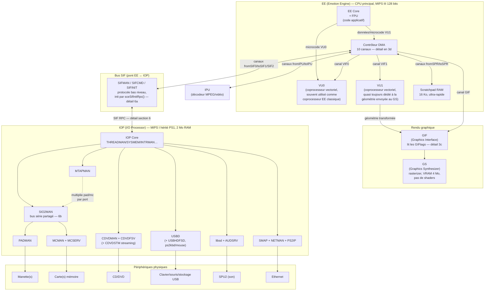

**PS2SDK :** Kit de développement pour la PS2 (https://github.com/ps2dev/ps2sdk)

https://ps2dev.github.io/#getting-started
https://www.psdevwiki.com/ps2/Main_Page

Vidéo présentations : https://www.youtube.com/watch?v=kX_JpzxR2Qg&list=PLFZsvEE0TWOsFhZr-9KwLED3Rzlwra_Rm


# 1 - Hardware infrastructure

La PS2 n'a pas un seul CPU mais plusieurs processeurs spécialisés qui communiquent entre eux. L'arborescence du SDK reflète cette architecture (`ee/`, `iop/`, `dvp/`, `gsKit/`).



Ce diagramme consolide tout ce qui est détaillé plus loin dans la note : les 10 canaux DMA (section 3d), le mécanisme GIFtag/GIF (section 3c), le bus SIF et la hiérarchie des modules IOP (section 6a-e).

| Hardware                       | Description                                                                                                                            | Toolchain / accès depuis le SDK                                                     |
| ------------------------------- | ---------------------------------------------------------------------------------------------------------------------------------------- | ------------------------------------------------------------------------------------ |
| EE (Emotion Engine)             | Processeur principal de la PS2, MIPS 64 bits (utilisé surtout en 32 bits en pratique). Exécute le code applicatif.                       | `ee/bin/mips64r5900el-ps2-elf-*`, headers `ee/include`                               |
| VU0 / VU1                       | Coprocesseurs vectoriels de l'EE, programmables en microcode (assembleur VU). VU1 quasi toujours dédié à la géométrie envoyée au GS.     | assembleur/compilateur VU : `openvcl`, `masp` (dans `bin/`)                          |
| DMA (EE)                        | Contrôleur à 10 canaux qui déplace les données (RAM → GIF, RAM → VU...) sans bloquer le CPU.                                             | `dmaKit.h` (gsKit), lib `-ldma`                                                       |
| Graphics Synthesizer (GS)       | GPU de la PS2 = rasterizer, pas de shaders. Pilotée en lui envoyant des paquets **GIF** construits par l'EE/VU1 via DMA.                 | `gsKit.h`, `gsVU1.h`, lib `-lgraph`/`-ldraw`                                          |
| IOP (I/O Processor)             | 2ᵉ CPU, plus modeste (MIPS I, hérité de la PS1), très peu de RAM (2 Mo). Gère tout ce qui touche à l'I/O (CD/DVD, mémoire, pad, USB, réseau, son). | `iop/bin/mipsel-none-elf-*`, headers `iop/include`                                    |
| Modules IRX                     | Code IOP packagé en modules chargeables au runtime (`.irx`). 212 modules précompilés fournis (cdvd, usbd, audsrv, memcard...).           | `ps2sdk/iop/irx`                                                                      |
| SIF (Sub-system Interface)      | Bus/pont EE ↔ IOP. La communication se fait via **SIF RPC** : l'EE envoie une requête à un module IRX chargé côté IOP, qui répond.       | samples `ps2sdk/samples/rpc/*` (pad, memorycard, audsrv, filexio, mtap, poweroff...) |
| DVP                             | 3ᵉ processeur, marginal (traitement vidéo/IPU), toolchain séparé. Rarement utilisé en homebrew classique.                                | `dvp/bin/dvp-*`                                                                       |

**Limites à retenir :**
- L'EE ne parle **jamais directement** aux périphériques (pad, mémoire, CD) — c'est toujours le rôle de l'IOP, via SIF RPC.
- L'IOP est lent et a très peu de RAM → jamais de calcul lourd ni de rendu côté IOP, uniquement de l'I/O.
- Conséquence pratique : dans presque tout programme PS2, il y a une étape explicite de **chargement de modules IRX** avant de pouvoir utiliser un pad, une carte mémoire ou le CD — ce n'est jamais "juste disponible" comme sur un OS classique.
- Le GS n'est pas programmable comme un GPU moderne : pas de shaders, on lui envoie des paquets GIF (registres/textures/primitives) — `gsKit` évite d'avoir à les construire à la main.


# 2 - Sdk


## Makefile

*Exemple Makefile:*
```Makefile
EE_BIN=test.elf
EE_OBJS=main.o

EE_LIBS=-ldma -lgraph -ldraw -lkernel -ldebug

EE_CFLAGS += -Wall --std=c99
EE_LDFLAGS = -L$(PS2SDK)/ee/common/lib -L$(PS2SDK)/ee/lib


PS2SDK=/usr/local/ps2dev/ps2sdk

ISO_TGT=test.iso

include $(PS2SDK)/samples/Makefile.eeglobal
include $(PS2SDK)/samples/Makefile.pref

all: $(ISO_TGT)

$(ISO_TGT): $(EE_BIN)
	mkisofs -l -o $(ISO_TGT) $(EE_BIN) SYSTEM.CNF

.PHONY: docker-build
docker-build:
	docker run -v $(shell pwd):/src ps2build make


.PHONY: clean
clean:
	rm -rf $(ISO_TGT) $(EE_BIN) $(EE_OBJS)
```


La ps2 lira le fichier `.elf` en sortie (executable et linkable)
il contient toute sorte de données, notamment les métadonnées liée à l'accès de la mémoire

On inclue une série de libraire importante :
- ldma : Direct Memory Access
- lgraph : Graphics Synthesizer
- ldraw : fonctions de dessin
- lkernel : fonction de système de base
- ldebug : affichage de debug (souvent `scr_printf`)

`EE_CFLAGS` existe déjà dans `$(PS2SDK)/samples/Makefile.eeglobal`. On ajoute juste quelques flags de compilation : `EE_CFLAGS += -Wall --std=c99`

`EE_LFLAGS` prend les valeurs contenue dans PS2SDK pour agrémenter en arguments l'éditeur de liaison

Les variable par défaut sont définies dans `$(PS2SDK)/samples/Makefile.pref`
Les règles de compilations de base sont définies dans `$(PS2SDK)/samples/Makefile.eeglobal`

Les règles
- On génère `.c` -> `.o` (règle implicite dans `Makefile.eeglobal`)
- `.o` -> `.elf` (règle implicite dans `Makefile.eeglobal`)
- `.elf` -> `.iso` (`mkisofs`)


`SYSTEM.CNF` -> fichier lu en premier lieu à la lecture du disque. Il permet d'identifier quel binaire exécuter

```SYSTEM.CNF
BOOT2 = cdrom0:\TEST.ELF;1
VER = 0.0
VMODE = NTSC
```

>[!Note]
>`bear -- make` permet de créer un `compile_commands.json` qui va être lu par le LSP et permettre un environnement de développement adapté en fonction des librairies incluse dans le makefile

Exemple de `.clangd` pour indiquer à l'éditeur quel compilateur utiliser 
```.clangd
CompileFlags:
  Add:
    - --target=mips64el-unknown-elf
	- -isystem/usr/local/ps2dev/ee/lib/gcc/mips64r5900el-ps2-elf/15.2.0/include

    - -isystem/usr/local/ps2dev/ee/lib/gcc/mips64r5900el-ps2-elf/15.2.0/include-fixed
    - -isystem/usr/local/ps2dev/ee/mips64r5900el-ps2-elf/include
```

## Architecture de base d'un programme

Pas d'OS derrière l'ELF : le programme tourne "bare metal" sur l'EE. Le squelette qui revient dans presque tous les samples (`graph.c`, `pad.c`, `mc_example.c`, `filexio/main.c`) :

1. **Includes de base** : `tamtypes.h` (types genre `u32`/`u64`), `kernel.h`, et dès qu'on touche à un périphérique → `sifrpc.h`.
2. **`sceSifInitRpc(0)`** — initialise le canal RPC vers l'IOP. Obligatoire dès qu'on veut parler pad/carte mémoire/CD/réseau.
3. **Chargement des modules IRX** nécessaires, deux méthodes selon que le module existe déjà en ROM de la console ou pas :
   - `SifLoadModule("rom0:PADMAN", 0, NULL)` → charge un module déjà présent dans la ROM de l'IOP (ex: `SIO2MAN`, `PADMAN`, `MCMAN`, `MCSERV`).
   - Pour un module qui n'est *pas* en ROM (ex: `iomanX`, `fileXio`) : on l'embarque dans l'ELF au moment du build via `bin2c` (voir `Makefile` de `samples/rpc/filexio` : règle `%_irx.c: ... bin2c $(PS2SDK)/iop/irx/$*.irx $@`), puis on le charge au runtime avec `SifExecModuleBuffer(&mon_irx, size_mon_irx, 0, NULL, NULL)`.
4. **Initialisation de la lib applicative correspondante** : `padInit()`, `mcInit(MC_TYPE_MC)`, `fileXioInit()`...
5. **Boucle principale** (`for(;;)`) : lecture d'entrées, logique, rendu.
6. **Fin** : `SleepThread()` — il n'y a personne pour récupérer le `return` de `main()` puisqu'il n'y a pas d'OS ; on endort le thread au lieu de "quitter".

> [!Note]
> Il existe une variante "module relocatable" (`.erl`, voir `samples/hello`) chargée dynamiquement par un `erl-loader.elf`, mais c'est un cas plus avancé (chargement dynamique de code) — le cas standard reste l'ELF autonome + `SYSTEM.CNF` déjà documenté plus haut.


# 3 - Afficher quelque chose à l'écran

Deux niveaux, du plus simple au plus "réel" :

## a) Texte de debug rapide (`libdebug`)

Pratique pour débugger sans passer par le pipeline graphique complet (`samples/debug/helloworld`) :

*Fichier complet, `samples/debug/helloworld/helloworld.c` :*

```c
#include <sifrpc.h>
#include <debug.h>
#include <unistd.h>

int main(int argc, char *argv[])
{
    sceSifInitRpc(0);
    init_scr();

    scr_printf("Hello, World!\n");

    // Apres 5 secondes, on efface l'ecran.
    sleep(5);
    scr_clear();

    // Deplace le curseur en 20, 20
    scr_setXY(20, 20);
    scr_printf("Hello Again, World!\n");

    sleep(10);

    return 0;
}
```

*Makefile associé (`EE_LIBS`) :*
```makefile
EE_BIN = helloworld.elf
EE_OBJS = helloworld.o
EE_LIBS = -ldebug

include $(PS2SDK)/samples/Makefile.pref
include $(PS2SDK)/samples/Makefile.eeglobal
```

`scr_printf` dessine du texte directement via le GS, un peu comme une console — pas besoin de gérer framebuffer/DMA/GIF soi-même.

## b) Vrai rendu graphique (`libgraph` + `libdraw`, bas niveau)

Le principe, en résumé, avant le code :

1. `dma_channel_initialize(DMA_CHANNEL_GIF, NULL, 0)` — init du canal DMA dédié au GIF (Graphics Interface).
2. Allouer un framebuffer en VRAM : `graph_vram_allocate(width, height, psm, GRAPH_ALIGN_PAGE)`.
3. `graph_initialize(frame.address, width, height, psm, 0, 0)` — relie ce framebuffer aux circuits d'affichage (le rendu à l'écran proprement dit).
4. Construire un **paquet GIF** (macros `PACK_GIFTAG`, registres `GIF_REG_PRIM`/`GIF_REG_RGBAQ`/`GIF_REG_XYZ2`) décrivant les primitives à dessiner.
5. Envoyer ce paquet au GS via DMA : `dma_channel_send_normal(DMA_CHANNEL_GIF, packet->data, ...)`.
6. `draw_wait_finish()` puis `graph_wait_vsync()` pour synchroniser avec le rafraîchissement écran (éviter le tearing).

**Synoptique des échanges entre processeurs** (chemin bas niveau de `graph.c` — pas de VU1 ici, l'EE construit et envoie le paquet directement) :

```
        EE                                DMA (canal GIF)                       GS
  ┌──────────────┐                    ┌────────────────────┐              ┌──────────────┐
  │ construit le  │  dma_channel_      │  copie RAM → GS     │   paquet     │  exécute le   │
  │ paquet GIF    │─ send_normal() ──► │  en tâche de fond    │─ GIF ──────► │  dessin des   │
  │ en RAM        │  (non bloquant,    │  (l'EE continue      │              │  primitives   │
  │ (packet_t)    │   l'EE est libre)  │   son thread)        │              │  (triangles)  │
  └──────┬────────┘                    └──────────┬──────────┘              └──────┬───────┘
         │                                          │                                │
         │  draw_wait_finish() ◄── interruption fin de transfert DMA ────────────────┘
         │  (attend que le DMA ait fini d'envoyer)
         │
         │  graph_wait_vsync() ◄── interruption VBLANK (retour vertical écran, 50/60 Hz)
         │  (attend le rafraîchissement pour éviter le tearing)
         ▼
   boucle suivante (frame suivante)
```

Le point clé : `dma_channel_send_normal` **ne bloque pas** l'EE — le transfert RAM→GS se fait en parallèle, pendant que l'EE pourrait préparer autre chose. Les deux points de synchronisation explicites (`draw_wait_finish`/`graph_wait_vsync`) sont volontairement placés par le programmeur pour garantir l'ordre (ne pas réécrire le paquet avant que le DMA l'ait consommé, ne pas dessiner une nouvelle frame avant l'affichage de la précédente).

C'est bas niveau — on construit les tags GIF à la main. **`gsKit`** (`gsKit.h`, `gsVU1.h`) existe justement pour éviter ça en fournissant des fonctions de dessin haut niveau (sprites, primitives, textures) qui génèrent les paquets GIF pour toi ; c'est la lib à privilégier pour un vrai projet plutôt que refaire `draw.h` à la main.

*Fichier complet, `samples/graph/graph.c` (dessine 20 carrés colorés puis dort) :*

```c
#include <kernel.h>
#include <tamtypes.h>
#include <stdio.h>

#include <gif_tags.h>
#include <gs_gp.h>
#include <gs_psm.h>

#include <dma.h>
#include <dma_tags.h>

#include <draw.h>
#include <graph.h>
#include <packet.h>

void init_gs(framebuffer_t *frame, zbuffer_t *z)
{
    // Framebuffer 32-bit 512x512.
    frame->width = 512;
    frame->height = 512;
    frame->mask = 0;
    frame->psm = GS_PSM_32;

    // Allocation de la vram pour le framebuffer.
    frame->address = graph_vram_allocate(frame->width, frame->height, frame->psm, GRAPH_ALIGN_PAGE);

    // Zbuffer desactive.
    z->enable = 0;
    z->address = 0;
    z->mask = 0;
    z->zsm = 0;

    // Initialise l'ecran et relie le framebuffer aux circuits d'affichage.
    graph_initialize(frame->address, frame->width, frame->height, frame->psm, 0, 0);
}

void init_drawing_environment(packet_t *packet, framebuffer_t *frame, zbuffer_t *z)
{
    qword_t *q = packet->data;

    q = draw_setup_environment(q, 0, frame, z);
    q = draw_finish(q);

    // Envoie le paquet, pas besoin d'attendre puisque c'est le premier.
    dma_channel_send_normal(DMA_CHANNEL_GIF, packet->data, q - packet->data, 0, 0);
    draw_wait_finish();
}

void render(packet_t *packet, framebuffer_t *frame)
{
    int loop0;
    qword_t *q;

    dma_wait_fast();

    q = packet->data;
    q = draw_clear(q, 0, 0, 0, frame->width, frame->height, 0, 0, 0);
    q = draw_finish(q);

    dma_channel_send_normal(DMA_CHANNEL_GIF, packet->data, q - packet->data, 0, 0);
    draw_wait_finish();
    graph_wait_vsync();

    // Dessine 20 carres de 100x100 depuis l'origine.
    for (loop0 = 0; loop0 < 20; loop0++) {
        q = packet->data;
        dma_wait_fast();

        PACK_GIFTAG(q, GIF_SET_TAG(4, 1, 0, 0, 0, 1), GIF_REG_AD);
        q++;
        PACK_GIFTAG(q, GIF_SET_PRIM(6, 0, 0, 0, 0, 0, 0, 0, 0), GIF_REG_PRIM);
        q++;
        PACK_GIFTAG(q, GIF_SET_RGBAQ((loop0 * 10), 0, 255 - (loop0 * 10), 0x80, 0x3F800000), GIF_REG_RGBAQ);
        q++;
        PACK_GIFTAG(q, GIF_SET_XYZ(((loop0 * 20) << 4) + (2048 << 4), ((loop0 * 10) << 4) + (2048 << 4), 0), GIF_REG_XYZ2);
        q++;
        PACK_GIFTAG(q, GIF_SET_XYZ((((loop0 * 20) + 100) << 4) + (2048 << 4), (((loop0 * 10) + 100) << 4) + (2048 << 4), 0), GIF_REG_XYZ2);
        q++;

        q = draw_finish(q);

        dma_channel_send_normal(DMA_CHANNEL_GIF, packet->data, q - packet->data, 0, 0);
        draw_wait_finish();
        graph_wait_vsync();
    }
}

int main(void)
{
    framebuffer_t frame;
    zbuffer_t z;

    packet_t *packet = packet_init(50, PACKET_NORMAL);

    dma_channel_initialize(DMA_CHANNEL_GIF, NULL, 0);
    dma_channel_fast_waits(DMA_CHANNEL_GIF);

    init_gs(&frame, &z);
    init_drawing_environment(packet, &frame, &z);
    render(packet, &frame);

    graph_vram_free(frame.address);
    packet_free(packet);

    graph_shutdown();
    dma_channel_shutdown(DMA_CHANNEL_GIF, 0);

    SleepThread();

    return 0;
}
```

*Makefile associé :*
```makefile
EE_BIN = graph.elf
EE_OBJS = graph.o
EE_LIBS = -lpacket -ldma -lgraph -ldraw -lc

include $(PS2SDK)/samples/Makefile.pref
include $(PS2SDK)/samples/Makefile.eeglobal
```

## c) Paquets GIF : `PACK_GIFTAG` et les registres `GIF_REG_*`

`PACK_GIFTAG` est la macro la plus bas niveau du dessin en libdraw/libgraph : elle écrit un quadword (128 bits) brut dans le paquet, en assemblant deux valeurs 64 bits (`common/include/gif_tags.h:76-78`) :

```c
#define PACK_GIFTAG(Q, D0, D1) \
    Q->dw[0] = (u64)(D0),      \
    Q->dw[1] = (u64)(D1)
```

`Q` est un pointeur `qword_t*` (un quadword = 16 octets = l'unité de transfert du GIF/DMA, cf. section 3b/3c). La macro se contente de poser `D0` dans les 64 bits bas et `D1` dans les 64 bits hauts — elle ne connaît rien au GIF en elle-même, c'est un simple "pack 2×64→128 bits". Son sens vient des valeurs qu'on y met, produites par les macros `GIF_SET_*` du même header.

**Un paquet GIF = un GIFtag (en-tête) suivi de N qwords de données.** Le GIFtag décrit ce qui suit (`GIF_SET_TAG(nloop, eop, pre, prim, flg, nreg)`) :

```c
PACK_GIFTAG(q, GIF_SET_TAG(4, 1, 0, 0, 0, 1), GIF_REG_AD);
q++;
```
- `nloop=4` : 4 qwords de données suivent.
- `eop=1` : fin de paquet après ces données (*End Of Packet*).
- `flg=0` : mode **PACKED** (voir plus bas).
- `nreg=1` : un seul registre décrit par qword de données (ici via A+D, voir plus bas).
- D1 = `GIF_REG_AD` (0x0E) : indique que chaque qword suivant est une paire **adresse+donnée** (mode "A+D"), qui permet d'écrire n'importe quel registre GS directement — c'est le cas particulier le plus utilisé du mode PACKED.

Ensuite, chaque qword de données en A+D suit le même schéma `PACK_GIFTAG(q, valeur, registre_cible)` :

```c
PACK_GIFTAG(q, GIF_SET_PRIM(...), GIF_REG_PRIM);   // D0 = valeur du registre PRIM,  D1 = n° du registre PRIM
PACK_GIFTAG(q, GIF_SET_RGBAQ(...), GIF_REG_RGBAQ); // D0 = valeur du registre RGBAQ, D1 = n° du registre RGBAQ
PACK_GIFTAG(q, GIF_SET_XYZ(...), GIF_REG_XYZ2);    // D0 = valeur du registre XYZ2,  D1 = n° du registre XYZ2
```
Chaque appel avance le paquet d'un quadword : la donnée dans `dw[0]`, l'identifiant du registre GS ciblé dans `dw[1]`.

Registres GS ciblables via A+D, `common/include/gif_tags.h` (liste non exhaustive) :

| Constante `GIF_REG_*` | Registre GS | Rôle |
|---|---|---|
| `GIF_REG_PRIM` | PRIM | Type de primitive à dessiner (point, ligne, triangle, sprite...) et options (gouraud, texture, AA...) |
| `GIF_REG_RGBAQ` | RGBAQ | Couleur/alpha courants (+ composante Q pour la perspective texture) |
| `GIF_REG_ST` | ST | Coordonnées de texture flottantes (avant division perspective) |
| `GIF_REG_UV` | UV | Coordonnées de texture entières (après division perspective) |
| `GIF_REG_XYZ2` | XYZ2 | Position d'un vertex (« draw kick » — déclenche le dessin) |
| `GIF_REG_XYZF2` | XYZF2 | Position d'un vertex + fog |
| `GIF_REG_XYZ3` / `GIF_REG_XYZF3` | XYZ3/XYZF3 | Variante vertex sans « draw kick » (utile en continuation) |
| `GIF_REG_TEX0_1`/`_2` | TEX0 (contexte 1/2) | Paramètres de texture (adresse VRAM, PSM, taille...) |
| `GIF_REG_CLAMP_1`/`_2` | CLAMP (contexte 1/2) | Mode de répétition/clamp des textures |
| `GIF_REG_FOG` | FOG | Valeur de fog du vertex |
| `GIF_REG_AD` | — | Marqueur "mode A+D" utilisé dans le GIFtag lui-même, pas un registre GS |
| `GIF_REG_NOP` | — | Qword ignoré (padding) |

>[!Note]
>Un GIFtag peut fonctionner selon 3 modes (`flg` dans `GIF_SET_TAG`, constantes `GIF_FLG_PACKED`/`GIF_FLG_REGLIST`/`GIF_FLG_IMAGE`) : **PACKED** (le plus courant, données sur 128 bits alignées, dont A+D est un cas particulier), **REGLIST** (données compactées sur 64 bits, sans padding), **IMAGE** (transfert brut vers la VRAM, ex: upload de texture). `graph.c` (section 3b) utilise PACKED + A+D car c'est le plus simple à écrire à la main ; **gsKit** fait exactement ce travail de construction de GIFtag/registres à la place du développeur.

**Décodage bit à bit, exemple réel tiré de `graph.c` :**

```c
PACK_GIFTAG(q, GIF_SET_TAG(4, 1, 0, 0, 0, 1), GIF_REG_AD);
```
`GIF_SET_TAG(NLOOP=4, EOP=1, PRE=0, PRIM=0, FLG=0, NREG=1)` :

| Champ | Bits | Valeur ici | Sens |
|---|---|---|---|
| `NLOOP` | 0-14 | 4 | 4 qwords de données suivent |
| `EOP` | 15 | 1 | fin de paquet après ces données |
| *(réservé)* | 16-45 | — | non utilisé |
| `PRE` | 46 | 0 | ne force pas de valeur PRIM depuis le tag |
| `PRIM` | 47-57 | 0 | (ignoré puisque `PRE=0`) |
| `FLG` | 58-59 | 0 | mode PACKED |
| `NREG` | 60-63 | 1 | 1 seul descripteur de registre (ici `AD`) |

Calcul du mot brut résultant, en posant chaque champ à sa position puis OR :
```
NLOOP=4        → 0x0000000000000004
EOP=1 (bit 15) → 0x0000000000008000
NREG=1 (bit60) → 0x1000000000000000
                 -------------------
                 0x1000000000008004   ← valeur exacte de Q->dw[0]
```

Chaque macro `GIF_SET_*` (ou `DMATAG`, section 3e) est un encodeur d'instruction : elle place des valeurs à des offsets de bits précis dans un mot 64 bits, comme un assembleur encode opcode+opérandes en un mot machine. `PACK_GIFTAG` (ou `PACK_DMATAG`) est le "store" qui écrit ce mot en mémoire à l'emplacement `Q`.

**Méthode générale pour décoder un tag (GIFtag ou DMAtag) à la main :**
1. Repérer le type de tag selon le contexte : DMAtag, lu par le contrôleur DMA en mode chaîné (section 3e) ; GIFtag, lu par le GIF une fois les données arrivées (ci-dessus).
2. Prendre la définition bit à bit dans le header concerné (`gif_tags.h` ici, `dma_tags.h` en section 3e).
3. Pour chaque champ : `(valeur & masque) << décalage`.
4. OR de tous les champs → mot 64 bits final.
5. Pour un GIFtag en mode PACKED, le second qword (`D1` dans `PACK_GIFTAG`) contient la liste des registres (4 bits chacun, jusqu'à `NREG` entrées) qui dit dans quel ordre interpréter les qwords de données suivants — sauf en mode A+D (`GIF_REG_AD`) où chaque qword de donnée porte lui-même son adresse de registre (voir ci-dessus).

## d) Les 10 canaux DMA de l'EE

Le tableau matériel (section 1) mentionne le contrôleur DMA "10 canaux" — détail des canaux, `ee/include/dma.h:22-31` :

| Constante | Valeur | Rôle |
|---|---|---|
| `DMA_CHANNEL_VIF0` | 0x00 | RAM → VU0 (via VIF0, Vector Interface 0) |
| `DMA_CHANNEL_VIF1` | 0x01 | RAM → VU1 (via VIF1) — le plus utilisé pour envoyer la géométrie/microcode à VU1 |
| `DMA_CHANNEL_GIF` | 0x02 | RAM (ou VU1) → GS, via le GIF (Graphics Interface) — utilisé dans `samples/graph/graph.c` (section 3b) pour envoyer les paquets GIF |
| `DMA_CHANNEL_fromIPU` | 0x03 | IPU (décodeur vidéo/MPEG) → RAM |
| `DMA_CHANNEL_toIPU` | 0x04 | RAM → IPU |
| `DMA_CHANNEL_fromSIF0` | 0x05 | IOP → EE, sens entrant du bus SIF (réception RPC/données depuis l'IOP) |
| `DMA_CHANNEL_toSIF1` | 0x06 | EE → IOP, sens sortant du bus SIF (envoi RPC/données vers l'IOP) |
| `DMA_CHANNEL_SIF2` | 0x07 | Canal SIF additionnel, bidirectionnel, peu utilisé (accès direct IOP↔EE hors protocole RPC standard) |
| `DMA_CHANNEL_fromSPR` | 0x08 | Scratchpad RAM → RAM principale |
| `DMA_CHANNEL_toSPR` | 0x09 | RAM principale → Scratchpad RAM |

Points à retenir :
- VIF0/VIF1/GIF sont les canaux "graphiques" : chemin typique de rendu RAM → VIF1 → VU1 (transformation géométrie) → GIF → GS.
- `fromSIF0`/`toSIF1` sont les deux moitiés du canal utilisé implicitement par `sceSifInitRpc`/`SifLoadModule`/tous les appels RPC (section 4/5/6) — c'est le pont EE↔IOP.
- `fromSPR`/`toSPR` servent à décharger du travail vers la scratchpad RAM (16 Ko) de l'EE, sans passer par le bus principal.
- `fromIPU`/`toIPU` ne sont utiles que pour du décodage MPEG/vidéo côté EE (`samples/mpeg`).

## e) Le DMAtag — chaînage côté DMA, et sa relation avec le GIFtag

Il y a deux langages de tags séparés, à deux étages différents du pipeline. Le GIFtag (section 3c) et le DMAtag ne sont pas la même chose et ne sont pas lus par le même matériel :

```
   EE (RAM)                    Contrôleur DMA                    GIF                    GS
┌────────────┐   lit le      ┌────────────────┐   transfère   ┌──────────┐   dessine  ┌────┐
│ données +   │──DMAtag──────►│ décide QUOI     │──les qwords──►│ lit le   │───────────►│    │
│ DMAtags +   │   (optionnel) │ lire et OÙ      │   au GIF       │ GIFtag   │            │    │
│ GIFtags     │               │ aller ensuite   │                │ qui suit │            │    │
└────────────┘               └────────────────┘                └──────────┘            └────┘
```

- Le **DMAtag** (`ee/include/dma_tags.h`) est lu par le contrôleur DMA lui-même (le matériel qui parcourt la RAM). Il répond à « quel bloc de qwords envoyer, et par où continuer après ? » — un mini-langage de chaînage mémoire.
- Le **GIFtag** (`common/include/gif_tags.h`, section 3c) est lu par le GIF une fois les données arrivées. Il répond à « comment interpréter les qwords qui suivent pour écrire les registres du GS ? » — un mini-langage d'écriture de registres.

Le DMA ne comprend rien au contenu GIF, et le GIF ne sait pas comment il a été acheminé : deux couches indépendantes, empilées.

Le DMAtag n'existe que si on utilise le **mode chaîné** du DMA (`dma_channel_send_chain`). `graph.c` (section 3b) utilise `dma_channel_send_normal` — mode normal, qui envoie un bloc fixe de qwords sans aucun DMAtag ; `dma_tags.h` y est inclus mais n'y sert jamais vraiment. Le DMAtag devient utile pour enchaîner plusieurs paquets (double-buffering VU1, ce que gsKit fait en interne) sans repasser par l'EE entre chaque bloc.

Format brut, `ee/include/dma_tags.h:46-49` :
```c
#define DMATAG(QWC,PCE,ID,IRQ,ADDR,SPR) \
    (u64)((QWC)  & 0x0000FFFF) <<  0 | (u64)((PCE) & 0x00000003) << 26 | \
    (u64)((ID)   & 0x00000007) << 28 | (u64)((IRQ) & 0x00000001) << 31 | \
    (u64)((ADDR) & 0x7FFFFFFF) << 32 | (u64)((SPR) & 0x00000001) << 63
```

| Champ | Bits | Rôle |
|---|---|---|
| `QWC` | 0-15 | Nombre de qwords du bloc de données qui suit ce tag |
| `PCE` | 26-27 | Contrôle de priorité (rarement utilisé) |
| `ID` | 28-30 | L'opcode — quel `DMA_TAG_*` |
| `IRQ` | 31 | Déclenche une interruption après ce tag |
| `ADDR` | 32-62 | Adresse mémoire (suivant à lire, cible d'un saut selon l'opcode) |
| `SPR` | 63 | 1 = l'adresse pointe vers la Scratchpad RAM plutôt que la RAM principale |

Opcodes (`ID`), `dma_tags.h:28-44` :

| Constante | Valeur | Effet (façon assembleur) |
|---|---|---|
| `DMA_TAG_CNT` | 0x01 | Bloc de `QWC` qwords suit, puis continue juste après (séquentiel) |
| `DMA_TAG_NEXT` | 0x02 | Bloc de `QWC` qwords suit, puis saute à `ADDR` (comme `jmp`) |
| `DMA_TAG_REF`/`REFS` | 0x03/0x04 | Le bloc de `QWC` qwords est ailleurs, à `ADDR` (comme un `call` sans retour) ; `REFS` ajoute un contrôle de stall |
| `DMA_TAG_REFE` | 0x00 | Comme `REF`, mais c'est le dernier bloc (fin de chaîne) |
| `DMA_TAG_CALL` | 0x05 | Lit `QWC` qwords ici, empile l'adresse de retour (`ASR0`), puis saute à `ADDR` (comme `call`) |
| `DMA_TAG_RET` | 0x06 | Dépile et reprend où `CALL` s'était arrêté (comme `ret`) ; pile vide → fin |
| `DMA_TAG_END` | 0x07 | Bloc de `QWC` qwords, puis fin de transfert |

`PACK_DMATAG(Q, D0, W2, W3)` (`dma_tags.h:51-54`) fait comme `PACK_GIFTAG` : pose la valeur brute `D0` (le tag) dans `Q->dw[0]`, et deux mots 32 bits optionnels (`W2`/`W3`, souvent STADR pour le mode `CNTS`) dans les positions hautes du qword.

## f) PSM — format de stockage des pixels

**PSM** = *Pixel Storage Method* (aussi vu "Pixel Storage Mode/Matrix" selon les docs). C'est le format d'encodage des pixels utilisé par le GS pour un framebuffer, une texture ou un Z-buffer en VRAM (profondeur de couleur, présence d'alpha, indexé ou non). C'est le champ `frame->psm`/`z->zsm` vu dans `init_gs()` ci-dessus (`GS_PSM_32`, section 3b), et `gsGlobal->PSM`/`PSMZ` côté gsKit.

>[!Note]
>Il existe **deux jeux de constantes différents** pour le même concept, à ne pas confondre :
>- `common/include/gs_psm.h` (ps2sdk bas niveau, utilisé par `libgraph`/`libdraw`, ex. `graph.c` section 3b) : `GS_PSM_*` pour la couleur, `GS_PSMZ_*` pour le Z-buffer avec des **valeurs différentes** (offset `+0x30`).
>- `gsKit/include/gsInit.h` (gsKit) : `GS_PSM_CT*`/`GS_PSM_T*` pour la couleur/textures, `GS_PSMZ_*` pour le Z-buffer, qui reprend **les mêmes valeurs numériques que la couleur** (0x00/0x01/0x02/0x0A) car c'est le registre `ZBUF` du GS qui donne le contexte.

Formats couleur/texture, `common/include/gs_psm.h:9-29` (ps2sdk) et `gsKit/include/gsInit.h:110-127` (gsKit, noms entre parenthèses) :

| Valeur | ps2sdk (`gs_psm.h`) | gsKit (`gsInit.h`) | Description |
|---|---|---|---|
| 0x00 | `GS_PSM_32` | `GS_PSM_CT32` | RGBA 32 bits (8:8:8:8) |
| 0x01 | `GS_PSM_24` | `GS_PSM_CT24` | RGB 24 bits (8:8:8, pas d'alpha) |
| 0x02 | `GS_PSM_16` | `GS_PSM_CT16` | RGBA 16 bits (5:5:5:1) |
| 0x0A | `GS_PSM_16S` | `GS_PSM_CT16S` | RGBA 16 bits, variante "entrelacée" (`S` = stockage alterné, meilleure perf DMA) |
| 0x13 | `GS_PSM_8` | `GS_PSM_T8` | Indexé 8 bits (palette/CLUT) |
| 0x14 | `GS_PSM_4` | `GS_PSM_T4` | Indexé 4 bits (palette/CLUT) |

Formats Z-buffer, `common/include/gs_psm.h:30-37` (ps2sdk) vs `gsKit/include/gsInit.h:129-136` (gsKit) — attention, valeurs **différentes** :

| Profondeur | ps2sdk `GS_PSMZ_*` | gsKit `GS_PSMZ_*` |
|---|---|---|
| 32 bits | 0x30 | 0x00 |
| 24 bits | 0x31 | 0x01 |
| 16 bits | 0x32 | 0x02 |
| 16 bits (S) | 0x3A | 0x0A |

Le choix du PSM a un impact direct sur la consommation de VRAM (le GS n'en a que 4 Mo) et la qualité de couleur/alpha disponible : `CT24` économise de la VRAM mais perd l'alpha, `CT16`/`CT16S` divisent par deux la taille mais réduisent la précision couleur (5 bits/canal, 1 bit d'alpha), `T8`/`T4` sont réservés aux textures indexées (avec CLUT via `gsKit_texture_send`/`GS_SET_TEXA` côté texturing, non détaillé ici).


# 4 - Utiliser la manette (pad)

Le pad est un périphérique IOP comme un autre : il faut charger ses modules avant de pouvoir le lire (`samples/rpc/pad/pad.c`) :

*Version complète et compilable (dérivée de `samples/rpc/pad/pad.c`) :*

```c
#include <tamtypes.h>
#include <kernel.h>
#include <sifrpc.h>
#include <loadfile.h>
#include <stdio.h>
#include <libpad.h>

// Buffer d'etat du pad, doit etre aligne sur 64 octets.
static char padBuf[256] __attribute__((aligned(64)));

static void loadModules(void)
{
    int ret;

    ret = SifLoadModule("rom0:SIO2MAN", 0, NULL);
    if (ret < 0) {
        printf("sifLoadModule sio failed: %d\n", ret);
        SleepThread();
    }

    ret = SifLoadModule("rom0:PADMAN", 0, NULL);
    if (ret < 0) {
        printf("sifLoadModule pad failed: %d\n", ret);
        SleepThread();
    }
}

static void waitPadReady(int port, int slot)
{
    int state = padGetState(port, slot);
    while (state != PAD_STATE_STABLE && state != PAD_STATE_FINDCTP1) {
        state = padGetState(port, slot);
    }
}

int main(void)
{
    int port = 0; // 0 -> connecteur 1, 1 -> connecteur 2
    int slot = 0; // toujours 0 si pas de multitap
    struct padButtonStatus buttons;
    u32 paddata, old_pad = 0, new_pad;

    sceSifInitRpc(0);
    loadModules();
    padInit(0);

    if (padPortOpen(port, slot, padBuf) == 0) {
        printf("padPortOpen failed\n");
        SleepThread();
    }

    waitPadReady(port, slot);

    for (;;) {
        waitPadReady(port, slot);

        if (padRead(port, slot, &buttons) != 0) {
            // Les bits sont a 0 quand le bouton est appuye -> on inverse.
            paddata = 0xffff ^ buttons.btns;
            new_pad = paddata & ~old_pad;
            old_pad = paddata;

            if (new_pad & PAD_CROSS)    printf("CROSS\n");
            if (new_pad & PAD_TRIANGLE) printf("TRIANGLE\n");
            if (new_pad & PAD_SQUARE)   printf("SQUARE\n");
            if (new_pad & PAD_CIRCLE)   printf("CIRCLE\n");
            if (new_pad & PAD_START)    printf("START\n");
        }
    }

    return 0;
}
```

*Makefile associé :*
```makefile
EE_BIN = pad_example.elf
EE_OBJS = pad.o
EE_LIBS = -lpad -lc

include $(PS2SDK)/samples/Makefile.pref
include $(PS2SDK)/samples/Makefile.eeglobal
```

Points notables :
- `SIO2MAN` gère le port physique (partagé avec la carte mémoire), `PADMAN` gère la logique manette — les deux sont chargés en ROM (`rom0:`).
- Les boutons sont lus par **masque de bits inversé** (`0xffff ^ buttons.btns`) : à l'état de repos les bits sont à 1.
- Le pad a des "modes" (digital, dual shock analogique, avec/sans vibration) qu'on négocie via `padInfoMode`/`padSetMainMode` — c'est ce que fait `initializePad()` dans le sample.
- Les actuateurs de vibration se pilotent avec `padSetActDirect`/`padSetActAlign`.


# 5 - Tour rapide des périphériques (CD-ROM, carte mémoire)

Même logique partout : **charger les modules IOP → initialiser la lib EE → utiliser une API façon fichier**.

## Carte mémoire (`libmc`, `samples/rpc/memorycard/mc_example.c`)

*Version complète et compilable (dérivée de `samples/rpc/memorycard/mc_example.c`) :*

```c
#define NEWLIB_PORT_AWARE

#include <tamtypes.h>
#include <kernel.h>
#include <sifrpc.h>
#include <loadfile.h>
#include <fileio.h>
#include <libmc.h>
#include <stdio.h>

#define ARRAY_ENTRIES 64
static sceMcTblGetDir mcDir[ARRAY_ENTRIES] __attribute__((aligned(64)));

static void loadModules(void)
{
    int ret;

    ret = SifLoadModule("rom0:SIO2MAN", 0, NULL);
    if (ret < 0) {
        printf("Failed to load module: SIO2MAN\n");
        SleepThread();
    }

    ret = SifLoadModule("rom0:MCMAN", 0, NULL);
    if (ret < 0) {
        printf("Failed to load module: MCMAN\n");
        SleepThread();
    }

    ret = SifLoadModule("rom0:MCSERV", 0, NULL);
    if (ret < 0) {
        printf("Failed to load module: MCSERV\n");
        SleepThread();
    }
}

int main(void)
{
    int type, free, format, ret, i;

    sceSifInitRpc(0);
    loadModules();

    if (mcInit(MC_TYPE_MC) < 0) {
        printf("Failed to initialise memcard server!\n");
        SleepThread();
    }

    // Etat de la carte memoire du port 0, slot 0.
    mcGetInfo(0, 0, &type, &free, &format);
    mcSync(0, NULL, &ret);              // les appels mc* sont asynchrones -> mcSync attend le resultat
    printf("Type: %d Free: %d Format: %d\n", type, free, format);

    // Listing du repertoire racine.
    mcGetDir(0, 0, "/*", 0, ARRAY_ENTRIES, mcDir);
    mcSync(0, NULL, &ret);
    printf("Listing racine carte memoire (%d entrees):\n", ret);

    for (i = 0; i < ret; i++) {
        if (mcDir[i].AttrFile & MC_ATTR_SUBDIR)
            printf("[DIR] %s\n", mcDir[i].EntryName);
        else
            printf("%s - %d octets\n", mcDir[i].EntryName, mcDir[i].FileSizeByte);
    }

    // Une fois mcInit fait, l'API fichier standard fonctionne sur mc0:/mc1:
    int fd = open("mc0:PS2DEV/icon.sys", O_RDONLY);
    if (fd >= 0) {
        printf("icon.sys existe deja.\n");
        close(fd);
    }

    SleepThread();
    return 0;
}
```

*Makefile associé :*
```makefile
EE_BIN = mc_example.elf
EE_OBJS = mc_example.o
EE_LIBS = -lmc -lc

include $(PS2SDK)/samples/Makefile.pref
include $(PS2SDK)/samples/Makefile.eeglobal
```

- Le device se nomme `mc0:` (slot 0) / `mc1:` (slot 1), utilisable avec `open`/`read`/`write`/`close`/`mkdir` classiques une fois `mcInit` fait.
- Beaucoup de fonctions `mc*` sont asynchrones : on lance l'opération puis on appelle `mcSync()` pour bloquer jusqu'au résultat.
- Une sauvegarde PS2 typique = un dossier contenant `icon.sys` (métadonnées d'affichage dans le browser : couleurs, éclairage 3D de l'icône, nom en SJIS) + les fichiers d'icône `.icn`.

## CD-ROM / DVD (`fileXio`, `samples/rpc/filexio/main.c`)

*Fichier complet, `samples/rpc/filexio/main.c` :*

```c
#include <iopcontrol.h>
#include <stdint.h>
#include <kernel.h>
#include <loadfile.h>
#include <sbv_patches.h>
#include <stdio.h>
#include <sifrpc.h>
#include <string.h>

#define NEWLIB_PORT_AWARE
#include <fileXio_rpc.h>

int __iomanX_id = -1;
int __fileXio_id = -1;

/* References vers IOMANX.IRX, embarque dans l'ELF (voir Makefile) */
extern unsigned char iomanX_irx[] __attribute__((aligned(16)));
extern unsigned int size_iomanX_irx;

/* References vers FILEXIO.IRX, embarque dans l'ELF (voir Makefile) */
extern unsigned char fileXio_irx[] __attribute__((aligned(16)));
extern unsigned int size_fileXio_irx;

static void reset_IOP(void)
{
    sceSifInitRpc(0);
    // Reset propre de l'IOP avant de charger nos propres modules.
    while (!SifIopReset(NULL, 0)) {};
    while (!SifIopSync()) {};

    sceSifInitRpc(0);
    sbv_patch_enable_lmb();
    sbv_patch_disable_prefix_check();
}

static int loadIRXs(void)
{
    __iomanX_id = SifExecModuleBuffer(&iomanX_irx, size_iomanX_irx, 0, NULL, NULL);
    if (__iomanX_id < 0)
        return -1;

    __fileXio_id = SifExecModuleBuffer(&fileXio_irx, size_fileXio_irx, 0, NULL, NULL);
    if (__fileXio_id < 0)
        return -2;

    return 0;
}

static int init_fileXio_driver(void)
{
    int ret = loadIRXs();
    if (ret < 0)
        return ret;

    return fileXioInit();
}

int main(int argc, char *argv[])
{
    reset_IOP();
    init_fileXio_driver();

    while (1) {
        printf("Hello using fileXio\n");
    }

    return 0;
}
```

*Makefile associé (règle `bin2c` pour embarquer les IRX qui ne sont pas en ROM) :*
```makefile
EE_BIN = filexio_sample.elf
EE_OBJS = main.o
EE_LIBS = -lfileXio -lpatches

IRX_FILES += iomanX.irx fileXio.irx
EE_OBJS += $(IRX_FILES:.irx=_irx.o)

%_irx.c:
	$(PS2SDK)/bin/bin2c $(PS2SDK)/iop/irx/$*.irx $@ $*_irx

include $(PS2SDK)/samples/Makefile.pref
include $(PS2SDK)/samples/Makefile.eeglobal
```

- Une fois `fileXio` initialisé, on accède au disque avec le device `cdrom0:` (même préfixe que dans `SYSTEM.CNF`, ex: `cdrom0:\DATA.BIN;1`) via les fonctions `fileXio*` ou les I/O standard.
- Pour un accès CD/DVD plus bas niveau (lecture de secteurs bruts, type de disque, TOC), il existe `libcdvd` (`cdvd.h`) — utile pour des besoins spécifiques (lecteur de disque audio, vérif de media), mais `fileXio` façon fichier suffit pour l'usage courant (charger des assets depuis le disque).
- Remarque Makefile : la règle `%_irx.c: ... bin2c $(PS2SDK)/iop/irx/$*.irx $@` transforme un `.irx` binaire en tableau C (`.c`) compilé dans l'ELF — c'est la technique standard pour embarquer un module IOP qui n'est pas déjà en ROM.


# 6 - Détail des modules IOP (rôles et différences)

Les modules IOP forment une **hiérarchie en couches**, pas une liste plate : (1) un "micro-noyau" IOP toujours présent, (2) un bus partagé pad/carte mémoire arbitré par SIO2MAN, (3) des paires driver-bas-niveau/serveur-fichier qui reviennent tout le temps, (4) des variantes (X, numérotées, "free") pour des besoins de compatibilité différents.

**Le schéma à retenir partout :** *driver bas niveau* (parle au hardware, secteurs/blocs bruts) → *couche serveur/filesystem* (donne une vue fichiers/répertoires) → *client RPC côté EE* (l'API qu'on appelle réellement : `libpad`, `libmc`, `fileXio`...).

## a) Le "micro-noyau" IOP (déjà chargé, on n'y touche presque jamais)

| Module | Rôle |
|---|---|
| `LOADCORE` | Le chargeur de modules lui-même — charge/relie tous les autres `.irx` (résolution d'imports/exports). |
| `SYSMEM` | Allocateur mémoire côté IOP. |
| `INTRMAN` | Gestionnaire d'interruptions. |
| `THREADMAN` | Ordonnanceur de threads IOP (mini-kernel préemptif). |
| `EXCEPMAN` | Gestion des exceptions CPU. |
| `VBLANK` | Pilote de l'interruption vblank. |
| `SIFMAN` / `SIFCMD` / `SIFINIT` | Implémentation bas niveau du protocole SIF (couche physique + couche commandes/RPC), initialisée sous le capot par `sceSifInitRpc()`. |
| `IOMAN` | API fichier basique héritée PS1 (noms courts façon 8.3). |

Ces modules sont normalement déjà chargés par le firmware avant que l'ELF démarre — on ne les charge soi-même que pour un loader/BIOS custom.

## b) Bus partagé pad + carte mémoire : SIO2MAN

Manettes et cartes mémoire passent par le **même bus série (SIO2)**, un par port. `SIO2MAN` arbitre ce bus ; `PADMAN` et `MCMAN`/`MCSERV` sont construits par-dessus.

```
                 ┌───────────┐
   port 1/2  ──► │  SIO2MAN  │  (arbitre le bus série partagé)
                 └─────┬─────┘
              ┌────────┴────────┐
              ▼                 ▼
         ┌─────────┐      ┌──────────────────┐
         │ PADMAN  │      │  MCMAN + MCSERV   │
         │ (pad)   │      │  (carte mémoire)  │
         └─────────┘      └──────────────────┘
```

| Module | Rôle |
|---|---|
| `SIO2MAN` | Pilote bas niveau du bus SIO2 (les 2 ports contrôleur/carte mémoire physiques). |
| `PADMAN` | Pilote manette, exposé côté EE via `libpad`. |
| `MCMAN` | Pilote **bas niveau** carte mémoire — accès bloc brut. |
| `MCSERV` | Couche **système de fichiers** par-dessus MCMAN (répertoires, `icon.sys`...) + serveur RPC exposé côté EE via `libmc`. |

- **Variantes `X`** (`XSIO2MAN`, `XMCMAN`, `XMCSERV`) : protocole **étendu** ("XMC"), plus rapide/plus de fonctionnalités que le protocole MC classique hérité PS1. C'est le choix fait par `mc_example.c` (`TYPE_XMC` vs `TYPE_MC`) — même API `libmc`, modules IOP différents selon le protocole voulu.
- **Suffixes numériques** (`-1300`/`-1400`/`-2000`/`-old`) : builds différents correspondant à des **révisions de BIOS/ROM** de console (comportement corrigé/changé entre versions). Le fichier sans suffixe = version générique recommandée par défaut.
- **Préfixe `free`** (`freepad`, `freesio2`, `freemtap`) : **réimplémentations libres/homebrew** de ces modules (pas des dumps ROM Sony), utiles quand `rom0:` n'est pas disponible (loaders non officiels, absence de BIOS complet).

## c) IOMAN vs IOMANX vs fileXio — la confusion la plus fréquente

| Module | Rôle | Où ça tourne |
|---|---|---|
| `IOMAN` | API fichier basique héritée PS1 : noms courts, pas de vrai `stat`. | IOP uniquement |
| `IOMANX` | API fichier **étendue façon POSIX** : noms longs, `stat`, sémantique riche. Successeur de IOMAN. | IOP uniquement |
| `fileXio` | **Pont RPC** EE ↔ IOP qui expose les primitives IOMANX au code EE à travers SIF. | Client EE (`fileXio_rpc.h`) + serveur IOP (`fileXio.irx`) |

`IOMAN`/`IOMANX` sont des API **internes à l'IOP** : le code EE ne peut pas les appeler directement (pas de mémoire partagée transparente). Il faut un pont RPC comme `fileXio` pour qu'un `open()`/`read()` côté EE traverse le SIF jusqu'à IOMANX côté IOP. D'où le sample `filexio/main.c` qui charge `iomanX.irx` **et** `fileXio.irx` ensemble : IOMANX fait le travail de filesystem, fileXio fait le pont RPC.

## d) CD/DVD — même schéma driver/filesystem que la carte mémoire

| Module | Rôle |
|---|---|
| `CDVDMAN` | Pilote **bas niveau** CD/DVD — secteurs bruts, détection type de disque, TOC. |
| `CDVDFSV` | Couche **filesystem ISO9660** par-dessus CDVDMAN, expose le device `cdrom0:`. |
| `CDVDSTM` | Variante **streaming** (lecture bufferisée continue, ex: FMV) plutôt qu'accès fichier classique. |

Contrairement à SIO2MAN/PADMAN/MCMAN, ces modules sont **déjà chargés par le firmware** au démarrage — le sample `filexio` ne charge que `iomanX`+`fileXio`, pas `cdvdman`/`cdvdfsv`, car supposés déjà présents.

## e) Autres familles de modules (panorama)

| Domaine | Modules | Rôle |
|---|---|---|
| USB | `USBD` (+ `usbd_mini`) | Pilote hôte USB bas niveau. |
| | `USBHDFSD` | Filesystem FAT par-dessus un périphérique de stockage USB (même logique que MCSERV/CDVDFSV, pour USB). |
| | `ps2kbd` / `ps2mouse` | Pilotes HID clavier/souris par-dessus USBD. |
| Son | `libsd` | Pilote bas niveau SPU2. |
| | `AUDSRV` | Serveur audio haut niveau (mixage, streaming) par-dessus `libsd`. |
| Réseau | `SMAP` | Pilote de la puce Ethernet. |
| | `NETMAN` | Lie les pilotes réseau à la pile protocolaire. |
| | `PS2IP` | Pile TCP/IP (port de lwIP). |
| Multitap | `MTAPMAN` | Permet 4 manettes/cartes mémoire par port. |
| Alim. | `POWEROFF` | RPC pour un arrêt propre de la console. |

