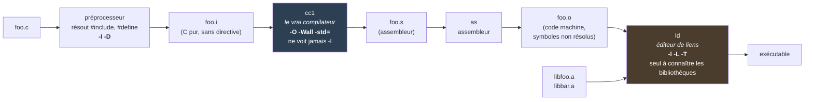

# C - compilation et linkage

> [!abstract] Concept
> Compiler un programme C enchaîne quatre programmes distincts — préprocesseur, compilateur, assembleur, éditeur de liens — orchestrés par `gcc`, qui n'est pas un compilateur mais un *driver* : il analyse ses arguments, décide quoi lancer et distribue chaque option à l'étape concernée.

## Explication

Ce qu'on appelle « compiler » n'est pas une opération mais une chaîne. Le **préprocesseur** transforme `.c` en `.i` en résolvant `#include` et `#define` ; il consomme `-I`, `-D`, `-U`. Le **compilateur** proprement dit, `cc1`, traduit ce `.i` en assembleur `.s` et consomme `-O`, `-Wall`, `-std=`, `-g`. L'**assembleur** `as` produit le fichier objet `.o`, code machine dont les symboles externes ne sont pas encore résolus. L'**éditeur de liens** `ld`, appelé via `collect2`, assemble les `.o` et les archives en un exécutable ; c'est lui, et lui seul, qui consomme `-l`, `-L`, `-T` et `-Wl,…`.

`gcc` ne fait aucun de ces travaux : il est le *driver* qui les enchaîne. Comprendre ce découpage règle immédiatement plusieurs confusions courantes. `gcc -c -lfoo foo.c` ne produit **aucune erreur et aucun effet** : `-c` s'arrête avant le link, l'option est simplement inutilisée. Inversement, `-I` n'a aucun sens à l'étape de link. Et surtout : une erreur `undefined reference to …` ne vient **jamais** du compilateur — le code a compilé, c'est `ld` qui n'a pas trouvé la définition, ce qui oriente le diagnostic vers `-l`/`-L` et non vers le source.

`gcc -###` affiche ce que le driver exécuterait, sans rien exécuter. C'est l'outil de diagnostic décisif : on y voit `collect2` recevoir les `-L` et `-l` recopiés tels quels, ainsi que toutes les bibliothèques que les *specs* du toolchain ajoutent d'office et qu'aucun Makefile n'a déclarées. Les options `-E`, `-S` et `-c` permettent par ailleurs d'arrêter la chaîne à l'étape voulue pour inspecter un résultat intermédiaire.

## Exemples

### Les quatre étapes

| Étape | Programme | Entrée → Sortie | Options concernées |
|---|---|---|---|
| Préprocesseur | `cpp` (intégré à `cc1`) | `.c` → `.i` | `-I`, `-D`, `-U` |
| Compilation | `cc1` | `.i` → `.s` | `-O`, `-Wall`, `-std=`, `-g` |
| Assemblage | `as` | `.s` → `.o` | `-Wa,…` |
| Édition de liens | `ld` (via `collect2`) | `.o` + `.a` → exécutable | `-l`, `-L`, `-T`, `-Wl,…` |



### S'arrêter à une étape donnée

```bash
gcc -E foo.c        # préprocesseur seul       → .i
gcc -S foo.c        # jusqu'à l'assembleur     → .s
gcc -c foo.c        # jusqu'à l'objet          → .o
gcc foo.c -o prog   # toute la chaîne          → exécutable
```

### Voir ce que le driver ferait

```bash
gcc -### -o prog foo.o -L/chemin/lib -lfoo
```

### Compilation multi-fichiers

```bash
# Méthode 1 : tout en une fois
gcc main.c utils.c -o prog

# Méthode 2 : compilation séparée (seul le .o modifié est refait)
gcc -c main.c    # → main.o
gcc -c utils.c   # → utils.o
gcc main.o utils.o -o prog
```

C'est la seconde méthode qu'automatise un [[Makefile - automatisation compilation C|Makefile]] : elle seule permet de ne recompiler que ce qui a changé.

### Options courantes, par étape

```bash
gcc -Wall -Wextra main.c -o prog  # avertissements     → cc1
gcc -g main.c -o prog             # symboles de debug  → cc1
gcc -O2 main.c -o prog            # optimisation       → cc1
gcc -std=c11 main.c -o prog       # norme du langage   → cc1
gcc main.o -L. -lfoo -o prog      # bibliothèque       → ld
```

### Archiver une bibliothèque statique

```bash
gcc -c lib.c -o lib.o     # -o est optionnel : il sert à renommer
ar rcs lib.a lib.o        # l'archive se nomme en premier
```

> [!Note]
> Les options de `ar` :
> - `-r` : remplace le membre dans l'archive s'il existe déjà
> - `-c` : crée l'archive sans avertissement
> - `-s` : indexe le contenu de l'archive
>
> Indexer permet de savoir quelle fonction se trouve dans quel `.o` : l'édition de liens est alors bien plus efficace.

## Cas d'usage

- **Situer une erreur** : `implicit declaration` vient du préprocesseur/compilateur, `undefined reference` vient de `ld`. Le message désigne l'étape, donc la famille d'options à corriger.
- **Diagnostiquer une option ignorée** : vérifier à quelle étape elle s'adresse — une option de link passée avec `-c` ne sert à rien et ne déclenche aucun avertissement.
- **Découvrir les bibliothèques implicites** d'un toolchain de cross-compilation avec `gcc -###`.
- **Inspecter un résultat intermédiaire** : `gcc -E` pour vérifier une macro dépliée, `gcc -S` pour lire l'assembleur généré.

## Avantages et inconvénients

✅ **Avantages** :
- Une seule commande pour toute la chaîne, options mélangées acceptées.
- `-E`, `-S`, `-c` donnent accès à chaque résultat intermédiaire.
- `-###` rend le comportement du driver entièrement inspectable.

❌ **Inconvénients** / Limites :
- Les options mal placées sont ignorées **en silence**.
- Le driver masque quelles bibliothèques sont réellement liées.
- La confusion « gcc = compilateur » fait chercher au mauvais endroit la cause d'une erreur de link.

## Connexions

### Notes liées
- [[C - en-tête et bibliothèque (déclarer vs définir)]] - Quelle étape échoue et pourquoi
- [[C - convention -lfoo et recherche des archives]] - Les options destinées à `ld`
- [[C - ordre de résolution des archives au link]] - Pourquoi la position d'un `-l` compte
- [[C - organisation multi-fichiers (headers)]] - Ce que la compilation séparée suppose
- [[Makefile - automatisation compilation C]] - L'automatisation de la compilation séparée
- [[ELF - Executable and Linkable Format]] - Le format du `.o` et de l'exécutable produits
- [[PS2SDK - bibliothèques injectées par les specs GCC]] - Un cas concret révélé par `-###`

### Options par étape
- [[GCC : [-O] - niveaux d'optimisation]] - Étape de compilation
- [[GCC : [-g] - niveaux d'informations de débogage]] - Étape de compilation
- [[GCC : [-MMD -MP] - génération des fichiers de dépendances]] - Étape de préprocessing
- [[GCC : [-fPIC] - code indépendant de la position]] - Compilation, pour produire un `.so`
- [[GCC : [-fvisibility] - visibilité des symboles]] - Compilation, visible au link

### Dans le contexte de
- [[C - bibliothèque statique vs bibliothèque partagée]] - Ce que l'étape de link produit au-delà d'un exécutable
- [[MOC - Programmation C]] - Fait partie de ce domaine

## Sources
- Fichiers source : `0-Inbox/Apprendre le C/Les Bases/Les Bases.md`, `0-Inbox/PS2SDK.md` (chapitres 7a-7b)
- Note fusionnée le 2026-09-29 avec `GCC - driver et non compilateur`

---
**Tags thématiques** : #c #compilation #gcc #driver #linkage #build
