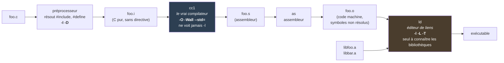

# GCC - driver et non compilateur

> [!abstract] Concept
> `gcc` ne compile rien lui-même : c'est un *driver* qui analyse ses arguments, décide quels programmes lancer (`cpp`, `cc1`, `as`, `collect2`/`ld`) et leur distribue les options — ce que `-###` rend visible.

## Explication

Ce qu'on appelle « compiler » enchaîne quatre programmes distincts, chacun avec ses propres options. Le préprocesseur transforme `.c` en `.i` et consomme `-I` et `-D`. Le vrai compilateur `cc1` transforme `.i` en `.s` et consomme `-O`, `-Wall`, `--std=`, `-g`. L'assembleur `as` produit le `.o`. L'éditeur de liens `ld`, appelé via `collect2`, consomme `-l`, `-L`, `-T` et `-Wl,…`.

Comprendre ce découpage règle immédiatement plusieurs confusions. `gcc -c -lfoo foo.c` ne produit **aucune erreur et aucun effet** : `-c` s'arrête avant le link, l'option est simplement inutilisée. Inversement, `-I` n'a aucun sens à l'étape de link. Et surtout : une erreur `undefined reference to …` ne vient **jamais** du compilateur — le code a compilé, c'est `ld` qui n'a pas trouvé la définition.

`gcc -###` affiche ce que le driver exécuterait sans rien exécuter. C'est l'outil de diagnostic décisif : on y voit `collect2` recevoir les `-L` et `-l` recopiés tels quels, ainsi que toutes les bibliothèques que les *specs* du toolchain ajoutent d'office et qu'aucun Makefile n'a déclarées.

## Exemples

### Les quatre étapes

| Étape | Programme | Entrée → Sortie | Options concernées |
|---|---|---|---|
| Préprocesseur | `cpp` (intégré à `cc1`) | `.c` → `.i` | `-I`, `-D`, `-U` |
| Compilation | `cc1` | `.i` → `.s` | `-O`, `-Wall`, `--std=`, `-g` |
| Assemblage | `as` | `.s` → `.o` | `-Wa,…` |
| Édition de liens | `ld` (via `collect2`) | `.o` + `.a` → exécutable | `-l`, `-L`, `-T`, `-Wl,…` |

### S'arrêter à une étape donnée



```bash
gcc -E foo.c        # préprocesseur seul
gcc -S foo.c        # jusqu'à l'assembleur
gcc -c foo.c        # jusqu'à l'objet, sans link
```

### Voir ce que le driver ferait

```bash
gcc -### -o prog foo.o -L/chemin/lib -lfoo
```

## Cas d'usage

- **Diagnostiquer une option ignorée** : vérifier à quelle étape elle s'adresse.
- **Découvrir les bibliothèques implicites** d'un toolchain de cross-compilation.
- **Situer une erreur** : compilation ou édition de liens ?

## Avantages et inconvénients

✅ **Avantages** :
- Une seule commande pour toute la chaîne, options mélangées acceptées.
- `-###` rend le comportement entièrement inspectable.

❌ **Inconvénients** / Limites :
- Les options mal placées sont ignorées en silence.
- Le driver masque quelles bibliothèques sont réellement liées.

## Connexions

### Notes liées
- [[C - compilation et linkage]] - Les étapes de build en C
- [[C - en-tête et bibliothèque (déclarer vs définir)]] - Quelle étape échoue et pourquoi
- [[C - convention -lfoo et recherche des archives]] - Les options destinées à `ld`
- [[PS2SDK - bibliothèques injectées par les specs GCC]] - Un cas concret révélé par `-###`

- [[ELF - Executable and Linkable Format]] - Le format du `.o` et de l'exécutable produits

### Dans le contexte de
- [[MOC - Programmation C]] - Fait partie de ce domaine

## Sources
- Fichier source : `0-Inbox/PS2SDK.md` (chapitre 7a-7b)

---
**Tags thématiques** : #gcc #compilation #driver #c #build
