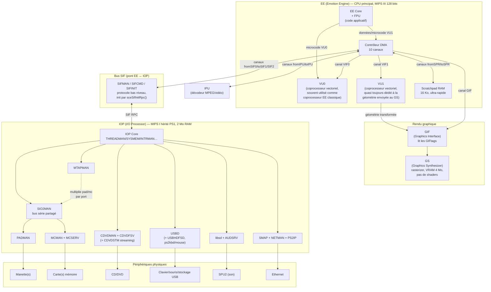

# PS2 - architecture multiprocesseur

> [!abstract] Concept
> La PlayStation 2 n'a pas un CPU unique mais plusieurs processeurs spécialisés (EE, GS, IOP, IPU, VU0/VU1) qui communiquent par bus dédiés, et l'arborescence du SDK reflète directement ce découpage matériel.

## Explication

Là où une machine classique expose un processeur généraliste et un système d'exploitation qui masque le matériel, la PS2 impose de raisonner en **plusieurs processeurs coopérants**. L'**EE** (Emotion Engine) exécute le code applicatif, le **GS** (Graphics Synthesizer) rasterise, l'**IOP** (I/O Processor) pilote tous les périphériques, l'**IPU** décode la vidéo MPEG, et les **VU0/VU1** sont deux coprocesseurs vectoriels attachés à l'EE. Aucun de ces blocs ne fait le travail d'un autre.

La conséquence la plus structurante est une règle de séparation stricte : **l'EE ne parle jamais directement aux périphériques**. Lire une manette, une carte mémoire ou le DVD passe obligatoirement par l'IOP, joint à l'EE par le bus [[PS2 - SIF pont RPC entre EE et IOP]]. Inversement, l'IOP — MIPS I hérité de la PS1, 2 Mo de RAM — ne fait jamais de calcul lourd ni de rendu.

Cette architecture se lit dans l'arborescence du PS2SDK : `ee/` (en-têtes et toolchain de l'EE), `iop/` (toolchain IOP et 212 modules IRX précompilés), `dvp/` (troisième processeur, marginal), `gsKit/` (couche graphique haut niveau). Deux toolchains complets et distincts cohabitent, `mips64r5900el-ps2-elf-` pour l'EE et `mipsel-none-elf-` pour l'IOP.

## Exemples

### Schéma d'ensemble



### Le chemin d'un triangle à l'écran

```
EE (construit la géométrie)
  → DMA canal VIF1 → VU1 (transformation)
  → GIF (lit les GIFtags) → GS (rasterise) → écran
```

### Le chemin d'un appui sur un bouton

```
Manette → bus SIO2 → IOP (module PADMAN)
  → SIF RPC → EE (libpad, padRead)
```

## Cas d'usage

- **Comprendre pourquoi un homebrew charge des modules** : sans IRX chargé côté IOP, aucun périphérique n'est accessible.
- **Répartir la charge** : déporter la transformation géométrique sur VU1 pour libérer l'EE.
- **Diagnostiquer une panne** : identifier de quel côté (EE, IOP, GS) se situe le blocage.

## Avantages et inconvénients

✅ **Avantages** :
- Parallélisme matériel réel : le DMA, le GS et l'IOP travaillent pendant que l'EE calcule.
- Chaque bloc est optimisé pour sa tâche.

❌ **Inconvénients** / Limites :
- Aucune abstraction OS : tout est explicite (chargement de modules, DMA, synchronisation).
- La communication inter-processeurs (SIF RPC) est asynchrone et coûteuse à orchestrer.

## Connexions

### Notes liées
- [[PS2 - EE Emotion Engine et coprocesseurs vectoriels]] - Le CPU principal de cette architecture
- [[PS2 - GS Graphics Synthesizer]] - Le bloc de rendu
- [[PS2 - IOP et modules IRX]] - Le processeur d'entrées-sorties
- [[PS2 - SIF pont RPC entre EE et IOP]] - Le lien entre les deux CPU
- [[PS2 - canaux DMA de l'EE]] - Les 10 chemins de données entre blocs

### Dans le contexte de
- [[MOC - PS2 Homebrew]] - Fait partie de ce domaine

## Sources
- Fichier source : `0-Inbox/PS2SDK.md` (chapitre 1 - Hardware infrastructure)
- https://ps2dev.github.io/ — https://www.psdevwiki.com/ps2/Main_Page

---
**Tags thématiques** : #ps2 #hardware #architecture #homebrew
