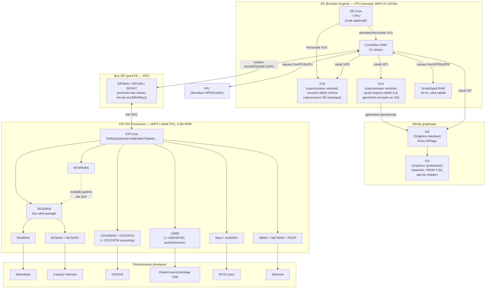

# PS2 - architecture multiprocesseur

> [!abstract] Concept
> La PlayStation 2 n'a pas un CPU unique mais plusieurs processeurs spécialisés (EE, GS, IOP, IPU, VU0/VU1) qui communiquent par bus dédiés, et l'arborescence du SDK reflète directement ce découpage matériel.

## Explication

Là où une machine classique expose un processeur généraliste et un système d'exploitation qui masque le matériel, la PS2 impose de raisonner en **plusieurs processeurs coopérants**. L'**EE** (Emotion Engine) exécute le code applicatif, le **GS** (Graphics Synthesizer) rasterise, l'**IOP** (I/O Processor) pilote tous les périphériques, l'**IPU** décode la vidéo MPEG, et les **VU0/VU1** sont deux coprocesseurs vectoriels attachés à l'EE. Aucun de ces blocs ne fait le travail d'un autre.

La conséquence la plus structurante est une règle de séparation stricte : **l'EE ne parle jamais directement aux périphériques**. Lire une manette, une carte mémoire ou le DVD passe obligatoirement par l'IOP, joint à l'EE par le bus [[PS2 - SIF pont RPC entre EE et IOP]]. Inversement, l'IOP — MIPS I hérité de la PS1, 2 Mo de RAM — ne fait jamais de calcul lourd ni de rendu.

Cette architecture se lit dans l'arborescence du PS2SDK : `ee/` (en-têtes et toolchain de l'EE), `iop/` (toolchain IOP et 212 modules IRX précompilés), `dvp/` (troisième processeur, marginal), `gsKit/` (couche graphique haut niveau). Deux toolchains complets et distincts cohabitent, `mips64r5900el-ps2-elf-` pour l'EE et `mipsel-none-elf-` pour l'IOP.

<svg viewBox="0 0 450 300" width="100%" style="max-width:450px" xmlns="http://www.w3.org/2000/svg" role="img" aria-label="Architecture multiprocesseur de la PS2 : EE, GS, IOP, IPU et leurs bus">
<defs><marker id="p2a" viewBox="0 0 10 10" refX="9" refY="5" markerWidth="6" markerHeight="6" orient="auto"><path d="M0,0 L10,5 L0,10 z" fill="currentColor"/></marker></defs>
<rect x="20" y="52" width="170" height="108" rx="7" fill="#4c9aff" fill-opacity="0.08" stroke="#4c9aff" stroke-width="1.7"/>
<text x="30" y="70" font-size="12" fill="#4c9aff">EE — Emotion Engine</text>
<text x="30" y="84" font-size="9.5" fill="#4c9aff" opacity="0.85">MIPS III R5900 · 32 Mo RAM</text>
<rect x="30" y="92" width="68" height="24" rx="4" fill="none" stroke="#4c9aff" stroke-width="1.2"/>
<text x="52" y="108" font-size="10" fill="#4c9aff">VU0</text>
<rect x="104" y="92" width="68" height="24" rx="4" fill="none" stroke="#4c9aff" stroke-width="1.2"/>
<text x="126" y="108" font-size="10" fill="#4c9aff">VU1</text>
<rect x="30" y="122" width="142" height="24" rx="4" fill="none" stroke="#4c9aff" stroke-width="1.2" stroke-dasharray="3 2"/>
<text x="52" y="138" font-size="10" fill="#4c9aff">DMAC — 10 canaux</text>
<rect x="280" y="52" width="150" height="62" rx="7" fill="#27ae60" fill-opacity="0.08" stroke="#27ae60" stroke-width="1.7"/>
<text x="290" y="70" font-size="12" fill="#27ae60">GS — Graphics Synth.</text>
<text x="290" y="86" font-size="9.5" fill="#27ae60" opacity="0.85">rasterizer à registres</text>
<text x="290" y="102" font-size="9.5" fill="#27ae60" opacity="0.85">4 Mo VRAM · aucun shader</text>
<line x1="190" y1="82" x2="278" y2="82" stroke="currentColor" stroke-width="2.4" marker-end="url(#p2a)"/>
<text x="206" y="74" font-size="10" fill="currentColor">GIF</text>
<text x="196" y="98" font-size="9" fill="currentColor" opacity="0.7">paquets DMA</text>
<rect x="280" y="130" width="150" height="46" rx="7" fill="none" stroke="currentColor" stroke-width="1.4" stroke-dasharray="4 3"/>
<text x="290" y="148" font-size="11" fill="currentColor">IPU</text>
<text x="290" y="164" font-size="9.5" fill="currentColor" opacity="0.8">décodage MPEG</text>
<line x1="190" y1="140" x2="278" y2="150" stroke="currentColor" stroke-width="1.3" stroke-dasharray="4 3"/>
<rect x="20" y="200" width="170" height="80" rx="7" fill="#f2994a" fill-opacity="0.08" stroke="#f2994a" stroke-width="1.7"/>
<text x="30" y="218" font-size="12" fill="#f2994a">IOP — I/O Processor</text>
<text x="30" y="232" font-size="9.5" fill="#f2994a" opacity="0.85">MIPS I (PS1) · 2 Mo RAM</text>
<text x="30" y="248" font-size="9.5" fill="#f2994a" opacity="0.85">modules IRX chargés au runtime</text>
<text x="30" y="266" font-size="9.5" fill="#f2994a" opacity="0.85">aucun calcul lourd, que de l'I/O</text>
<line x1="105" y1="160" x2="105" y2="198" stroke="currentColor" stroke-width="2.4" marker-end="url(#p2a)"/>
<line x1="125" y1="198" x2="125" y2="162" stroke="currentColor" stroke-width="2.4" marker-end="url(#p2a)"/>
<text x="132" y="182" font-size="10" fill="currentColor">SIF (RPC)</text>
<rect x="250" y="200" width="180" height="80" rx="7" fill="none" stroke="#f2994a" stroke-width="1.2" stroke-dasharray="4 3"/>
<text x="260" y="218" font-size="10.5" fill="#f2994a">périphériques</text>
<text x="260" y="236" font-size="9.5" fill="currentColor" opacity="0.8">manette · carte mémoire · CD/DVD</text>
<text x="260" y="252" font-size="9.5" fill="currentColor" opacity="0.8">USB · réseau · son</text>
<text x="260" y="270" font-size="9.5" fill="#e05252">l'EE ne les atteint JAMAIS directement</text>
<line x1="190" y1="240" x2="248" y2="240" stroke="#f2994a" stroke-width="2" marker-end="url(#p2a)"/>
<text x="16" y="28" font-size="12" fill="currentColor">cinq processeurs spécialisés, aucun ne fait le travail d'un autre</text>
<text x="16" y="42" font-size="10.5" fill="currentColor" opacity="0.75">deux toolchains distincts : mips64r5900el-ps2-elf- (EE) et mipsel-none-elf- (IOP)</text>
</svg>

## Exemples

### Schéma d'ensemble


```mermaid
%%{init: {"flowchart": {"useMaxWidth": true, "htmlLabels": true}}}%%
graph TB
    subgraph EE_SIDE["EE (Emotion Engine) — CPU principal, MIPS III 128 bits"]
        EE["EE Core<br/>+ FPU<br/>(code applicatif)"]
        VU0["VU0<br/>(coprocesseur vectoriel,<br/>souvent utilisé comme<br/>coprocesseur EE classique)"]
        VU1["VU1<br/>(coprocesseur vectoriel,<br/>quasi toujours dédié à la<br/>géométrie envoyée au GS)"]
        SPR["Scratchpad RAM<br/>16 Ko, ultra-rapide"]
        DMAC["Contrôleur DMA<br/>10 canaux"]
    end

    subgraph GS_SIDE["Rendu graphique"]
        GIF["GIF<br/>(Graphics Interface)<br/>lit les GIFtags"]
        GS["GS<br/>(Graphics Synthesizer)<br/>rasterizer, VRAM 4 Mo,<br/>pas de shaders"]
    end

    IPU["IPU<br/>(décodeur MPEG/vidéo)"]

    subgraph SIF_BUS["Bus SIF (pont EE ↔ IOP)"]
        SIFHW["SIFMAN / SIFCMD / SIFINIT<br/>protocole bas niveau,<br/>init par sceSifInitRpc()"]
    end

    subgraph IOP_SIDE["IOP (I/O Processor) — MIPS I hérité PS1, 2 Mo RAM"]
        IOP["IOP Core<br/>THREADMAN/SYSMEM/INTRMAN…"]
        SIO2["SIO2MAN<br/>bus série partagé"]
        PADMAN["PADMAN"]
        MCSTACK["MCMAN + MCSERV"]
        CDVDSTACK["CDVDMAN + CDVDFSV<br/>(+ CDVDSTM streaming)"]
        USBD["USBD<br/>(+ USBHDFSD, ps2kbd/mouse)"]
        SNDSTACK["libsd + AUDSRV"]
        NETSTACK["SMAP + NETMAN + PS2IP"]
        MTAP["MTAPMAN"]
    end

    subgraph PERIPH["Périphériques physiques"]
        PAD["Manette(s)"]
        MC["Carte(s) mémoire"]
        CD["CD/DVD"]
        USB["Clavier/souris/stockage USB"]
        SOUND["SPU2 (son)"]
        NET["Ethernet"]
    end

    EE -->|microcode VU0| VU0
    EE -->|données/microcode VU1| DMAC
    DMAC -->|canal VIF0| VU0
    DMAC -->|canal VIF1| VU1
    VU1 -->|géométrie transformée| GIF
    DMAC -->|canal GIF| GIF
    GIF --> GS
    DMAC <-->|canaux fromIPU/toIPU| IPU
    DMAC <-->|canaux fromSPR/toSPR| SPR
    DMAC <-->|canaux fromSIF0/toSIF1/SIF2| SIFHW
    SIFHW <-->|SIF RPC| IOP

    IOP --> SIO2
    SIO2 --> PADMAN --> PAD
    SIO2 --> MCSTACK --> MC
    IOP --> CDVDSTACK --> CD
    IOP --> USBD --> USB
    IOP --> SNDSTACK --> SOUND
    IOP --> NETSTACK --> NET
    IOP --> MTAP -.->|multiplie pad/mc<br/>par port| SIO2
```

### Le chemin d'un triangle à l'écran

```
EE (construit la géométrie)
  → DMA canal VIF1 → VU1 (transformation)
  → GIF (lit les GIFtags) → GS (rasterise) → écran
```

### Le chemin d'un appui sur un bouton

```
Manette → bus SIO2 → IOP (module PADMAN)
  → SIF RPC → EE (libpad, padRead)
```

## Cas d'usage

- **Comprendre pourquoi un homebrew charge des modules** : sans IRX chargé côté IOP, aucun périphérique n'est accessible.
- **Répartir la charge** : déporter la transformation géométrique sur VU1 pour libérer l'EE.
- **Diagnostiquer une panne** : identifier de quel côté (EE, IOP, GS) se situe le blocage.

## Avantages et inconvénients

✅ **Avantages** :
- Parallélisme matériel réel : le DMA, le GS et l'IOP travaillent pendant que l'EE calcule.
- Chaque bloc est optimisé pour sa tâche.

❌ **Inconvénients** / Limites :
- Aucune abstraction OS : tout est explicite (chargement de modules, DMA, synchronisation).
- La communication inter-processeurs (SIF RPC) est asynchrone et coûteuse à orchestrer.

## Connexions

### Notes liées
- [[PS2 - EE Emotion Engine et coprocesseurs vectoriels]] - Le CPU principal de cette architecture
- [[PS2 - GS Graphics Synthesizer]] - Le bloc de rendu
- [[PS2 - IOP et modules IRX]] - Le processeur d'entrées-sorties
- [[PS2 - SIF pont RPC entre EE et IOP]] - Le lien entre les deux CPU
- [[PS2 - canaux DMA de l'EE]] - Les 10 chemins de données entre blocs

### Dans le contexte de
- [[MOC - PS2 Homebrew]] - Fait partie de ce domaine

## Sources
- Fichier source : `0-Inbox/PS2SDK.md` (chapitre 1 - Hardware infrastructure)
- https://ps2dev.github.io/ — https://www.psdevwiki.com/ps2/Main_Page

---
**Tags thématiques** : #ps2 #hardware #architecture #homebrew
