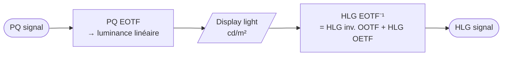
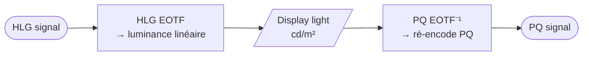

# Transcoding HDR - PQ vers HLG via Display Light

> [!abstract] Concept
> Le transcoding entre PQ et HLG passe obligatoirement par une étape intermédiaire de décodage en luminance linéaire (display light). C'est le seul référentiel commun aux deux standards — le Display Light en cd/m² est le pivot de toute conversion HDR↔HDR.

## Explication

PQ (Perceptual Quantizer) et HLG (Hybrid Log Gamma) sont deux standards HDR incompatibles directement : leurs courbes de transfert sont fondamentalement différentes. Pour passer de l'un à l'autre, il faut décoder le signal en **luminance linéaire** (display light en cd/m²), puis ré-encoder dans l'autre standard.

Ce principe est défini dans le rapport ITU-R BT.2408-14 (PQ→HLG) et BT.2408-15 (HLG→PQ).

### Transcoding PQ → HLG (BT.2408-14)

1. **PQ EOTF** : décode le signal PQ en luminance linéaire (0–10 000 cd/m²)
2. **Display light** : luminance intermédiaire en cd/m² (référence commune)
3. **HLG inverse EOTF** : ré-encode en HLG (= HLG inverse OOTF suivi du HLG OETF)

### Transcoding HLG → PQ (BT.2408-15)

1. **HLG EOTF** : décode le signal HLG en luminance linéaire (0–1 000 cd/m²)
2. **Display light** : luminance intermédiaire en cd/m²
3. **PQ inverse EOTF** : ré-encode en PQ

### Objectif

L'objectif est d'obtenir **le même rendu visuel** sur le moniteur avec le signal transcodé qu'avec le signal original. Le display light garantit cette équivalence.

> ⚠️ Note importante : le HLG inverse EOTF n'est PAS simplement l'inverse de l'EOTF HLG. C'est la combinaison `HLG inverse OOTF + HLG OETF`. Cette distinction est critique pour les implémentations.

## Cas d'usage

- Régie broadcast live : production en HLG, livraison d'un master additionnel en PQ pour les plateformes SVoD
- Post-production : transcodage d'archives PQ (cinéma) vers HLG pour diffusion TV
- En régie (IMAGINE SNP, Selenio...) : transcoding display-light PQ↔HLG en temps réel

## Connexions

### Notes liées
- [[OOTF - Fonction de transfert opto-optique HLG]] — HLG inverse OOTF est le cœur du transcoding PQ→HLG
- [[Gamma vidéo - OETF et EOTF]] — EOTF des deux standards est la première et dernière étape
- [[HLG - Hybrid Log Gamma]] — l'un des deux standards en jeu
- [[PQ - Perceptual Quantizer]] — l'autre standard en jeu
- [[Workflow production simultanée HDR-SDR]] — le transcoding PQ↔HLG est une étape du workflow live
- [[LUT broadcast HDR - Types BBC et interpolation]] — les LUTs peuvent encapsuler ce transcoding

### Contexte
La coexistence de PQ (cinéma, plateformes) et HLG (broadcast TV) oblige les opérateurs à maîtriser ce transcoding. En pratique, les équipements broadcast (Imagine, Grass Valley, Sony...) l'intègrent nativement en LUT hardware.

## Source

- ITU-R BT.2408-14 (Concept of transcoding PQ→HLG)
- ITU-R BT.2408-15 (Concept of transcoding HLG→PQ)
- Formation IIFA / Média 180, 2026-04-08 — [[0-Inbox/Formation UHD - HDR J2]]

---

**Tags thématiques** : `#uhd-hdr` `#transcoding` `#pq` `#hlg` `#conversion`
