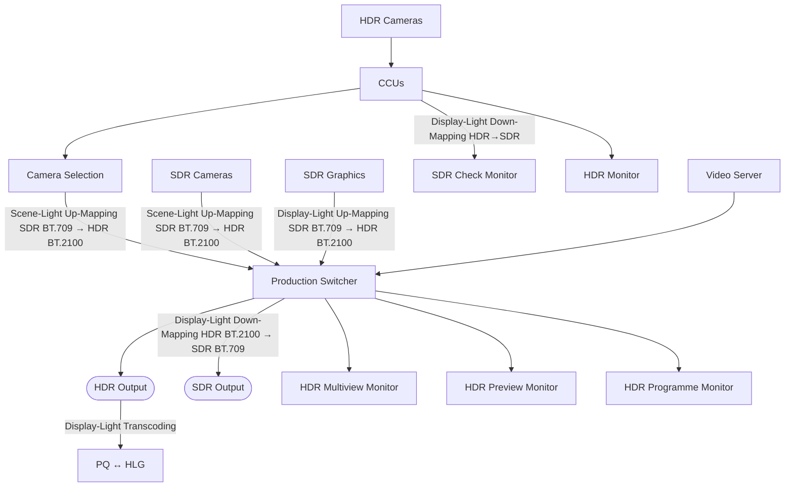

# Workflow production simultanée HDR-SDR

> [!abstract] Concept
> En production broadcast live, la régie travaille nativement en HDR. Les caméras SDR sont converties en HDR dès l'entrée (Scene-Light). La sortie SDR est une descente Display-Light depuis le signal HDR maître. Ce principe est décrit dans ITU-R BT.2408-8 §7.2 sous le nom "HDR-focused camera shading".

## Explication

La production simultanée HDR-SDR est devenue le standard en broadcast. Plutôt que de produire deux programmes distincts, une seule régie produit nativement en HDR et **dérive la sortie SDR** automatiquement.

### Principe général

### Règles de conversion par type de source

| Source              | Conversion entrée régie                    | Pourquoi                                                            |
| ------------------- | ------------------------------------------ | ------------------------------------------------------------------- |
| Caméras HDR natives | Aucune (signal BT.2100 direct)             | Signal déjà en HDR                                                  |
| Caméras SDR         | **Scene-Light Up-Mapping** SDR→HDR         | Préserve le signal capteur, permet d'aligner les caméras SDR et HDR |
| Graphiques SDR      | **Display-Light Up-Mapping** SDR→HDR       | Préserve l'apparence colorimétrique des graphiques étalonnés        |
| Inserts SDR (VTR)   | Display-Light Up-Mapping ou Direct Mapping | Contenu pré-étalonné SDR                                            |

### Sorties

| Sortie | Conversion | Note |
|---|---|---|
| HDR Output | Aucune | Signal maître |
| SDR Output programme | **Display-Light Down-Mapping** HDR→SDR | Identique au monitoring SDR |
| SDR Check Monitor (caméras) | **Display-Light Down-Mapping** HDR→SDR | Peut être dynamique ⭐ |
| PQ/HLG Transcoding | **Display-Light Transcoding** PQ↔HLG | Pour livraison multi-format |

⭐ Les deux sorties SDR (check et programme) sont identiques et peuvent être dynamiques.

### Monitoring

La régie HDR-focused dispose de plusieurs moniteurs en parallèle :
- **HDR Monitor** : référence principal, visualisation du signal maître
- **SDR Check Monitor** : vérification de la descente SDR (Display-Light Down-Mapping)
- **HDR Multiview Monitor** : vision multi-caméras en HDR
- **HDR Preview / HDR Programme** : prévisualisation et programme final

## Cas d'usage

- Événement sportif live : une régie produit simultanément la diffusion TV SDR (TNT) et le flux HDR HLG (chaîne HD premium ou streaming)
- Plateau TV : caméras SDR existantes intégrées dans un workflow HDR via Scene-Light Up-Mapping
- Post-production : même principe appliqué au montage avec un master HDR unique

## Connexions

### Notes liées
- [[Display Light vs Scene Light - Conversion SDR vers HDR]] — les deux types de conversion utilisés dans ce workflow
- [[Conversions HDR-SDR - Tone Mapping Inverse TM Direct Mapping]] — TM et ITM sont les opérations de base du workflow
- [[LUT broadcast HDR - Types BBC et interpolation]] — les LUTs implémentent chaque conversion du workflow
- [[Transcoding HDR - PQ vers HLG via Display Light]] — étape de livraison multi-format depuis le master HDR
- [[ITU-R BT.2408 - Niveaux nominaux et bonnes pratiques production HDR]] — norme définissant ce workflow (Fig20 §7.2)
- [[HLG - Hybrid Log Gamma]] — standard HDR broadcast utilisé en régie live
- [[Commutation seamless - basculement sans coupure]] — les conversions HDR/SDR s'appliquent aussi aux systèmes de commutation

### Contexte
Ce workflow est la concrétisation de toute la chaîne HDR théorique en conditions réelles de diffusion live. Maîtriser les points de conversion (quand utiliser Scene vs Display Light, comment gérer les inserts) est indispensable pour un technicien broadcast travaillant en régie HDR.

## Source

- ITU-R BT.2408-8 Fig20 §7.2 — *HDR-focused camera shading*
- Formation IIFA / Média 180, 2026-04-08 — [[0-Inbox/Formation UHD - HDR J2]]

---

**Tags thématiques** : `#uhd-hdr` `#workflow` `#broadcast` `#production` `#hdr-sdr`
