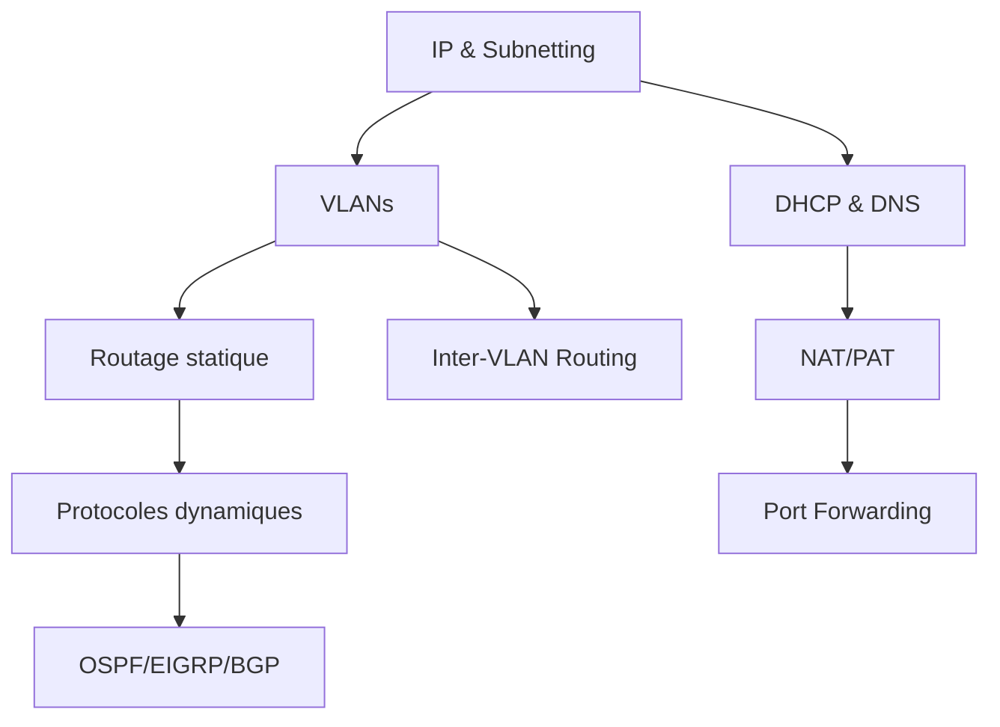

# MOC - Réseau

Map of Content centralisée pour tous les concepts réseau, protocoles, et configurations.

---

## 🎯 Parcours d'apprentissage recommandé

### Niveau 1 : Fondations réseau
1. Comprendre l'adressage IP et le subnetting
2. Maîtriser les VLANs et la segmentation
3. Découvrir les protocoles essentiels (ARP, ICMP, DNS, DHCP)

### Niveau 2 : Routage et services
1. Routage statique et dynamique
2. Configuration NAT/PAT
3. Services réseau avancés

### Niveau 3 : Protocoles de routage avancés
1. OSPF et EIGRP
2. BGP pour l'interconnexion Internet
3. Multicast et PIM

---

## 📚 Notes par thème

### 🔢 Adressage IP

#### Concepts fondamentaux
- [[IP - subnetting]] → Découpage de réseaux
- [[RFC 1918 - adressage IP privé]] → Plages IP privées
- [[TTL - Time To Live]] → Durée de vie paquets

### 🏷️ VLAN (Virtual LAN)

#### Concepts de base
- [[VLAN - Virtual LAN]] → Segmentation logique des réseaux
- [[VLAN - mode access vs trunk]] → Types de ports
- [[VLAN - natif untagged]] → VLAN natif sans tag

#### Encapsulation et tagging
- [[802.1Q - tagging VLAN]] → Standard de tagging

#### Configuration Cisco
- [[VLAN Cisco - Configuration switch]] → Configuration de base
- [[VLAN Cisco - Port trunk et 802.1Q]] → Configuration trunks
- [[VLAN Cisco - Sécurisation]] → Sécurité VLAN
- [[VLAN Cisco - Vérification et dépannage]] → Troubleshooting
- [[VLAN Cisco - Switch Layer 3]] → Switch L3
- [[VLAN Cisco - Router on a stick]] → Routage inter-VLAN
- [[CISCO - sous-interfaces]] → Configuration sous-interfaces

#### Configuration Linux
- [[VLAN Linux - Configuration interfaces]] → Setup VLAN sous Linux
- [[VLAN Linux - Routage inter-VLAN]] → Routage L3 Linux

#### Routage inter-VLAN
- [[VLAN - router on a stick]] → Méthode classique

### 🔀 Routage

#### Concepts de base
- [[ROUTAGE - statique]] → Routes statiques

#### Configuration Cisco
- [[Routage Cisco - Configuration de base]] → Setup initial
- [[Routage Cisco - Routes statiques avancées]] → Routes complexes
- [[Routage Cisco - Distance administrative]] → Métrique de priorité
- [[Routage Cisco - Vérification et dépannage]] → Troubleshooting

#### Protocoles de routage
- [[RIP - Routing Information Protocol]] → Protocol distance vector
- [[OSPF - Open Shortest Path First]] → Protocol link-state
- [[EIGRP - Enhanced Interior Gateway Routing Protocol]] → Protocol hybride Cisco
- [[BGP - Border Gateway Protocol]] → Routage Internet

### 🌐 NAT (Network Address Translation)

#### Concepts
- [[NAT - Network Address Translation]] → Translation d'adresses
- [[PAT - Port Address Translation]] → NAT avec ports
- [[NAT - source NAT (SNAT)]] → NAT source
- [[NAT - destination NAT (DNAT)]] → NAT destination
- [[NAT - port forwarding]] → Redirection de ports
- [[Port Forwarding]] → Concept détaillé

#### Configuration Cisco
- [[NAT Cisco - Configuration interfaces]] → Setup interfaces
- [[NAT Cisco - NAT statique]] → Mapping 1:1
- [[NAT Cisco - PAT et NAT Overload]] → Partage IP
- [[NAT Cisco - Port forwarding]] → Redirection ports
- [[NAT Cisco - Vérification et dépannage]] → Troubleshooting

#### Configuration Linux
- [[NAT Linux - iptables et NAT]] → NAT avec iptables
- [[NAT Linux - Port forwarding]] → Redirection Linux

### 📡 DHCP (Dynamic Host Configuration Protocol)

#### Concepts
- [[DHCP - Dynamic Host Configuration]] → Attribution IP automatique
- [[DHCP Relay Agent]] → Relais DHCP
- [[DHCP - snooping protection]] → Protection snooping

#### Configuration Cisco
- [[DHCP Cisco - Configuration de base]] → Setup serveur
- [[DHCP Cisco - Multi-VLAN]] → DHCP multi-VLAN
- [[DHCP Cisco - Relay Agent]] → Configuration relay
- [[DHCP Cisco - Réservations MAC]] → Binding statique
- [[DHCP Cisco - Vérification et dépannage]] → Troubleshooting

#### Configuration Linux
- [[DHCP Linux - Installation et configuration]] → Setup serveur
- [[DHCP Linux - Client DHCP]] → Configuration client
- [[DHCP Linux - DHCP Relay]] → Relais DHCP
- [[DHCP Linux - Réservations MAC]] → Réservations
- [[DHCP Linux - Vérification et dépannage]] → Troubleshooting

### 🔍 DNS et résolution de noms
- [[DNS - Domain Name System]] → Résolution de noms

### 🛡️ Sécurité réseau
- [[DMZ - Zone démilitarisée]] → Zone tampon sécurisée

### 📨 Protocoles de couche 3

#### Protocoles de contrôle
- [[ARP - Address Resolution Protocol]] → Résolution MAC/IP
- [[ICMP - Internet Control Message Protocol]] → Messages de contrôle

#### Multicast
- [[MULTICAST - diffusion groupe]] → Communication 1-vers-n
- [[IGMP - Internet Group Management Protocol]] → Gestion groupes multicast
- [[PIM - Protocol Independent Multicast]] → Routage multicast

##### Configuration Linux
- [[MULTICAST Linux - client réception flux]] → Client s'abonnant à un flux
- [[MULTICAST Linux - bridge IGMP snooping]] → Switch L2 avec IGMP snooping
- [[MULTICAST Linux - routeur PIM]] → Routeur L3 avec PIM daemon

##### Configuration Cisco
- [[MULTICAST Cisco - switch IGMP snooping]] → Switch L2 avec IGMP snooping
- [[MULTICAST Cisco - routeur PIM]] → Routeur L3 avec PIM Sparse Mode

### 📡 Broadcast IP (SMPTE 2110)

> 💡 **Pour un guide complet** : Voir [[MOC - SMPTE 2110 & Broadcast IP]]

#### Fondamentaux
- [[SMPTE 2110 - transport multimédia par IP]] → Norme transport broadcast
- [[SDI vs IP - comparaison broadcast]] → Évolution SDI vers IP
- [[Topologie Spine-Leaf - architecture réseau]] → Architecture datacenter

#### Synchronisation
- [[PTP - Precision Time Protocol]] → Synchronisation nanoseconde
- [[BMCA - Best Master Clock Algorithm]] → Sélection Master PTP
- [[PTP Clock modes - Ordinary Transparent Boundary]] → Modes switches PTP

#### Orchestration et transport
- [[NMOS - découverte équipements broadcast]] → Découverte IS-04/IS-05
- [[RTP - Real-time Transport Protocol]] → Encapsulation temps réel
- [[SDP - Session Description Protocol]] → Description flux

#### Redondance
- [[SMPTE 2022-7 - redondance réseau]] → Haute disponibilité rouge/bleu

### 🔧 Outils de diagnostic
- [[ping - tester connectivité réseau]] → Test connectivité ICMP
- [[traceroute - tracer route réseau]] → Traçage de route

---

## 📋 Notes par plateforme

### Cisco IOS
- [[VLAN Cisco - Configuration switch]]
- [[VLAN Cisco - Port trunk et 802.1Q]]
- [[VLAN Cisco - Router on a stick]]
- [[VLAN Cisco - Switch Layer 3]]
- [[VLAN Cisco - Sécurisation]]
- [[VLAN Cisco - Vérification et dépannage]]
- [[CISCO - sous-interfaces]]
- [[Routage Cisco - Configuration de base]]
- [[Routage Cisco - Routes statiques avancées]]
- [[Routage Cisco - Distance administrative]]
- [[Routage Cisco - Vérification et dépannage]]
- [[NAT Cisco - Configuration interfaces]]
- [[NAT Cisco - NAT statique]]
- [[NAT Cisco - PAT et NAT Overload]]
- [[NAT Cisco - Port forwarding]]
- [[NAT Cisco - Vérification et dépannage]]
- [[DHCP Cisco - Configuration de base]]
- [[DHCP Cisco - Multi-VLAN]]
- [[DHCP Cisco - Relay Agent]]
- [[DHCP Cisco - Réservations MAC]]
- [[DHCP Cisco - Vérification et dépannage]]

### Linux
- [[VLAN Linux - Configuration interfaces]]
- [[VLAN Linux - Routage inter-VLAN]]
- [[NAT Linux - iptables et NAT]]
- [[NAT Linux - Port forwarding]]
- [[DHCP Linux - Installation et configuration]]
- [[DHCP Linux - Client DHCP]]
- [[DHCP Linux - DHCP Relay]]
- [[DHCP Linux - Réservations MAC]]
- [[DHCP Linux - Vérification et dépannage]]

---

## 🔗 Connexions avec autres domaines

### Sécurité
- Protection DHCP Snooping
- DMZ et segmentation
- Contrôle d'accès par VLAN

### Linux Système
- Configuration réseau avancée
- Modules noyau réseau
- Interfaces et bridges

### Administration
- Automatisation configuration
- Monitoring et supervision
- Dépannage méthodique

---

## 📝 Concepts clés à maîtriser

1. **Segmentation** : VLANs, subnetting
2. **Routage** : Statique, dynamique, protocols
3. **Services** : DHCP, DNS, NAT
4. **Sécurité** : DMZ, isolation, contrôle d'accès
5. **Diagnostic** : ping, traceroute, show commands

---

## 🎓 Progression suggérée

---

## 📊 Statistiques du vault réseau

**Notes VLAN** : 13 notes
**Notes DHCP** : 11 notes
**Notes NAT** : 9 notes
**Notes Routage** : 8 notes
**Notes Multicast** : 8 notes (concept + 3 Linux + 2 Cisco + 2 protocoles)
**Notes Broadcast IP (SMPTE 2110)** : 11 notes
**Protocoles** : 7 notes
**Total notes réseau** : ~67 notes

---

**Dernière mise à jour** : 2025-11-25
